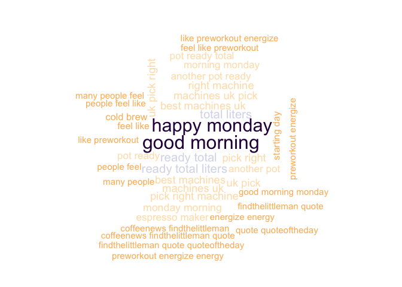
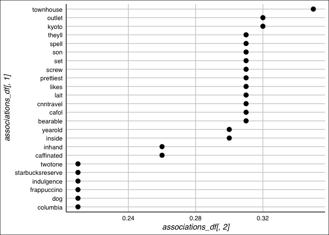

Text Mining Notes
================

Introduction
------------

The notes you are reading now are what I learned from courses, projects and other experts. I tried to give a structured overview of text mining programming in R. My goal is not to give a theoretical overview of text mining but to give practical examples with real code and real data.

As a dataset we will use tweets. I decided I could download some real tweets by myself. This could prove an interesting challenge and could give some interesting insights if we download the right tweets. To do this I followed the instructions on this websites

[Link on twitter download 1](https://www.credera.com/blog/business-intelligence/twitter-analytics-using-r-part-1-extract-tweets/)

[Link on twitter download 2](http://thinktostart.com/twitter-authentification-with-r/)

Let's get the tweets
====================

Let's load the necessary libraries

``` r
library("devtools")
library("twitteR")
library("ROAuth")
```

Now to be able to download tweets you need to have a twitter account and authorize it (using special generated keys). To know how follow the instructions you can found on the page linked above. I saved my keys in a file that I access to read it. You don't have to do that, but I wanted to have a working piece of code that I can run and at the same time publish. Again, use google to find out how you can do it differently. You will understand if I don't want to put my keys here ;-)

``` r
secrets <- read.csv("/Users/umberto/Documents/Passwords and Secrets/twitter-keys.csv", 
                    stringsAsFactors = FALSE, header = TRUE, sep =",")

api_key <- secrets$api_key
api_secret <- secrets$api_secret
access_token <- secrets$access_token
access_token_secret <- secrets$access_token_secret
 

setup_twitter_oauth(api_key,api_secret)
```

    ## [1] "Using browser based authentication"

Coffee Tweets
-------------

Let's now see what we can find out on Coffee. Let's find tweets that have the hashtag Coffee (`#Coffee`) in them and let's exclude the retweets, since they will falsify our results since they contains almost always the same exact text with RT at the beginning.

``` r
search.string <- "#coffee exclude:retweets"
no.of.tweets <- 1000

c_tweets <- searchTwitter(search.string, n=no.of.tweets, lang="en")
```

Now we need to access the text of the tweets. So we do it in this way (we also need to clean up the tweets from special characters that for now we don't need, like emoticons with the `sapply` function.). At the same time let's remove all web links from the tweets, since we are not interested in having them in our wordclouds or networks.

``` r
coffee_tweets = sapply(c_tweets, function(t) t$getText())

coffee_tweets <- sapply(coffee_tweets,function(row) iconv(row, "latin1", "ASCII", sub=""))
names(coffee_tweets) <- NULL

coffee_tweets <- gsub("\\s?(f|ht)(tp)(s?)(://)([^\\.]*)[\\.|/](\\S*)", "", coffee_tweets)

head(coffee_tweets)
```

    ## [1] "The latest Mo's Coffee News! Thanks to @PoorLilItGirl @BloggersWales @kuldeepnegi80 #coffee #monday"               
    ## [2] "#Abraaj Group to buy #African #coffee chain #Java House - #GoogleAlerts"                                           
    ## [3] "Cartoon businessman office worker quickly runs to work with coffee #artoon #BusinessMan #business #coffee #office" 
    ## [4] "@RealSeanatello @ABEducational @smgaillard @Teach4SpclNeeds @LennonCorey @noasbobs @MaryHadley8 @weknowteaching"   
    ## [5] "Breakfast in the Quarter at cafeenvie ! #bagelandlox #coffee #NOLA"                                                
    ## [6] "It's busy at Bunde's this morning. #Coffee time.  #southhaven #PureMichigan #LakeshoreRealtor #Lakeshoresfinest #S"

It is interested to see how many parameters we get from the search

``` r
str(c_tweets[[1]])
```

    ## Reference class 'status' [package "twitteR"] with 17 fields
    ##  $ text         : chr "The latest Mo's Coffee News! https://t.co/KIdTRIClBG Thanks to @PoorLilItGirl @BloggersWales @kuldeepnegi80 #coffee #monday"
    ##  $ favorited    : logi FALSE
    ##  $ favoriteCount: num 0
    ##  $ replyToSN    : chr(0) 
    ##  $ created      : POSIXct[1:1], format: "2017-07-03 14:26:59"
    ##  $ truncated    : logi FALSE
    ##  $ replyToSID   : chr(0) 
    ##  $ id           : chr "881881964743204865"
    ##  $ replyToUID   : chr(0) 
    ##  $ statusSource : chr "<a href=\"http://paper.li\" rel=\"nofollow\">Paper.li</a>"
    ##  $ screenName   : chr "MoLovesCoffee"
    ##  $ retweetCount : num 0
    ##  $ isRetweet    : logi FALSE
    ##  $ retweeted    : logi FALSE
    ##  $ longitude    : chr(0) 
    ##  $ latitude     : chr(0) 
    ##  $ urls         :'data.frame':   1 obs. of  5 variables:
    ##   ..$ url         : chr "https://t.co/KIdTRIClBG"
    ##   ..$ expanded_url: chr "http://paper.li/MoLovesCoffee/1309526832?edition_id=ab1660d0-5ffb-11e7-afd2-0cc47a0d15fd"
    ##   ..$ display_url : chr "paper.li/MoLovesCoffee/<U+2026>"
    ##   ..$ start_index : num 29
    ##   ..$ stop_index  : num 52
    ##  and 53 methods, of which 39 are  possibly relevant:
    ##    getCreated, getFavoriteCount, getFavorited, getId, getIsRetweet,
    ##    getLatitude, getLongitude, getReplyToSID, getReplyToSN, getReplyToUID,
    ##    getRetweetCount, getRetweeted, getRetweeters, getRetweets,
    ##    getScreenName, getStatusSource, getText, getTruncated, getUrls,
    ##    initialize, setCreated, setFavoriteCount, setFavorited, setId,
    ##    setIsRetweet, setLatitude, setLongitude, setReplyToSID, setReplyToSN,
    ##    setReplyToUID, setRetweetCount, setRetweeted, setScreenName,
    ##    setStatusSource, setText, setTruncated, setUrls, toDataFrame,
    ##    toDataFrame#twitterObj

So there is quite some possibilities here. But we are not actually interested in that here, but just in the text `tweetsText`. (check for example as reference this [stackoverflow post](http://stackoverflow.com/questions/14549305/searchtwitter-timestamps)).

Tea tweets
----------

Since we are going to compare corpora of text later on, we need a second set of tweets. I decided to download the first 1000 tweets on Tea

Tea Tweets
----------

``` r
search.string <- "#tea exclude:retweets"
no.of.tweets <- 1000

t_tweets <- searchTwitter(search.string, n=no.of.tweets, lang="en")
```

Now we need to access the text of the tweets. So we do it in this way (we also need to clean up the tweets from special characters that for now we don't need, like emoticons with the `sapply` function.)

``` r
tea_tweets = sapply(t_tweets, function(t) t$getText())

tea_tweets <- sapply(tea_tweets,function(row) iconv(row, "latin1", "ASCII", sub=""))
names(tea_tweets) <- NULL

tea_tweets <- gsub("?(f|ht)(tp)(s?)(://)(.*)[.|/](.*)", "", tea_tweets)

head(tea_tweets)
```

    ## [1] "Fascinating tour of historic #Chichester house plus afternoon #tea @edeshouse #Birthday idea see Taste West #Sussex "
    ## [2] "Our #bestfoodfriend @Aaronvegan at it again with a rich #tea &amp; #ginger #nut #pudding using "                     
    ## [3] "Enjoy a delicious #brew, try one of the popular flavours from @CheshireTea  - "                                      
    ## [4] "The real taste of #Apple #Cinnamon in every sip by @teameteas \n#TeaTime #Tea #TeaAddicts #BlackTea "                
    ## [5] "In the edit on a new film about Tea featuring the Rare Tea Lady #tea #food #life "                                   
    ## [6] "A great product range of #tea is developed by Tea Drops. An amazing assortment of USDA organic "

Let's start with text mining
============================

To do text mining one of the most used library (and the one I will use here) is `tm`.

``` r
library("tm")
```

First we need to create a vector of texts

``` r
coffee_source <- VectorSource(coffee_tweets)
tea_source <- VectorSource(tea_tweets)
```

Then we need to make a `VCorpus` of the list of tweets

``` r
coffee_corpus <- VCorpus(coffee_source)
tea_corpus <- VCorpus(tea_source)
coffee_corpus
```

    ## <<VCorpus>>
    ## Metadata:  corpus specific: 0, document level (indexed): 0
    ## Content:  documents: 1000

So if we want to see the text of a tweet in the corpus we can use

``` r
coffee_corpus[[15]][1]
```

    ## $content
    ## [1] "I scream, you scream, we all scream for no churn Kahla Espresso Ice Cream! #vegan #coffee... via @FitFoodieMama"

``` r
tea_corpus[[15]][1]
```

    ## $content
    ## [1] "#Tea Over Ice #Sweepstakes "

Cleaning text
-------------

Now that I how to make a corpus, I can focus on cleaning, or preprocessing, the text. In bag of words text mining, cleaning helps aggregate terms. For example, it may make sense that the words "miner", "mining" and "mine" should be considered one term. Specific preprocessing steps will vary based on the project. For example, the words used in tweets are vastly different than those used in legal documents, so the cleaning process can also be quite different. (Text Source: Datacamp)

Common preprocessing functions include:

-   tolower(): Make all characters lowercase
-   removePunctuation(): Remove all punctuation marks
-   removeNumbers(): Remove numbers
-   stripWhitespace(): Remove excess whitespace

Note that tolower() is part of base R, while the other three functions come from the tm package. Going forward, we'll load the tm and qdap for you when they are needed.

The **qdap** package offers other text cleaning functions. Each is useful in its own way and is particularly powerful when combined with the others.

-   bracketX(): Remove all text within brackets (e.g. "It's (so) cool" becomes "It's cool")
-   replace\_number(): Replace numbers with their word equivalents (e.g. "2" becomes "two")
-   replace\_abbreviation(): Replace abbreviations with their full text equivalents (e.g. "Sr" becomes "Senior")
-   replace\_contraction(): Convert contractions back to their base words (e.g. "shouldn't" becomes "should not")
-   replace\_symbol() Replace common symbols with their word equivalents (e.g. "$" becomes "dollar")

Stopwords
---------

Using the c() function allows you to add new words (separated by commas) to the stop words list. For example, the following would add "word1" and "word2" to the default list of English stop words:

    all_stops <- c("word1", "word2", stopwords("en"))

You can use the following command to remove stopwords

    removeWords(text, stopwords("en"))

Stemming
--------

I won't go into stemming here but I tought is worthwile mentioning it. Here is an example of stemming

``` r
stemDocument(c("computational", "computers", "computation"))
```

    ## [1] "comput" "comput" "comput"

Here is an example of using stemming

``` r
# Create complicate
complicate <- c("complicated", "complication", "complicatedly")
# Perform word stemming: stem_doc
stem_doc <- stemDocument(complicate)
# Create the completion dictionary: comp_dict
comp_dict <- "complicate"
# Perform stem completion: complete_text 
complete_text <- stemCompletion(stem_doc, comp_dict)
# Print complete_text
complete_text
```

    ##      complic      complic      complic 
    ## "complicate" "complicate" "complicate"

Clean the Corpus
================

Let's get back to our set of tweets. Let's start cleaning it. To clean the Corpus we can define a function that applies several functions on the corpus

``` r
clean_corpus <- function(corpus){
  corpus <- tm_map(corpus, stripWhitespace)
  corpus <- tm_map(corpus, removePunctuation)
  corpus <- tm_map(corpus, content_transformer(tolower))
  corpus <- tm_map(corpus, removeWords, c(stopwords("en"), "mug", "coffee", "amp","now","cafe"))
  return(corpus)
}
```

Then we can try to apply it on our coffee corpus

``` r
clean_corp <- clean_corpus(coffee_corpus)
```

Then we can pring a cleaned-up tweet

``` r
clean_corp[[227]][1]
```

    ## $content
    ## [1] "karishmakotak karishmakotak  looking gorgeousactress   think   take  pose   cup  "

and the original one

``` r
coffee_corpus[[227]][1]
```

    ## $content
    ## [1] "@karishmakotak @karishmakotak you looking #GorgeousActress but I think you should take a pose with a cup #Coffee ,"

So we have removed special characters, punctuation and so on. Not all the words make always much sense really (for example twitter usernames) but it should not be a problem since we don't expect to see them very often in our corpus.

Make a document-term matrix
---------------------------

We can use the following code to make a DTM. Each document is represented as a row and each word as a column.

``` r
coffee_dtm <- DocumentTermMatrix(clean_corp)

# Print out coffee_dtm data
print(coffee_dtm)
```

    ## <<DocumentTermMatrix (documents: 1000, terms: 3464)>>
    ## Non-/sparse entries: 7208/3456792
    ## Sparsity           : 100%
    ## Maximal term length: 38
    ## Weighting          : term frequency (tf)

``` r
# Convert coffee_dtm to a matrix: coffee_m
coffee_m <- as.matrix(coffee_dtm)

# Print the dimensions of coffee_m
dim(coffee_m)
```

    ## [1] 1000 3464

``` r
# Review a portion of the matrix
coffee_m[1:10, 253: 259]
```

    ##     Terms
    ## Docs bagelandlox bagels bagging bags bailed bakery baking
    ##   1            0      0       0    0      0      0      0
    ##   2            0      0       0    0      0      0      0
    ##   3            0      0       0    0      0      0      0
    ##   4            0      0       0    0      0      0      0
    ##   5            1      0       0    0      0      0      0
    ##   6            0      0       0    0      0      0      0
    ##   7            0      0       0    0      0      0      0
    ##   8            0      0       0    0      0      0      0
    ##   9            0      0       0    0      0      0      0
    ##   10           0      0       0    0      0      0      0

Make a document-term matrix (DTM)
---------------------------------

You can also transpose a TDM, to have each word as a row and each column as a document.

``` r
# Create a TDM from clean_corp: coffee_tdm
coffee_tdm <- TermDocumentMatrix(clean_corp)

# Print coffee_tdm data
print(coffee_tdm)
```

    ## <<TermDocumentMatrix (terms: 3464, documents: 1000)>>
    ## Non-/sparse entries: 7208/3456792
    ## Sparsity           : 100%
    ## Maximal term length: 38
    ## Weighting          : term frequency (tf)

``` r
# Convert coffee_tdm to a matrix: coffee_m
coffee_m <- as.matrix(coffee_tdm)

# Print the dimensions of the matrix
dim(coffee_m)
```

    ## [1] 3464 1000

``` r
# Review a portion of the matrix
coffee_m[2587:2590, 148:150]
```

    ##             Docs
    ## Terms        148 149 150
    ##   recycled     0   0   0
    ##   red          0   0   0
    ##   redfox       0   0   0
    ##   redroaster   0   0   0

Frequent terms with tm
----------------------

Now that you know how to make a term-document matrix, as well as its transpose, the document-term matrix, we will use it as the basis for some analysis. In order to analyze it we need to change it to a simple matrix.

Calling `rowSums()` on your newly made matrix aggregates all the terms used in a passage. Once you have the `rowSums()`, you can `sort()` them with `decreasing = TRUE`, so you can focus on the most common terms.

Lastly, you can make a barplot() of the top 5 terms of term\_frequency with the following code (we will make something prettier later on with ggplot2).

    barplot(term_frequency[1:5], col = "#C0DE25")

So let's try with out coffee tweets

``` r
## coffee_tdm is still loaded in your workspace

# Create a matrix: coffee_m
coffee_m <- as.matrix(coffee_tdm)

# Calculate the rowSums: term_frequency
term_frequency <- rowSums(coffee_m)

# Sort term_frequency in descending order
term_frequency <- sort(term_frequency, decreasing = TRUE)

# View the top 10 most common words
term_frequency[1:10]
```

    ##           monday          morning             good              day 
    ##              138              129               67               58 
    ##              cup            today              get            happy 
    ##               43               43               42               42 
    ## mondaymotivation             work 
    ##               40               40

``` r
# Plot a barchart of the 10 most common words
barplot(term_frequency[1:10], col = "tan", las = 2)
```

 Now let's make it a bit prettier with **ggplot2**...

``` r
library(ggplot2)
```

``` r
library(dplyr)

tf <- as.data.frame(term_frequency)
tf$words <- row.names(tf)
tf10 <- as.data.frame(tf[1:10,])

# We need to make the words factors (ordered) otherwise ggplot2 will order the 
# x axis alphabetically
tf10 <- mutate(tf10, words = factor(words, words))

ggplot(tf10, aes(x = tf10$words , y = tf10$term_frequency   )) + 
  geom_bar(stat = "identity", fill = "tan", col = "black")+ 
  theme_grey()+theme(text = element_text(size=16),
                     axis.title.x=element_blank(),
                     axis.text.x=element_text(angle=90,hjust=1,vjust=0.5))+
  ylab("Words Frequency") 
```


Note that the knitr button command don't work from Rstudio with these libraries (Java problems on my system), if you want to use `knitr`. So the solution is to do it from the console with the following commands

``` r
library(rmarkdown)
render("/Users/umberto/Documents/Education/Data Camp/Text Mining/Text-Mining-Notes/text-mining-notes.Rmd")
```

The command will render an html file in the directory where the `Rmd` file is.

``` r
library(rJava)
library(qdap)
```

Let's build a word frequency plot with `qdap` library (note that we are not working with our cleaned up corpus, and therefore we will see different words).

``` r
frequency <- freq_terms(coffee_tweets, top = 10, at.least = 3, 
                        stopwords = "Top200Words")

frequency <- mutate(frequency, WORD = factor(WORD, WORD))

ggplot(frequency, aes(x = frequency$WORD , y = frequency$FREQ   )) + 
  geom_bar(stat = "identity", fill = "tan", col = "black")+ 
  theme_grey()+theme(text = element_text(size=16),  
                     axis.title.x=element_blank(),
                     axis.text.x=element_text(angle=90,hjust=1,vjust=0.5))+
  ylab("Words Frequency") 
```

 Now let's remove more stopwords (now it looks similar to what we obtained at the beginning)

``` r
frequency2 <- freq_terms(coffee_tweets, top = 10, at.least = 3, stopwords = c(tm::stopwords("english"),"coffee","httpstco","amp","now","cafe"))

frequency2 <- mutate(frequency2, WORD = factor(WORD, WORD))

ggplot(frequency2, aes(x = frequency2$WORD , y = frequency2$FREQ   )) + 
  geom_bar(stat = "identity", fill = "tan", col = "black")+ 
  theme_grey()+
  theme(text = element_text(size=16),  
        axis.title.x=element_blank(),
        axis.text.x=element_text(angle=90,hjust=1,vjust=0.5))+
  ylab("Words Frequency") 
```


Wordclouds
----------

A very cool way of visualizing frequency of words, are the "wordcloud". You will always get a wow effect when showing it to people. To build beatiful clouds you will need the library `wordcloud`. Here is an example

``` r
library(wordcloud)

term_frequency[1:10]
```

    ##           monday          morning             good              day 
    ##              138              129               67               58 
    ##              cup            today              get            happy 
    ##               43               43               42               42 
    ## mondaymotivation             work 
    ##               40               40

``` r
word_freqs <- data.frame(term = names(term_frequency), num = term_frequency)
wordcloud(word_freqs$term, word_freqs$num, max.words = 100, colors = "red")
```


Now we need to remove some words that are clear are appearing while talking about coffee

``` r
# Add new stop words to clean_corpus()
clean_corpus <- function(corpus){
  corpus <- tm_map(corpus, removePunctuation)
  corpus <- tm_map(corpus, stripWhitespace)
  corpus <- tm_map(corpus, removeNumbers)
  corpus <- tm_map(corpus, content_transformer(tolower))
  corpus <- tm_map(corpus, removeWords, 
                   c(stopwords("en"), "brew", "cafe", "coffeetime", "cup", "coffee"))
  return(corpus)
}

clean_coffee <- clean_corpus(coffee_corpus)
coffee_tdm <- TermDocumentMatrix(clean_coffee)
coffee_m <- as.matrix(coffee_tdm)
coffee_words <- rowSums(coffee_m)
```

Now we prepare the right order of words for the wordcloud

``` r
coffee_words <- sort(coffee_words, decreasing = TRUE)
coffee_words[1:6]
```

    ##  monday morning     amp    good     day   today 
    ##     138     129      68      67      59      43

``` r
coffee_freqs <- data.frame (term = names(coffee_words), num = coffee_words)

wordcloud(coffee_freqs$term, coffee_freqs$num, max.words = 50, colors = "red")
```


### Improve word colours

``` r
wordcloud(coffee_freqs$term, coffee_freqs$num, 
          max.words = 100, 
          colors = c("grey80", "darkgoldenrod1", "tomato"))
```


Now let's improve even more on the colors. To do that we will need to use RColorBrewer. RColorBrewer color schemes are organized into three categories:

-   Sequential: Colors ascend from light to dark in sequence
-   Qualitative: Colors are chosen for their pleasing qualities together
-   Diverging: Colors have two distinct color spectra with lighter colors in between

To change the colors parameter of the `wordcloud()` function you can use a select a palette from `RColorBrewer` such as "Greens". The function `display.brewer.all()` will list all predefined color palettes. More information on ColorBrewer (the framework behind RColorBrewer) is available on its [website](http://www.colorbrewer.org/). (Source: datacamp)

The function `brewer.pal()` allows you to select colors from a palette. Specify the number of distinct colors needed (e.g. 8) and the predefined palette to select from (e.g. "Greens"). Often in word clouds, very faint colors are washed out so it may make sense to remove the first couple from a brewer.pal() selection, leaving only the darkest.

Here's an example:

    green_pal <- brewer.pal(8, "Greens")
    green_pal <- green_pal[-(1:2)]

Then just add that object to the wordcloud() function.

    wordcloud(chardonnay_freqs$term, chardonnay_freqs$num, max.words = 100, colors = green_pal)

The command `display.brewer.all()` will display all palettes. Is a very cool command

``` r
display.brewer.all()
```


Let's try to use the `PuOr` palette

``` r
# Create purple_orange
PuOr <- brewer.pal(10, "PuOr")
purple_orange <- PuOr[-(1:2)]
```

And now we can create the wordcloud woith this palette

``` r
wordcloud(coffee_freqs$term, coffee_freqs$num, max.words = 100, colors = purple_orange)
```


Weel it seems that people talking about coffee are talking also about "morning". Make sense. When is Coffee important if not on the morning?

Sometimes not all the words can be plotted. In this case the only solutions are to reduce the number of words or to reduce the scale of the words themselves. For example

``` r
wordcloud(coffee_freqs$term, coffee_freqs$num, 
          max.words = 100, 
          colors = purple_orange, 
          scale = c(2,0.3))
```


Wordclouds with bigrams
-----------------------

Now sometimes single words don't tell the entire story and is interesting to do the same plot with bigrams (words that appear together in the corpus). The tokenizer from `RWeka` is very useful.

``` r
library(RWeka)
```

Then we need to get the couples of words (note that the definition give below will give you **only** bigrams, and not single words anymore).

``` r
BigramTokenizer <- function(x) NGramTokenizer(x, Weka_control(min = 1, max = 2))
tdm.bigram <- TermDocumentMatrix(clean_corp, control = list(tokenize = BigramTokenizer))
```

Then we can get the frequencies of the bigrams

``` r
freq <- sort(rowSums(as.matrix(tdm.bigram)), decreasing = TRUE)
freq.df <- data.frame(word = names(freq), freq= freq)
head(freq.df)
```

    ##            word freq
    ## monday   monday  138
    ## morning morning  129
    ## good       good   67
    ## day         day   58
    ## cup         cup   43
    ## today     today   43

Now we can plot the wordcloud

``` r
wordcloud(freq.df$word, freq.df$freq, 
          max.words = 50, 
          random.order = F, 
          colors = purple_orange, 
          scale = c(4,0.7))
```


Apparently not many bigrams appear so frequently. The only one is "good morning". It makes again sense...

We need of course first to do a different cleanup of the bigrams list. But that is something that goes beyond the notes I am writing. An important point is that if you remove all stop words like "not" you may loose important informations for bigrams (like negations).

Trigrams
--------

Just as a reference here is the code to do wordclouds with trigrams and bigrams

``` r
TrigramTokenizer <- function(x) NGramTokenizer(x, Weka_control(min = 2, max = 3))
tdm.trigram <- TermDocumentMatrix(clean_corp, control = list(tokenize= TrigramTokenizer))

freq <- sort(rowSums(as.matrix(tdm.trigram)), decreasing = TRUE)
freq.df <- data.frame(word = names(freq), freq= freq)
head(freq.df)
```

    ##                                  word freq
    ## good morning             good morning   32
    ## happy monday             happy monday   30
    ## ready total               ready total   14
    ## ready total liters ready total liters   14
    ## total liters             total liters   14
    ## best machines           best machines   11

``` r
wordcloud(freq.df$word, freq.df$freq, 
          max.words = 40, 
          random.order = F, 
          colors = purple_orange, 
          scale = c(2,0.7))
```



Words are long so not all could be written in the plot. You have to choose between something that is not readable and something that has less words...

Common Words between Corpora
============================

To find common words we need to create two "big" documents of tweets. We need to collapse all tweets together separated by a space

``` r
all_coffee <- paste (coffee_tweets, collapse = " ")
all_tea <- paste (tea_tweets,collapse = " ")
all_tweets <- c(all_coffee, all_tea)
```

Now we convert to a Corpus

``` r
# Convert to a vector source
all_tweets <- VectorSource(all_tweets)

# Create all_corpus
all_corpus <- VCorpus(all_tweets)
```

Now that we have a corpus filled with words used in both the tea and coffee tweets files, we can clean the corpus, convert it into a TermDocumentMatrix, and then a matrix to prepare it for a commonality.cloud(). First we need to define a proper cleaning function that contains words like *coffee* and *tea*

``` r
clean_corpus <- function(corpus){
  corpus <- tm_map(corpus, stripWhitespace)
  corpus <- tm_map(corpus, removePunctuation)
  corpus <- tm_map(corpus, content_transformer(tolower))
  corpus <- tm_map(corpus, removeWords, c(stopwords("en"), "mug", "coffee", "tea", "amp", "cup"))
  return(corpus)
}
```

Let's clean the corpus

``` r
# Clean the corpus
all_clean <- clean_corpus (all_corpus)

# Create all_tdm
all_tdm <- TermDocumentMatrix(all_clean) 

# Create all_m
all_m <- as.matrix(all_tdm)
```

Now the communality cloud

``` r
commonality.cloud(all_m, max.words = 100, colors = "steelblue1")
```

    ## Warning in wordcloud(rownames(term.matrix)[freq > 0], freq[freq > 0],
    ## min.freq = 0, : morning could not be fit on page. It will not be plotted.


Comparison Cloud
----------------

You can plot a comparison cloud in this way

``` r
comparison.cloud(all_m, max.words = 50, colors = c("orange", "blue"), scale = c(3,0.5))
```


(Source Datacamp) A commonality.cloud() may be misleading since words could be represented disproportionately in one corpus or the other, even if they are shared. In the commonality cloud, they would show up without telling you which one of the corpora has more term occurrences.

To solve this problem, we can create a `pyramid.plot()` from the `plotrix` package.

``` r
library(plotrix)
```

``` r
all_tdm_m <- all_m
# Create common_words
common_words <- subset(all_tdm_m, all_tdm_m[, 1] > 0 & all_tdm_m[, 2] > 0)

# Create difference
difference <- abs(common_words[, 1] - common_words[, 2])

# Combine common_words and difference
common_words <- cbind(common_words, difference)

# Order the data frame from most differences to least
common_words <- common_words[order(common_words[, 3], decreasing = TRUE), ]

# Create top25_df
top25_df <- data.frame(x = common_words[1:25, 1], 
                       y = common_words[1:25, 2], 
                       labels = rownames(common_words[1:25, ]))

# Create the pyramid plot
pyramid.plot(top25_df$x, top25_df$y,
             labels = top25_df$labels, gap = 60,
             top.labels = c("Coffee", "Words", "Tea"),
             main = "Words in Common", laxlab = NULL, 
             raxlab = NULL, unit = NULL)
```


    ## [1] 5.1 4.1 4.1 2.1

Word Networks
-------------

In a network graph, the circles are called nodes and represent individual terms, while the lines connecting the circles are called edges and represent the connections between the terms.

For the over-caffeinated text miner, qdap provides a shorcut for making word networks. The word\_network\_plot() and word\_associate() functions both make word networks easy!

``` r
word_associate(coffee_tweets, match.string = c("books"), 
               stopwords = Top200Words, 
               network.plot = TRUE)
```

    ## Warning in text2color(words = V(g)$label, recode.words = target.words,
    ## colors = label.colors): length of colors should be 1 more than length of
    ## recode.words


    ##   row group unit text                                                                                                       
    ## 1 278   all  278 He doesn't bat an eye at the #bookstacks dominating our home &amp; buys me #coffee all the time.           
    ## 2 636   all  636 Happy Monday! #workday #gmorning #monday #coffee #iamwriter #books #kindle #breakfast                      
    ## 3 643   all  643 When summer school is over, but you're still in "early wake up" mode. #Books #FuzzySocks #Coffee           
    ## 4 761   all  761 There are only two perfect things in this world...books and #coffee! Time for #amreading lunchtime!!       
    ## 5 940   all  940 Step into History with BLACKHEART, a Pirate!#coffee #books #StoryFriday #fantasy #book #Readers #literature

    ## 
    ## Match Terms
    ## ===========

    ## 
    ## List 1:
    ## bookstacks, books, worldbooks

    ## 

Distance Matrix and Dendograms
==============================

First let's limit the number of words in your TDM using removeSparseTerms() from tm. Why would you want to adjust the sparsity of the TDM/DTM?

TDMs and DTMs are sparse, meaning they contain mostly zeros. Remember that 1000 tweets can become a TDM with over 3000 terms! You won't be able to easily interpret a dendrogram that is so cluttered, especially if you are working on more text.

A good TDM has between 25 and 70 terms. The lower the sparse value, the more terms are kept. The closer it is to 1, the fewer are kept. This value is a percentage cutoff of zeros for each term in the TDM.

Let's see the dimensions of your coffee tdm

``` r
dim(coffee_tdm)
```

    ## [1] 3399 1000

Let's remove some terms

``` r
coffee_tdm1 <- removeSparseTerms(coffee_tdm, sparse = 0.97)
dim(coffee_tdm1)
```

    ## [1]   15 1000

Let's see a dendrogram now

``` r
coffee_tdm1_m <- as.matrix(coffee_tdm1)
coffee_tdm1_df <- as.data.frame(coffee_tdm1_m)  
coffee_dist <- dist(coffee_tdm1_df)

coffee_hc <- hclust(coffee_dist)
plot(coffee_hc)
```


Now let's make the dendrogram more appealing

``` r
library(dendextend)
```

Now

``` r
hcd <- as.dendrogram(coffee_hc)
labels(hcd)
```

    ##  [1] "monday"           "morning"          "amp"             
    ##  [4] "good"             "day"              "great"           
    ##  [7] "today"            "get"              "mondaymotivation"
    ## [10] "love"             "need"             "happy"           
    ## [13] "work"             "now"              "ready"

Now let's work on the appearance

``` r
hcd <- branches_attr_by_labels(hcd, c("mondaymorning", "work"), "red")
```

    ## Warning in branches_attr_by_labels(hcd, c("mondaymorning", "work"), "red"): Not all of the labels you provided are included in the dendrogram.
    ## The following labels were omitted:mondaymorning

``` r
plot(hcd, main = "Better Dendrogram")
```


Now let's add rectangular shapes around the clusters

``` r
# Add cluster rectangles 
plot(hcd, main = "Better Dendrogram")
rect.dendrogram(hcd, k = 2, border = "grey50")
```


Word Associations
=================

Another way to think about word relationships is with the findAssocs() function in the tm package. For any given word, findAssocs() calculates its correlation with every other word in a TDM or DTM. Scores range from 0 to 1. A score of 1 means that two words always appear together, while a score of 0 means that they never appear together.

To use findAssocs() pass in a TDM or DTM, the search term, and a minimum correlation. The function will return a list of all other terms that meet or exceed the minimum threshold.

    findAssocs(tdm, "word", 0.25)

``` r
# Create associations
associations <- findAssocs(coffee_tdm, "starbucks", 0.2)

# View the venti associations
print(associations)
```

    ## $starbucks
    ##        townhouse            kyoto           outlet         bearable 
    ##             0.35             0.32             0.32             0.31 
    ##            cafol        cnntravel             lait            likes 
    ##             0.31             0.31             0.31             0.31 
    ##        prettiest            screw              set              son 
    ##             0.31             0.31             0.31             0.31 
    ##            spell           theyll           inside          yearold 
    ##             0.31             0.31             0.30             0.30 
    ##       caffinated           inhand         columbia              dog 
    ##             0.26             0.26             0.21             0.21 
    ##      frappuccino       indulgence starbucksreserve          twotone 
    ##             0.21             0.21             0.21             0.21

As you can see, some more serious cleaning of the text should be done to gain real interesting insights.

``` r
library(ggthemes)

# Create associations_df
associations_df <- list_vect2df(associations)[,2:3]

# Plot the associations_df values (don't change this)
ggplot(associations_df, aes(y = associations_df[, 1])) + 
  geom_point(aes(x = associations_df[, 2]), 
             data = associations_df, size = 3) + 
  theme_gdocs()
```



Similarity matrix
=================

Another very useful thing to calculate is the similarity matrix between tweets. I won't explain here what it is, but show how to calculate it. I will use the cosine distance here (note that the following piece of code may take sometime, since it must calculate one million of values)

``` r
require(proxy)
```

    ## Loading required package: proxy

    ## 
    ## Attaching package: 'proxy'

    ## The following objects are masked from 'package:stats':
    ## 
    ##     as.dist, dist

    ## The following object is masked from 'package:base':
    ## 
    ##     as.matrix

``` r
coffee_tdm_m <- as.matrix(coffee_tdm)

coffee_cosine_dist_mat <- as.matrix(dist(coffee_tdm_m, method = "cosine"))
```

what dimensions we have in this matrix?

``` r
dim(coffee_cosine_dist_mat)
```

    ## [1] 3399 3399

as expected. Let's check some rows

``` r
coffee_cosine_dist_mat[1:5,1:5]
```

    ##               abbotkinney abeducational able abraaj abstraction
    ## abbotkinney             0             1    1      1           1
    ## abeducational           1             0    1      1           1
    ## able                    1             1    0      1           1
    ## abraaj                  1             1    1      0           1
    ## abstraction             1             1    1      1           0

We can do the same calculations using the fact we have sparse matrices

``` r
library(slam)
cosine_dist_mat <- crossprod_simple_triplet_matrix(coffee_tdm)/
  (sqrt(col_sums(coffee_tdm^2) %*% t(col_sums(coffee_tdm^2))))
```

``` r
cosine_dist_mat[1:15,1:15]
```

    ##     Docs
    ## Docs 1 2 3 4 5         6          7         8 9 10 11 12 13 14         15
    ##   1  1 0 0 0 0 0.0000000 0.00000000 0.0000000 0  0  0  0  0  0 0.00000000
    ##   2  0 1 0 0 0 0.0000000 0.00000000 0.0000000 0  0  0  0  0  0 0.00000000
    ##   3  0 0 1 0 0 0.0000000 0.00000000 0.0000000 0  0  0  0  0  0 0.00000000
    ##   4  0 0 0 1 0 0.0000000 0.00000000 0.0000000 0  0  0  0  0  0 0.00000000
    ##   5  0 0 0 0 1 0.0000000 0.00000000 0.0000000 0  0  0  0  0  0 0.00000000
    ##   6  0 0 0 0 0 1.0000000 0.00000000 0.9354143 0  0  0  0  0  0 0.00000000
    ##   7  0 0 0 0 0 0.0000000 1.00000000 0.0000000 0  0  0  0  0  0 0.08574929
    ##   8  0 0 0 0 0 0.9354143 0.00000000 1.0000000 0  0  0  0  0  0 0.00000000
    ##   9  0 0 0 0 0 0.0000000 0.00000000 0.0000000 1  0  0  0  0  0 0.00000000
    ##   10 0 0 0 0 0 0.0000000 0.00000000 0.0000000 0  1  0  0  0  0 0.00000000
    ##   11 0 0 0 0 0 0.0000000 0.00000000 0.0000000 0  0  1  0  0  0 0.00000000
    ##   12 0 0 0 0 0 0.0000000 0.00000000 0.0000000 0  0  0  1  0  0 0.00000000
    ##   13 0 0 0 0 0 0.0000000 0.00000000 0.0000000 0  0  0  0  1  0 0.00000000
    ##   14 0 0 0 0 0 0.0000000 0.00000000 0.0000000 0  0  0  0  0  1 0.00000000
    ##   15 0 0 0 0 0 0.0000000 0.08574929 0.0000000 0  0  0  0  0  0 1.00000000

Tweets 14 and 4 seems similar. Let's check them

``` r
print(coffee_tweets[[14]])
```

    ## [1] "Sitting in the window of @Costa watching the world go by \n#chilled #coffee #SkinnnyLatte #timeoutforme"

``` r
print(coffee_tweets[[5]])
```

    ## [1] "Breakfast in the Quarter at cafeenvie ! #bagelandlox #coffee #NOLA"

Bag of words
============

``` r
my.tdm <- TermDocumentMatrix(coffee_corpus, 
                             control = list(weighting = weightTfIdf))
my.dtm <- DocumentTermMatrix(coffee_corpus, 
                             control = list(weighting = weightTfIdf, 
                                            stopwords = TRUE))
inspect(my.dtm)
```

    ## <<DocumentTermMatrix (documents: 1000, terms: 4212)>>
    ## Non-/sparse entries: 8783/4203217
    ## Sparsity           : 100%
    ## Maximal term length: 39
    ## Weighting          : term frequency - inverse document frequency (normalized) (tf-idf)
    ## Sample             :
    ##      Terms
    ## Docs  #monday &amp; coffee cup day good love monday morning need
    ##   296       0     0      0   0   0    0    0      0       0    0
    ##   41        0     0      0   0   0    0    0      0       0    0
    ##   445       0     0      0   0   0    0    0      0       0    0
    ##   491       0     0      0   0   0    0    0      0       0    0
    ##   52        0     0      0   0   0    0    0      0       0    0
    ##   630       0     0      0   0   0    0    0      0       0    0
    ##   713       0     0      0   0   0    0    0      0       0    0
    ##   872       0     0      0   0   0    0    0      0       0    0
    ##   902       0     0      0   0   0    0    0      0       0    0
    ##   940       0     0      0   0   0    0    0      0       0    0

Let's find (for example) all words that appear twice in any document

``` r
findFreqTerms(my.tdm, 200)
```

    ## character(0)

``` r
cosine_dist_mat <- crossprod_simple_triplet_matrix(my.tdm)/
  (sqrt(col_sums(my.tdm^2) %*% t(col_sums(my.tdm^2))))
cosine_dist_mat[1:5,1:5]
```

    ##     Docs
    ## Docs            1            2            3 4            5
    ##    1 1.000000e+00 6.637792e-05 7.011253e-03 0 8.386614e-03
    ##    2 6.637792e-05 1.000000e+00 5.100975e-05 0 7.420666e-05
    ##    3 7.011253e-03 5.100975e-05 1.000000e+00 0 5.498966e-05
    ##    4 0.000000e+00 0.000000e+00 0.000000e+00 1 0.000000e+00
    ##    5 8.386614e-03 7.420666e-05 5.498966e-05 0 1.000000e+00

``` r
y <- which(cosine_dist_mat>0.5, arr.in = TRUE)
str(y)
```

    ##  int [1:1462, 1:2] 1 2 3 4 36 5 6 8 7 6 ...
    ##  - attr(*, "dimnames")=List of 2
    ##   ..$ : chr [1:1462] "1" "2" "3" "4" ...
    ##   ..$ : chr [1:2] "Docs" "Docs"

``` r
print(coffee_tweets[[659]])
```

    ## [1] "Oh gracious #coffee how would I get up withou you? #coffeefiend"

``` r
print(coffee_tweets[[292]])
```

    ## [1] "Amora Coffee - $2.95 offer &gt;&gt;\n\n#gourmet #glutenfree #vegan #coffee #veganfood #coffeescrub"

So really very similar...

and we can extract the values of the matrix with

``` r
cosine_dist_mat[y]
```

    ##    [1] 1.0000000 1.0000000 1.0000000 1.0000000 0.8499777 1.0000000
    ##    [7] 1.0000000 0.9186893 1.0000000 0.9186893 1.0000000 1.0000000
    ##   [13] 1.0000000 1.0000000 1.0000000 1.0000000 1.0000000 1.0000000
    ##   [19] 1.0000000 1.0000000 1.0000000 1.0000000 1.0000000 1.0000000
    ##   [25] 1.0000000 1.0000000 1.0000000 1.0000000 1.0000000 1.0000000
    ##   [31] 1.0000000 1.0000000 1.0000000 1.0000000 1.0000000 1.0000000
    ##   [37] 1.0000000 1.0000000 0.8499777 1.0000000 1.0000000 1.0000000
    ##   [43] 1.0000000 1.0000000 1.0000000 1.0000000 1.0000000 1.0000000
    ##   [49] 1.0000000 1.0000000 1.0000000 1.0000000 1.0000000 1.0000000
    ##   [55] 1.0000000 1.0000000 1.0000000 1.0000000 1.0000000 1.0000000
    ##   [61] 1.0000000 1.0000000 1.0000000 1.0000000 1.0000000 1.0000000
    ##   [67] 1.0000000 0.8729078 1.0000000 1.0000000 1.0000000 1.0000000
    ##   [73] 0.5816376 0.6528222 0.5816376 0.6528222 0.5816376 0.6528222
    ##   [79] 0.5816376 0.6528222 1.0000000 1.0000000 1.0000000 1.0000000
    ##   [85] 1.0000000 1.0000000 1.0000000 1.0000000 1.0000000 1.0000000
    ##   [91] 1.0000000 1.0000000 1.0000000 1.0000000 1.0000000 1.0000000
    ##   [97] 1.0000000 1.0000000 1.0000000 1.0000000 1.0000000 1.0000000
    ##  [103] 1.0000000 1.0000000 1.0000000 1.0000000 1.0000000 1.0000000
    ##  [109] 1.0000000 1.0000000 1.0000000 1.0000000 1.0000000 1.0000000
    ##  [115] 1.0000000 1.0000000 1.0000000 1.0000000 1.0000000 1.0000000
    ##  [121] 1.0000000 1.0000000 1.0000000 1.0000000 1.0000000 1.0000000
    ##  [127] 1.0000000 1.0000000 1.0000000 1.0000000 1.0000000 1.0000000
    ##  [133] 1.0000000 1.0000000 1.0000000 1.0000000 1.0000000 1.0000000
    ##  [139] 1.0000000 1.0000000 1.0000000 1.0000000 1.0000000 1.0000000
    ##  [145] 1.0000000 1.0000000 1.0000000 1.0000000 1.0000000 1.0000000
    ##  [151] 1.0000000 1.0000000 1.0000000 1.0000000 1.0000000 1.0000000
    ##  [157] 1.0000000 1.0000000 1.0000000 1.0000000 1.0000000 1.0000000
    ##  [163] 1.0000000 1.0000000 1.0000000 1.0000000 1.0000000 1.0000000
    ##  [169] 1.0000000 1.0000000 1.0000000 1.0000000 1.0000000 1.0000000
    ##  [175] 1.0000000 1.0000000 1.0000000 1.0000000 1.0000000 1.0000000
    ##  [181] 1.0000000 1.0000000 1.0000000 1.0000000 1.0000000 1.0000000
    ##  [187] 1.0000000 1.0000000 1.0000000 1.0000000 1.0000000 1.0000000
    ##  [193] 1.0000000 1.0000000 1.0000000 1.0000000 1.0000000 1.0000000
    ##  [199] 1.0000000 1.0000000 1.0000000 1.0000000 1.0000000 1.0000000
    ##  [205] 1.0000000 1.0000000 1.0000000 1.0000000 1.0000000 1.0000000
    ##  [211] 1.0000000 1.0000000 1.0000000 1.0000000 1.0000000 1.0000000
    ##  [217] 1.0000000 1.0000000 1.0000000 1.0000000 0.8729078 1.0000000
    ##  [223] 1.0000000 1.0000000 1.0000000 1.0000000 1.0000000 1.0000000
    ##  [229] 1.0000000 1.0000000 1.0000000 1.0000000 1.0000000 0.9030086
    ##  [235] 0.9030086 1.0000000 1.0000000 1.0000000 1.0000000 1.0000000
    ##  [241] 1.0000000 1.0000000 1.0000000 1.0000000 0.8729078 0.8729078
    ##  [247] 1.0000000 1.0000000 1.0000000 1.0000000 1.0000000 1.0000000
    ##  [253] 1.0000000 1.0000000 1.0000000 0.6251912 0.5246205 0.6172272
    ##  [259] 0.5562915 0.5109227 1.0000000 1.0000000 1.0000000 1.0000000
    ##  [265] 1.0000000 1.0000000 1.0000000 1.0000000 1.0000000 1.0000000
    ##  [271] 1.0000000 1.0000000 1.0000000 0.5323537 1.0000000 1.0000000
    ##  [277] 1.0000000 1.0000000 1.0000000 1.0000000 1.0000000 1.0000000
    ##  [283] 1.0000000 1.0000000 1.0000000 1.0000000 1.0000000 1.0000000
    ##  [289] 1.0000000 1.0000000 1.0000000 1.0000000 1.0000000 1.0000000
    ##  [295] 1.0000000 1.0000000 1.0000000 1.0000000 1.0000000 1.0000000
    ##  [301] 1.0000000 1.0000000 1.0000000 1.0000000 1.0000000 1.0000000
    ##  [307] 1.0000000 1.0000000 1.0000000 1.0000000 1.0000000 1.0000000
    ##  [313] 1.0000000 1.0000000 1.0000000 1.0000000 1.0000000 1.0000000
    ##  [319] 1.0000000 1.0000000 1.0000000 1.0000000 1.0000000 1.0000000
    ##  [325] 1.0000000 1.0000000 1.0000000 1.0000000 1.0000000 1.0000000
    ##  [331] 1.0000000 1.0000000 1.0000000 1.0000000 0.5323537 1.0000000
    ##  [337] 1.0000000 1.0000000 1.0000000 1.0000000 1.0000000 1.0000000
    ##  [343] 1.0000000 1.0000000 1.0000000 1.0000000 1.0000000 1.0000000
    ##  [349] 1.0000000 1.0000000 1.0000000 1.0000000 1.0000000 1.0000000
    ##  [355] 1.0000000 1.0000000 1.0000000 1.0000000 1.0000000 1.0000000
    ##  [361] 1.0000000 1.0000000 1.0000000 1.0000000 1.0000000 1.0000000
    ##  [367] 1.0000000 1.0000000 1.0000000 1.0000000 0.5452203 1.0000000
    ##  [373] 1.0000000 1.0000000 1.0000000 1.0000000 1.0000000 1.0000000
    ##  [379] 1.0000000 1.0000000 1.0000000 0.6251912 1.0000000 0.5053107
    ##  [385] 0.5328757 0.5358159 1.0000000 1.0000000 1.0000000 1.0000000
    ##  [391] 1.0000000 1.0000000 1.0000000 1.0000000 1.0000000 1.0000000
    ##  [397] 1.0000000 1.0000000 1.0000000 1.0000000 1.0000000 1.0000000
    ##  [403] 1.0000000 1.0000000 1.0000000 1.0000000 1.0000000 1.0000000
    ##  [409] 1.0000000 1.0000000 1.0000000 1.0000000 1.0000000 1.0000000
    ##  [415] 1.0000000 1.0000000 1.0000000 1.0000000 1.0000000 1.0000000
    ##  [421] 1.0000000 0.7865556 1.0000000 1.0000000 1.0000000 1.0000000
    ##  [427] 0.8400054 1.0000000 1.0000000 1.0000000 1.0000000 1.0000000
    ##  [433] 1.0000000 1.0000000 1.0000000 1.0000000 1.0000000 1.0000000
    ##  [439] 1.0000000 1.0000000 0.5452203 1.0000000 1.0000000 0.8091072
    ##  [445] 1.0000000 1.0000000 1.0000000 1.0000000 1.0000000 1.0000000
    ##  [451] 1.0000000 1.0000000 1.0000000 0.8400054 1.0000000 1.0000000
    ##  [457] 1.0000000 0.8400054 0.8400054 1.0000000 0.8400054 0.8400054
    ##  [463] 0.8400054 1.0000000 1.0000000 0.8091072 1.0000000 1.0000000
    ##  [469] 0.6966014 1.0000000 1.0000000 1.0000000 0.8400054 1.0000000
    ##  [475] 1.0000000 1.0000000 1.0000000 1.0000000 1.0000000 1.0000000
    ##  [481] 1.0000000 1.0000000 1.0000000 1.0000000 0.5947452 0.8142355
    ##  [487] 0.5947452 0.8142355 0.5947452 0.8142355 0.5947452 0.8142355
    ##  [493] 1.0000000 0.6966014 1.0000000 1.0000000 1.0000000 1.0000000
    ##  [499] 1.0000000 1.0000000 1.0000000 1.0000000 1.0000000 1.0000000
    ##  [505] 1.0000000 1.0000000 1.0000000 0.5816376 0.5947452 1.0000000
    ##  [511] 0.5816376 0.5947452 0.7244077 0.5816376 0.5947452 0.7244077
    ##  [517] 0.5816376 0.5947452 0.7244077 0.5816376 0.5947452 1.0000000
    ##  [523] 1.0000000 1.0000000 1.0000000 1.0000000 1.0000000 1.0000000
    ##  [529] 1.0000000 1.0000000 1.0000000 1.0000000 1.0000000 1.0000000
    ##  [535] 1.0000000 1.0000000 1.0000000 1.0000000 1.0000000 1.0000000
    ##  [541] 1.0000000 1.0000000 1.0000000 1.0000000 1.0000000 0.8400054
    ##  [547] 1.0000000 1.0000000 1.0000000 1.0000000 1.0000000 1.0000000
    ##  [553] 1.0000000 1.0000000 1.0000000 1.0000000 1.0000000 1.0000000
    ##  [559] 1.0000000 1.0000000 0.7865556 1.0000000 1.0000000 1.0000000
    ##  [565] 1.0000000 1.0000000 1.0000000 1.0000000 1.0000000 1.0000000
    ##  [571] 1.0000000 1.0000000 1.0000000 1.0000000 1.0000000 1.0000000
    ##  [577] 1.0000000 1.0000000 1.0000000 1.0000000 1.0000000 1.0000000
    ##  [583] 1.0000000 1.0000000 1.0000000 1.0000000 1.0000000 1.0000000
    ##  [589] 1.0000000 1.0000000 1.0000000 1.0000000 1.0000000 1.0000000
    ##  [595] 0.8517838 1.0000000 1.0000000 1.0000000 1.0000000 1.0000000
    ##  [601] 0.5641865 0.5900809 1.0000000 1.0000000 1.0000000 1.0000000
    ##  [607] 0.8517838 1.0000000 1.0000000 1.0000000 1.0000000 1.0000000
    ##  [613] 1.0000000 0.5641865 1.0000000 0.7220599 1.0000000 0.6528222
    ##  [619] 0.5816376 1.0000000 0.5816376 0.6528222 0.5816376 0.6528222
    ##  [625] 0.5816376 0.6528222 1.0000000 1.0000000 1.0000000 0.5900809
    ##  [631] 0.7220599 1.0000000 0.9030086 1.0000000 1.0000000 1.0000000
    ##  [637] 1.0000000 1.0000000 1.0000000 1.0000000 1.0000000 1.0000000
    ##  [643] 1.0000000 0.8591956 0.8591956 1.0000000 1.0000000 1.0000000
    ##  [649] 1.0000000 1.0000000 1.0000000 1.0000000 0.8400054 1.0000000
    ##  [655] 1.0000000 1.0000000 1.0000000 1.0000000 1.0000000 1.0000000
    ##  [661] 1.0000000 1.0000000 1.0000000 1.0000000 1.0000000 1.0000000
    ##  [667] 1.0000000 1.0000000 1.0000000 1.0000000 1.0000000 1.0000000
    ##  [673] 1.0000000 1.0000000 1.0000000 1.0000000 1.0000000 1.0000000
    ##  [679] 1.0000000 1.0000000 1.0000000 1.0000000 1.0000000 0.8142355
    ##  [685] 0.5947452 1.0000000 0.5947452 0.8142355 0.5947452 0.8142355
    ##  [691] 0.5947452 0.8142355 1.0000000 1.0000000 1.0000000 1.0000000
    ##  [697] 1.0000000 1.0000000 1.0000000 1.0000000 1.0000000 1.0000000
    ##  [703] 1.0000000 1.0000000 1.0000000 1.0000000 1.0000000 1.0000000
    ##  [709] 1.0000000 1.0000000 1.0000000 1.0000000 1.0000000 1.0000000
    ##  [715] 1.0000000 1.0000000 1.0000000 1.0000000 1.0000000 1.0000000
    ##  [721] 1.0000000 1.0000000 1.0000000 1.0000000 1.0000000 1.0000000
    ##  [727] 1.0000000 1.0000000 1.0000000 1.0000000 1.0000000 1.0000000
    ##  [733] 1.0000000 1.0000000 1.0000000 1.0000000 1.0000000 1.0000000
    ##  [739] 1.0000000 1.0000000 1.0000000 1.0000000 1.0000000 1.0000000
    ##  [745] 1.0000000 1.0000000 1.0000000 1.0000000 1.0000000 0.5246205
    ##  [751] 0.5053107 1.0000000 1.0000000 0.5790108 0.5876255 0.7952789
    ##  [757] 1.0000000 1.0000000 1.0000000 1.0000000 1.0000000 0.5816376
    ##  [763] 0.5947452 0.7244077 0.5816376 0.5947452 1.0000000 0.5816376
    ##  [769] 0.5947452 0.7244077 0.5816376 0.5947452 0.7244077 0.5816376
    ##  [775] 0.5947452 1.0000000 1.0000000 1.0000000 1.0000000 1.0000000
    ##  [781] 1.0000000 1.0000000 1.0000000 1.0000000 1.0000000 1.0000000
    ##  [787] 1.0000000 1.0000000 1.0000000 1.0000000 1.0000000 1.0000000
    ##  [793] 1.0000000 1.0000000 0.5790108 1.0000000 0.5907863 0.5847611
    ##  [799] 0.5790108 1.0000000 1.0000000 1.0000000 0.5876255 0.5907863
    ##  [805] 1.0000000 0.5934613 0.5876255 1.0000000 1.0000000 1.0000000
    ##  [811] 1.0000000 1.0000000 1.0000000 0.8425006 1.0000000 1.0000000
    ##  [817] 0.8425006 0.8425006 0.8425006 1.0000000 0.7952789 0.5847611
    ##  [823] 0.5934613 1.0000000 0.7952789 1.0000000 1.0000000 1.0000000
    ##  [829] 1.0000000 1.0000000 1.0000000 0.5790108 0.5876255 0.7952789
    ##  [835] 1.0000000 1.0000000 1.0000000 1.0000000 1.0000000 1.0000000
    ##  [841] 1.0000000 1.0000000 1.0000000 1.0000000 1.0000000 1.0000000
    ##  [847] 1.0000000 1.0000000 1.0000000 1.0000000 1.0000000 1.0000000
    ##  [853] 1.0000000 1.0000000 1.0000000 1.0000000 1.0000000 1.0000000
    ##  [859] 1.0000000 1.0000000 1.0000000 1.0000000 1.0000000 1.0000000
    ##  [865] 1.0000000 1.0000000 1.0000000 1.0000000 1.0000000 0.7070681
    ##  [871] 1.0000000 1.0000000 1.0000000 1.0000000 1.0000000 1.0000000
    ##  [877] 1.0000000 1.0000000 1.0000000 1.0000000 1.0000000 1.0000000
    ##  [883] 1.0000000 1.0000000 1.0000000 1.0000000 0.9030086 1.0000000
    ##  [889] 1.0000000 1.0000000 1.0000000 1.0000000 1.0000000 0.6528222
    ##  [895] 0.5816376 0.6528222 0.5816376 1.0000000 0.5816376 0.6528222
    ##  [901] 0.5816376 0.6528222 1.0000000 1.0000000 1.0000000 1.0000000
    ##  [907] 1.0000000 1.0000000 1.0000000 1.0000000 1.0000000 1.0000000
    ##  [913] 1.0000000 1.0000000 1.0000000 1.0000000 1.0000000 1.0000000
    ##  [919] 1.0000000 1.0000000 1.0000000 1.0000000 1.0000000 1.0000000
    ##  [925] 1.0000000 1.0000000 1.0000000 1.0000000 1.0000000 1.0000000
    ##  [931] 1.0000000 1.0000000 1.0000000 1.0000000 1.0000000 1.0000000
    ##  [937] 1.0000000 1.0000000 1.0000000 1.0000000 1.0000000 1.0000000
    ##  [943] 1.0000000 0.6404088 1.0000000 1.0000000 1.0000000 1.0000000
    ##  [949] 1.0000000 1.0000000 1.0000000 1.0000000 1.0000000 1.0000000
    ##  [955] 1.0000000 1.0000000 1.0000000 1.0000000 1.0000000 1.0000000
    ##  [961] 0.9146023 1.0000000 0.9146023 1.0000000 1.0000000 1.0000000
    ##  [967] 1.0000000 1.0000000 1.0000000 1.0000000 1.0000000 1.0000000
    ##  [973] 1.0000000 1.0000000 1.0000000 1.0000000 1.0000000 1.0000000
    ##  [979] 1.0000000 1.0000000 1.0000000 1.0000000 1.0000000 1.0000000
    ##  [985] 1.0000000 1.0000000 1.0000000 1.0000000 1.0000000 1.0000000
    ##  [991] 0.9262669 1.0000000 0.9262669 1.0000000 1.0000000 1.0000000
    ##  [997] 1.0000000 1.0000000 1.0000000 1.0000000
    ##  [ reached getOption("max.print") -- omitted 462 entries ]

Another way of doing TF-IDF
===========================

Another way of doing TF-IDF is the following

``` r
dtm <- DocumentTermMatrix(coffee_corpus)
dtm_tfxidf <- weightTfIdf(dtm)
inspect(dtm_tfxidf[1:10, 1001:1010])
```

    ## <<DocumentTermMatrix (documents: 10, terms: 10)>>
    ## Non-/sparse entries: 0/100
    ## Sparsity           : 100%
    ## Maximal term length: 16
    ## Weighting          : term frequency - inverse document frequency (normalized) (tf-idf)
    ## Sample             :
    ##     Terms
    ## Docs #newrock1041 #newstreet #newweek #newyork #newyorker #nhv #nice
    ##   1             0          0        0        0          0    0     0
    ##   10            0          0        0        0          0    0     0
    ##   2             0          0        0        0          0    0     0
    ##   3             0          0        0        0          0    0     0
    ##   4             0          0        0        0          0    0     0
    ##   5             0          0        0        0          0    0     0
    ##   6             0          0        0        0          0    0     0
    ##   7             0          0        0        0          0    0     0
    ##   8             0          0        0        0          0    0     0
    ##   9             0          0        0        0          0    0     0
    ##     Terms
    ## Docs #nickmunrodesign #nitrocoldbrew #nofilter
    ##   1                 0              0         0
    ##   10                0              0         0
    ##   2                 0              0         0
    ##   3                 0              0         0
    ##   4                 0              0         0
    ##   5                 0              0         0
    ##   6                 0              0         0
    ##   7                 0              0         0
    ##   8                 0              0         0
    ##   9                 0              0         0

Keep Tweets Metadata
--------------------

Depending on what you are trying to accomplish, you may want to keep metadata about the document when you create a TDM or DTM. This metadata can be incorporated into the corpus fairly easily by creating a readerControl list and applying it to a DataframeSource when calling `VCorpus()`.

You will need to know the column names of the data frame containing the metadata to be captured. The `names()` function is helpful for this.

To capture the text column of the coffee tweets text along with a metadata column of unique numbers called num you would use the code below.

    custom_reader <- readTabular(
      mapping = list(content = "text", id = "num")
    )
    text_corpus <- VCorpus(
      DataframeSource(tweets), 
      readerControl = list(reader = custom_reader)
    )

An example is

``` r
df <- do.call("rbind", lapply(c_tweets, as.data.frame))

df$text <- sapply(df$text,function(row) iconv(row, "latin1", "ASCII", sub=""))


# Add author to custom reading list
custom_reader <- readTabular(mapping = list(content = "text", 
                                            id = "id",
                                            author = "screenName",
                                            date = "created"
                                            ))

# Make corpus with custom reading
text_corpus <- VCorpus(DataframeSource(df), readerControl = list(reader = custom_reader))

# Clean corpus
text_corpus <- clean_corpus(text_corpus)

# Print data
text_corpus[[1]][1]
```

    ## $content
    ## [1] " latest mos  news httpstcokidtriclbg thanks  poorlilitgirl bloggerswales kuldeepnegi80  monday"

``` r
# Print metadata
text_corpus[[1]][2]
```

    ## $meta
    ##   id      : 881881964743204865
    ##   author  : MoLovesCoffee
    ##   date    : 2017-07-03 14:26:59
    ##   language: en
