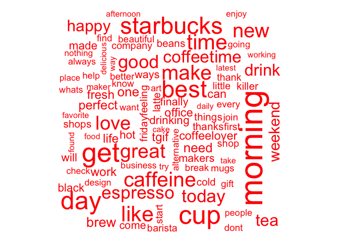
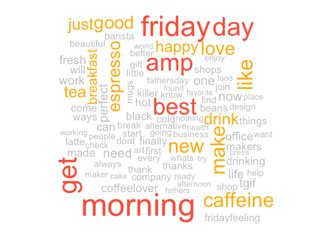

Text Mining Notes
================

Introduction
------------

The notes you are reading now are what I learned from courses, projects and other experts. I tried to give a structured overview of text mining programming in R. My goal is not to give a theoretical overview of text mining but to give practical examples with real code and real data.

As a dataset we will use tweets. I decided I could download some real tweets by myself. This could prove an interesting challenge and could give some interesting insights if we download the right tweets. To do this I followed the instructions on this websites

[Link on twitter download 1](https://www.credera.com/blog/business-intelligence/twitter-analytics-using-r-part-1-extract-tweets/) [Link on twitter download 2](http://thinktostart.com/twitter-authentification-with-r/)

Let's get the tweets
====================

Let's load the necessary libraries

``` r
library("devtools")
library("twitteR")
library("ROAuth")
```

Now to be able to download tweets you need to have a twitter account and authorize it (using special generated keys). To know how follow the instructions you can found on the page linked above. I saved my keys in a file that I access to read it. You don't have to do that, but I wanted to have a working piece of code that I can run and at the same time publish. Again, use google to find out how you can do it differently. You will understand if I don't want to put my keys here ;-)

``` r
secrets <- read.csv("/Users/umberto/Documents/Passwords and Secrets/twitter-keys.csv", stringsAsFactors = FALSE, header = TRUE, sep =",")

api_key <- secrets$api_key
api_secret <- secrets$api_secret
access_token <- secrets$access_token
access_token_secret <- secrets$access_token_secret
 

setup_twitter_oauth(api_key,api_secret)
```

    ## [1] "Using browser based authentication"

Coffee Tweets
-------------

Let's now see what we can find out on Coffee. Let's find tweets that have the hashtag Coffee (`#Coffee`) in them and let's exclude the retweets, since they will falsify our results since they contains almost always the same exact text with RT at the beginning.

``` r
search.string <- "#coffee exclude:retweets"
no.of.tweets <- 1000

c_tweets <- searchTwitter(search.string, n=no.of.tweets, lang="en")
```

Now we need to access the text of the tweets. So we do it in this way (we also need to clean up the tweets from special characters that for now we don't need, like emoticons with the `sapply` function.). At the same time let's remove all web links from the tweets, since we are not interested in having them in our wordclouds or networks.

``` r
coffee_tweets = sapply(c_tweets, function(t) t$getText())

coffee_tweets <- sapply(coffee_tweets,function(row) iconv(row, "latin1", "ASCII", sub=""))
names(coffee_tweets) <- NULL

coffee_tweets <- gsub("?(f|ht)(tp)(s?)(://)(.*)[.|/](.*)", "", coffee_tweets)

head(coffee_tweets)
```

    ## [1] "#coffeetime #coffee #morning @ Cardamom Pod Brickworks, Ferry Rd, "                                                                      
    ## [2] "Came across an old pic of me and @GuyFieri speaking at the same foodie conference. We need to hook up again man! "                       
    ## [3] "Drinking coffee, reading Harry Potter, and listening to the soundtrack to ocarina of time. Is there anything more me? #hp #zelda #coffee"
    ## [4] "Funny #coffee quote designs from #GilmoreGirls - "                                                                                       
    ## [5] "Finally a great #coffee after two weeks? #roadtrip @ Tim Hortons "                                                                       
    ## [6] "Time for a little pick me up #coffee #caffeine #basic #strength #training #squats #deadlift #push #pull "

It is interested to see how many parameters we get from the search

``` r
str(c_tweets[[1]])
```

    ## Reference class 'status' [package "twitteR"] with 17 fields
    ##  $ text         : chr "#coffeetime #coffee #morning @ Cardamom Pod Brickworks, Ferry Rd,<U+2026> https://t.co/WP1oh9QhjT"
    ##  $ favorited    : logi FALSE
    ##  $ favoriteCount: num 0
    ##  $ replyToSN    : chr(0) 
    ##  $ created      : POSIXct[1:1], format: "2017-06-16 20:48:20"
    ##  $ truncated    : logi FALSE
    ##  $ replyToSID   : chr(0) 
    ##  $ id           : chr "875817339668836353"
    ##  $ replyToUID   : chr(0) 
    ##  $ statusSource : chr "<a href=\"http://instagram.com\" rel=\"nofollow\">Instagram</a>"
    ##  $ screenName   : chr "Sammijane3"
    ##  $ retweetCount : num 0
    ##  $ isRetweet    : logi FALSE
    ##  $ retweeted    : logi FALSE
    ##  $ longitude    : chr "153.40984"
    ##  $ latitude     : chr "-27.98092"
    ##  $ urls         :'data.frame':   1 obs. of  5 variables:
    ##   ..$ url         : chr "https://t.co/WP1oh9QhjT"
    ##   ..$ expanded_url: chr "https://www.instagram.com/p/BVaheZNleGxjXTXpI6Rv-gfGG2fVoT5e9BsOKo0/"
    ##   ..$ display_url : chr "instagram.com/p/BVaheZNleGxj<U+2026>"
    ##   ..$ start_index : num 67
    ##   ..$ stop_index  : num 90
    ##  and 53 methods, of which 39 are  possibly relevant:
    ##    getCreated, getFavoriteCount, getFavorited, getId, getIsRetweet,
    ##    getLatitude, getLongitude, getReplyToSID, getReplyToSN, getReplyToUID,
    ##    getRetweetCount, getRetweeted, getRetweeters, getRetweets,
    ##    getScreenName, getStatusSource, getText, getTruncated, getUrls,
    ##    initialize, setCreated, setFavoriteCount, setFavorited, setId,
    ##    setIsRetweet, setLatitude, setLongitude, setReplyToSID, setReplyToSN,
    ##    setReplyToUID, setRetweetCount, setRetweeted, setScreenName,
    ##    setStatusSource, setText, setTruncated, setUrls, toDataFrame,
    ##    toDataFrame#twitterObj

So there is quite some possibilities here. But we are not actually interested in twitters now, but just in the text `tweetsText`. (check for example as reference this [stackoverflow post](http://stackoverflow.com/questions/14549305/searchtwitter-timestamps)).

Tea tweets
----------

Since we are going to compare corpora of text later on, we need a second set of tweets. I decided to download the first 1000 tweets on Tea

Tea Tweets
----------

``` r
search.string <- "#tea exclude:retweets"
no.of.tweets <- 1000

t_tweets <- searchTwitter(search.string, n=no.of.tweets, lang="en")
```

Now we need to access the text of the tweets. So we do it in this way (we also need to clean up the tweets from special characters that for now we don't need, like emoticons with teh `sapply` function.)

``` r
tea_tweets = sapply(t_tweets, function(t) t$getText())

tea_tweets <- sapply(tea_tweets,function(row) iconv(row, "latin1", "ASCII", sub=""))
names(tea_tweets) <- NULL

tea_tweets <- gsub("?(f|ht)(tp)(s?)(://)(.*)[.|/](.*)", "", tea_tweets)

head(tea_tweets)
```

    ## [1] "IMAGE: Hillary without Bubba "                                                                                              
    ## [2] "shark infusers a fun way to make tea "                                                                                      
    ## [3] "I want to #win the amazing #international #WithLoveforBooks #books &amp; #tea #notebook, #pillow &amp; #totebag #giveaway! "
    ## [4] "#etsy shop is back up and open for orders!!! #crystals #necklaces #tea all made to order!\n"                                
    ## [5] "Delighted to announce #TheTeaBook @theteastylist @dkpublishing has won Best #Tea Publication at #WorldTeaExpo "             
    ## [6] "lesbian #woman necklaces #loudandproud pride "

Let's start with text mining
============================

To do text mining one of the most used library (and the one I will use here) is `tm`.

``` r
library("tm")
```

First we need to create a vector of texts

``` r
coffee_source <- VectorSource(coffee_tweets)
tea_source <- VectorSource(tea_tweets)
```

Then we need to make a `VCorpus` of the list of tweets

``` r
coffee_corpus <- VCorpus(coffee_source)
tea_corpus <- VCorpus(tea_source)
coffee_corpus
```

    ## <<VCorpus>>
    ## Metadata:  corpus specific: 0, document level (indexed): 0
    ## Content:  documents: 1000

So if we want to see the text of a tweet in the corpus we can use

``` r
coffee_corpus[[15]][1]
```

    ## $content
    ## [1] "me: no more #coffee today!\n*also me* "

``` r
tea_corpus[[15]][1]
```

    ## $content
    ## [1] "IMAGE: Change for Hillary and Bill Clinton "

Cleaning text
-------------

Now that I how to make a corpus, I can focus on cleaning, or preprocessing, the text. In bag of words text mining, cleaning helps aggregate terms. For example, it may make sense that the words "miner", "mining" and "mine" should be considered one term. Specific preprocessing steps will vary based on the project. For example, the words used in tweets are vastly different than those used in legal documents, so the cleaning process can also be quite different. (Text Source: Datacamp)

Common preprocessing functions include:

-   tolower(): Make all characters lowercase
-   removePunctuation(): Remove all punctuation marks
-   removeNumbers(): Remove numbers
-   stripWhitespace(): Remove excess whitespace

Note that tolower() is part of base R, while the other three functions come from the tm package. Going forward, we'll load the tm and qdap for you when they are needed.

The **qdap** package offers other text cleaning functions. Each is useful in its own way and is particularly powerful when combined with the others.

-   bracketX(): Remove all text within brackets (e.g. "It's (so) cool" becomes "It's cool")
-   replace\_number(): Replace numbers with their word equivalents (e.g. "2" becomes "two")
-   replace\_abbreviation(): Replace abbreviations with their full text equivalents (e.g. "Sr" becomes "Senior")
-   replace\_contraction(): Convert contractions back to their base words (e.g. "shouldn't" becomes "should not")
-   replace\_symbol() Replace common symbols with their word equivalents (e.g. "$" becomes "dollar")

Stopwords
---------

Using the c() function allows you to add new words (separated by commas) to the stop words list. For example, the following would add "word1" and "word2" to the default list of English stop words:

    all_stops <- c("word1", "word2", stopwords("en"))

You can use the following command to remove stopwords

    removeWords(text, stopwords("en"))

Stemming
--------

I won't go into stemming here but I tought is worthwile mentioning it. Here is an example of stemming

``` r
stemDocument(c("computational", "computers", "computation"))
```

    ## [1] "comput" "comput" "comput"

Here is an example of using stemming

``` r
# Create complicate
complicate <- c("complicated", "complication", "complicatedly")
# Perform word stemming: stem_doc
stem_doc <- stemDocument(complicate)
# Create the completion dictionary: comp_dict
comp_dict <- "complicate"
# Perform stem completion: complete_text 
complete_text <- stemCompletion(stem_doc, comp_dict)
# Print complete_text
complete_text
```

    ##      complic      complic      complic 
    ## "complicate" "complicate" "complicate"

Clean the Corpus
================

Let's get back to our set of tweets. Let's start cleaning it. To clean the Corpus we can define a function that applies several functions on the corpus

``` r
clean_corpus <- function(corpus){
  corpus <- tm_map(corpus, stripWhitespace)
  corpus <- tm_map(corpus, removePunctuation)
  corpus <- tm_map(corpus, content_transformer(tolower))
  corpus <- tm_map(corpus, removeWords, c(stopwords("en"), "mug", "coffee", "amp","now","cafe"))
  return(corpus)
}
```

Then we can try to apply it on our coffee corpus

``` r
clean_corp <- clean_corpus(coffee_corpus)
```

Then we can pring a cleaned-up tweet

``` r
clean_corp[[227]][1]
```

    ## $content
    ## [1] "stay classy rayleigh cafetierre  classy puntastic "

and the original one

``` r
coffee_corpus[[227]][1]
```

    ## $content
    ## [1] "Stay classy Rayleigh... #cafetierre #coffee #classy #puntastic "

So we have removed special characters, punctuation and so on. Not all the words make much sense really (for example twitter usernames) but it should not be a problem since we don't expect to see them very often in our corpus.

Make a document-term matrix
---------------------------

We can use the following code to make a DTM. Each document is represented as a row and each word as a column.

``` r
coffee_dtm <- DocumentTermMatrix(clean_corp)

# Print out coffee_dtm data
print(coffee_dtm)
```

    ## <<DocumentTermMatrix (documents: 1000, terms: 3578)>>
    ## Non-/sparse entries: 7060/3570940
    ## Sparsity           : 100%
    ## Maximal term length: 34
    ## Weighting          : term frequency (tf)

``` r
# Convert coffee_dtm to a matrix: coffee_m
coffee_m <- as.matrix(coffee_dtm)

# Print the dimensions of coffee_m
dim(coffee_m)
```

    ## [1] 1000 3578

``` r
# Review a portion of the matrix
coffee_m[1:10, 253: 259]
```

    ##     Terms
    ## Docs bbcworld bbq bbqsauce beach beaches beancentric beans
    ##   1         0   0        0     0       0           0     0
    ##   2         0   0        0     0       0           0     0
    ##   3         0   0        0     0       0           0     0
    ##   4         0   0        0     0       0           0     0
    ##   5         0   0        0     0       0           0     0
    ##   6         0   0        0     0       0           0     0
    ##   7         0   0        0     0       0           0     0
    ##   8         0   0        0     0       0           0     0
    ##   9         0   0        0     0       0           0     0
    ##   10        0   0        0     0       0           0     0

Make a document-term matrix (DTM)
---------------------------------

You can also transpose a TDM, to have each word as a row and each column as a document.

``` r
# Create a TDM from clean_corp: coffee_tdm
coffee_tdm <- TermDocumentMatrix(clean_corp)

# Print coffee_tdm data
print(coffee_tdm)
```

    ## <<TermDocumentMatrix (terms: 3578, documents: 1000)>>
    ## Non-/sparse entries: 7060/3570940
    ## Sparsity           : 100%
    ## Maximal term length: 34
    ## Weighting          : term frequency (tf)

``` r
# Convert coffee_tdm to a matrix: coffee_m
coffee_m <- as.matrix(coffee_tdm)

# Print the dimensions of the matrix
dim(coffee_m)
```

    ## [1] 3578 1000

``` r
# Review a portion of the matrix
coffee_m[2587:2590, 148:150]
```

    ##             Docs
    ## Terms        148 149 150
    ##   rccoffeeuk   0   0   0
    ##   reached      0   0   0
    ##   react        0   0   0
    ##   reactions    0   0   0

Frequent terms with tm
----------------------

Now that you know how to make a term-document matrix, as well as its transpose, the document-term matrix, we will use it as the basis for some analysis. In order to analyze it we need to change it to a simple matrix.

Calling `rowSums()` on your newly made matrix aggregates all the terms used in a passage. Once you have the `rowSums()`, you can `sort()` them with `decreasing = TRUE`, so you can focus on the most common terms.

Lastly, you can make a barplot() of the top 5 terms of term\_frequency with the following code (we will make something prettier later on with ggplot2).

    barplot(term_frequency[1:5], col = "#C0DE25")

So let's try with out coffee tweets

``` r
## coffee_tdm is still loaded in your workspace

# Create a matrix: coffee_m
coffee_m <- as.matrix(coffee_tdm)

# Calculate the rowSums: term_frequency
term_frequency <- rowSums(coffee_m)

# Sort term_frequency in descending order
term_frequency <- sort(term_frequency, decreasing = TRUE)

# View the top 10 most common words
term_frequency[1:10]
```

    ##   morning    friday       get       cup       day      best starbucks 
    ##        61        54        50        48        46        43        43 
    ##      like      time  caffeine 
    ##        38        38        36

``` r
# Plot a barchart of the 10 most common words
barplot(term_frequency[1:10], col = "tan", las = 2)
```

 Now let's make it a bit prettier with **ggplot2**...

``` r
library(ggplot2)
```

``` r
library(dplyr)

tf <- as.data.frame(term_frequency)
tf$words <- row.names(tf)
tf10 <- as.data.frame(tf[1:10,])

# We need to make the words factors (ordered) otherwise ggplot2 will order the 
# x axis alphabetically
tf10 <- mutate(tf10, words = factor(words, words))

ggplot(tf10, aes(x = tf10$words , y = tf10$term_frequency   )) + geom_bar(stat = "identity", fill = "tan", col = "black")+ theme_grey()+theme(text = element_text(size=16),  axis.title.x=element_blank(),axis.text.x=element_text(angle=90,hjust=1,vjust=0.5))+ylab("Words Frequency") 
```


Note that the knitr button command don't work from Rstudio if you want to use `knitr`. So the solution is to do it from the console with the following commands

``` r
library(rmarkdown)
render("/Users/umberto/Documents/Education/Data Camp/Text Mining/Text-Mining-Notes/text-mining-notes.Rmd")
```

The command will render an html file in the directory where the `Rmd` file is.

``` r
library(rJava)
library(qdap)
```

Let's build a word frequency plot with `qdap` library (note that we are not working with our cleaned up corpus, and therefore we will see different words).

``` r
frequency <- freq_terms(coffee_tweets, top = 10, at.least = 3, stopwords = "Top200Words")

frequency <- mutate(frequency, WORD = factor(WORD, WORD))

ggplot(frequency, aes(x = frequency$WORD , y = frequency$FREQ   )) + geom_bar(stat = "identity", fill = "tan", col = "black")+ theme_grey()+theme(text = element_text(size=16),  axis.title.x=element_blank(),axis.text.x=element_text(angle=90,hjust=1,vjust=0.5))+ylab("Words Frequency") 
```

 Now let's remove more stopwords (now it looks similar to what we obtained at the beginning)

``` r
frequency2 <- freq_terms(coffee_tweets, top = 10, at.least = 3, stopwords = c(tm::stopwords("english"),"coffee","httpstco","amp","now","cafe"))

frequency2 <- mutate(frequency2, WORD = factor(WORD, WORD))

ggplot(frequency2, aes(x = frequency2$WORD , y = frequency2$FREQ   )) + geom_bar(stat = "identity", fill = "tan", col = "black")+ theme_grey()+theme(text = element_text(size=16),  axis.title.x=element_blank(),axis.text.x=element_text(angle=90,hjust=1,vjust=0.5))+ylab("Words Frequency") 
```


Wordclouds
----------

A very cool way of visualizing frequency of words, are the "wordcloud". You will always get a wow effect when showing it to people. To build beatiful clouds you will need the library `wordcloud`. Here is an example

``` r
library(wordcloud)

term_frequency[1:10]
```

    ##   morning    friday       get       cup       day      best starbucks 
    ##        61        54        50        48        46        43        43 
    ##      like      time  caffeine 
    ##        38        38        36

``` r
word_freqs <- data.frame(term = names(term_frequency), num = term_frequency)
wordcloud(word_freqs$term, word_freqs$num, max.words = 100, colors = "red")
```

    ## Warning in wordcloud(word_freqs$term, word_freqs$num, max.words = 100,
    ## colors = "red"): breakfast could not be fit on page. It will not be
    ## plotted.

    ## Warning in wordcloud(word_freqs$term, word_freqs$num, max.words = 100,
    ## colors = "red"): friday could not be fit on page. It will not be plotted.

    ## Warning in wordcloud(word_freqs$term, word_freqs$num, max.words = 100,
    ## colors = "red"): just could not be fit on page. It will not be plotted.

    ## Warning in wordcloud(word_freqs$term, word_freqs$num, max.words = 100,
    ## colors = "red"): portable could not be fit on page. It will not be plotted.

    ## Warning in wordcloud(word_freqs$term, word_freqs$num, max.words = 100,
    ## colors = "red"): absolute could not be fit on page. It will not be plotted.

    ## Warning in wordcloud(word_freqs$term, word_freqs$num, max.words = 100,
    ## colors = "red"): coldbrew could not be fit on page. It will not be plotted.

    ## Warning in wordcloud(word_freqs$term, word_freqs$num, max.words = 100,
    ## colors = "red"): ready could not be fit on page. It will not be plotted.



Now we need to remove some words that are clear are appearing while talking about coffee

``` r
# Add new stop words to clean_corpus()
clean_corpus <- function(corpus){
  corpus <- tm_map(corpus, removePunctuation)
  corpus <- tm_map(corpus, stripWhitespace)
  corpus <- tm_map(corpus, removeNumbers)
  corpus <- tm_map(corpus, content_transformer(tolower))
  corpus <- tm_map(corpus, removeWords, 
                   c(stopwords("en"), "brew", "cafe", "coffeetime", "cup", "coffee"))
  return(corpus)
}

clean_coffee <- clean_corpus(coffee_corpus)
coffee_tdm <- TermDocumentMatrix(clean_coffee)
coffee_m <- as.matrix(coffee_tdm)
coffee_words <- rowSums(coffee_m)
```

Now we prepare the right order of words for the wordcloud

``` r
coffee_words <- sort(coffee_words, decreasing = TRUE)
coffee_words[1:6]
```

    ## morning  friday     get     day     amp    best 
    ##      61      54      50      48      45      43

``` r
coffee_freqs <- data.frame (term = names(coffee_words), num = coffee_words)

wordcloud(coffee_freqs$term, coffee_freqs$num, max.words = 50, colors = "red")
```

    ## Warning in wordcloud(coffee_freqs$term, coffee_freqs$num, max.words = 50, :
    ## morning could not be fit on page. It will not be plotted.


### Improve word colours

``` r
wordcloud(coffee_freqs$term, coffee_freqs$num, max.words = 100, colors = c("grey80", "darkgoldenrod1", "tomato"))
```

    ## Warning in wordcloud(coffee_freqs$term, coffee_freqs$num, max.words =
    ## 100, : time could not be fit on page. It will not be plotted.

    ## Warning in wordcloud(coffee_freqs$term, coffee_freqs$num, max.words =
    ## 100, : today could not be fit on page. It will not be plotted.

    ## Warning in wordcloud(coffee_freqs$term, coffee_freqs$num, max.words =
    ## 100, : starbucks could not be fit on page. It will not be plotted.

    ## Warning in wordcloud(coffee_freqs$term, coffee_freqs$num, max.words =
    ## 100, : portable could not be fit on page. It will not be plotted.

    ## Warning in wordcloud(coffee_freqs$term, coffee_freqs$num, max.words =
    ## 100, : great could not be fit on page. It will not be plotted.

    ## Warning in wordcloud(coffee_freqs$term, coffee_freqs$num, max.words =
    ## 100, : coldbrew could not be fit on page. It will not be plotted.

    ## Warning in wordcloud(coffee_freqs$term, coffee_freqs$num, max.words =
    ## 100, : absolute could not be fit on page. It will not be plotted.

    ## Warning in wordcloud(coffee_freqs$term, coffee_freqs$num, max.words =
    ## 100, : mug could not be fit on page. It will not be plotted.

    ## Warning in wordcloud(coffee_freqs$term, coffee_freqs$num, max.words =
    ## 100, : weekend could not be fit on page. It will not be plotted.



Now let's improve even more on the colors. To do that we will need to use RColorBrewer. RColorBrewer color schemes are organized into three categories:

-   Sequential: Colors ascend from light to dark in sequence
-   Qualitative: Colors are chosen for their pleasing qualities together
-   Diverging: Colors have two distinct color spectra with lighter colors in between

To change the colors parameter of the `wordcloud()` function you can use a select a palette from `RColorBrewer` such as "Greens". The function `display.brewer.all()` will list all predefined color palettes. More information on ColorBrewer (the framework behind RColorBrewer) is available on its [website](http://www.colorbrewer.org/). (Source: datacamp)

The function `brewer.pal()` allows you to select colors from a palette. Specify the number of distinct colors needed (e.g. 8) and the predefined palette to select from (e.g. "Greens"). Often in word clouds, very faint colors are washed out so it may make sense to remove the first couple from a brewer.pal() selection, leaving only the darkest.

Here's an example:

    green_pal <- brewer.pal(8, "Greens")
    green_pal <- green_pal[-(1:2)]

Then just add that object to the wordcloud() function.

    wordcloud(chardonnay_freqs$term, chardonnay_freqs$num, max.words = 100, colors = green_pal)

The command `display.brewer.all()` will display all palettes. Is a very cool command

``` r
display.brewer.all()
```


Let's try to use the `PuOr` palette

``` r
# Create purple_orange
PuOr <- brewer.pal(10, "PuOr")
purple_orange <- PuOr[-(1:2)]
```

And now we can create the wordcloud woith this palette

``` r
wordcloud(coffee_freqs$term, coffee_freqs$num, max.words = 100, colors = purple_orange)
```

    ## Warning in wordcloud(coffee_freqs$term, coffee_freqs$num, max.words =
    ## 100, : absolute could not be fit on page. It will not be plotted.

    ## Warning in wordcloud(coffee_freqs$term, coffee_freqs$num, max.words =
    ## 100, : friday could not be fit on page. It will not be plotted.

    ## Warning in wordcloud(coffee_freqs$term, coffee_freqs$num, max.words =
    ## 100, : get could not be fit on page. It will not be plotted.

    ## Warning in wordcloud(coffee_freqs$term, coffee_freqs$num, max.words =
    ## 100, : starbucks could not be fit on page. It will not be plotted.


Weel it seems that people talking about coffee are talking also about "morning". Make sense. When is Coffee important if not on the morning?

Sometimes not all the words can be plotted. In this case the only solutions are to reduce the number of words or to reduce the scale of the words themselves. For example

``` r
wordcloud(coffee_freqs$term, coffee_freqs$num, max.words = 100, colors = purple_orange, scale = c(2,0.3))
```


Wordclouds with bigrams
-----------------------

Now sometimes single words don't tell the entire story and is interesting to do the same plot with bigrams (words that appear together in the corpus). The tokenizer from `RWeka` is very useful.

``` r
library(RWeka)
```

Then we need to get the couples of words (note that the definition give below will give you **only** bigrams, and not single words anymore).

``` r
BigramTokenizer <- function(x) NGramTokenizer(x, Weka_control(min = 1, max = 2))
tdm.bigram <- TermDocumentMatrix(clean_corp, control = list(tokenize = BigramTokenizer))
```

Then we can get the frequencies of the bigrams

``` r
freq <- sort(rowSums(as.matrix(tdm.bigram)), decreasing = TRUE)
freq.df <- data.frame(word = names(freq), freq= freq)
head(freq.df)
```

    ##            word freq
    ## morning morning   61
    ## friday   friday   54
    ## get         get   50
    ## cup         cup   48
    ## day         day   46
    ## best       best   43

Now we can plot the wordcloud

``` r
wordcloud(freq.df$word, freq.df$freq, max.words = 50, random.order = F, colors = purple_orange, scale = c(4,0.7))
```

    ## Warning in wordcloud(freq.df$word, freq.df$freq, max.words = 50,
    ## random.order = F, : ways make could not be fit on page. It will not be
    ## plotted.


Apparently not many bigrams appear so frequently. The only one is "good morning". It makes again sense...

We need of course first to do a different cleanup of the bigrams list. But that is something that goes beyond the notes I am writing. An important point is that if you remove all stop words like "not" you may loose important informations for bigrams (like negations).

Trigrams
--------

Just as a reference here is the code to do wordclouds with trigrams and bigrams

``` r
TrigramTokenizer <- function(x) NGramTokenizer(x, Weka_control(min = 2, max = 3))
tdm.trigram <- TermDocumentMatrix(clean_corp, control = list(tokenize= TrigramTokenizer))

freq <- sort(rowSums(as.matrix(tdm.trigram)), decreasing = TRUE)
freq.df <- data.frame(word = names(freq), freq= freq)
head(freq.df)
```

    ##                                  word freq
    ## absolute best           absolute best   21
    ## absolute best ways absolute best ways   14
    ## best ways                   best ways   14
    ## best ways make         best ways make   14
    ## go portable               go portable   14
    ## go portable makers go portable makers   14

``` r
wordcloud(freq.df$word, freq.df$freq, max.words = 40, random.order = F, colors = purple_orange, scale = c(3,0.7))
```

    ## Warning in wordcloud(freq.df$word, freq.df$freq, max.words = 40,
    ## random.order = F, : good morning could not be fit on page. It will not be
    ## plotted.

    ## Warning in wordcloud(freq.df$word, freq.df$freq, max.words = 40,
    ## random.order = F, : absolute best service could not be fit on page. It will
    ## not be plotted.

    ## Warning in wordcloud(freq.df$word, freq.df$freq, max.words = 40,
    ## random.order = F, : best service sumato could not be fit on page. It will
    ## not be plotted.

    ## Warning in wordcloud(freq.df$word, freq.df$freq, max.words = 40,
    ## random.order = F, : coffeenews findthelittleman could not be fit on page.
    ## It will not be plotted.

    ## Warning in wordcloud(freq.df$word, freq.df$freq, max.words = 40,
    ## random.order = F, : company finally found could not be fit on page. It will
    ## not be plotted.

    ## Warning in wordcloud(freq.df$word, freq.df$freq, max.words = 40,
    ## random.order = F, : desperate homebased could not be fit on page. It will
    ## not be plotted.

    ## Warning in wordcloud(freq.df$word, freq.df$freq, max.words = 40,
    ## random.order = F, : desperate homebased business could not be fit on page.
    ## It will not be plotted.

    ## Warning in wordcloud(freq.df$word, freq.df$freq, max.words = 40,
    ## random.order = F, : distracted desperate could not be fit on page. It will
    ## not be plotted.

    ## Warning in wordcloud(freq.df$word, freq.df$freq, max.words = 40,
    ## random.order = F, : finally found absolute could not be fit on page. It
    ## will not be plotted.

    ## Warning in wordcloud(freq.df$word, freq.df$freq, max.words = 40,
    ## random.order = F, : findthelittleman quote could not be fit on page. It
    ## will not be plotted.

    ## Warning in wordcloud(freq.df$word, freq.df$freq, max.words = 40,
    ## random.order = F, : findthelittleman quote quoteoftheday could not be fit
    ## on page. It will not be plotted.

    ## Warning in wordcloud(freq.df$word, freq.df$freq, max.words = 40,
    ## random.order = F, : force distracted could not be fit on page. It will not
    ## be plotted.

    ## Warning in wordcloud(freq.df$word, freq.df$freq, max.words = 40,
    ## random.order = F, : force distracted desperate could not be fit on page. It
    ## will not be plotted.

    ## Warning in wordcloud(freq.df$word, freq.df$freq, max.words = 40,
    ## random.order = F, : found absolute could not be fit on page. It will not be
    ## plotted.

    ## Warning in wordcloud(freq.df$word, freq.df$freq, max.words = 40,
    ## random.order = F, : found absolute best could not be fit on page. It will
    ## not be plotted.

    ## Warning in wordcloud(freq.df$word, freq.df$freq, max.words = 40,
    ## random.order = F, : homebased business owners could not be fit on page. It
    ## will not be plotted.

    ## Warning in wordcloud(freq.df$word, freq.df$freq, max.words = 40,
    ## random.order = F, : quote quoteoftheday could not be fit on page. It will
    ## not be plotted.

    ## Warning in wordcloud(freq.df$word, freq.df$freq, max.words = 40,
    ## random.order = F, : shops alternative could not be fit on page. It will not
    ## be plotted.

 Words are long so not all could be written in the plot. You have to choose between something that is not readable and something that has less words...

Common Words between Corpora
============================

To find common words we need to create two "big" documents of tweets. We need to collapse all tweets together separated by a space

``` r
all_coffee <- paste (coffee_tweets, collapse = " ")
all_tea <- paste (tea_tweets,collapse = " ")
all_tweets <- c(all_coffee, all_tea)
```

Now we convert to a Corpus

``` r
# Convert to a vector source
all_tweets <- VectorSource(all_tweets)

# Create all_corpus
all_corpus <- VCorpus(all_tweets)
```

Now that we have a corpus filled with words used in both the tea and coffee tweets files, we can clean the corpus, convert it into a TermDocumentMatrix, and then a matrix to prepare it for a commonality.cloud(). First we need to define a proper cleaning function that contains words like *coffee* and *tea*

``` r
clean_corpus <- function(corpus){
  corpus <- tm_map(corpus, stripWhitespace)
  corpus <- tm_map(corpus, removePunctuation)
  corpus <- tm_map(corpus, content_transformer(tolower))
  corpus <- tm_map(corpus, removeWords, c(stopwords("en"), "mug", "coffee", "tea", "amp", "cup"))
  return(corpus)
}
```

Let's clean the corpus

``` r
# Clean the corpus
all_clean <- clean_corpus (all_corpus)

# Create all_tdm
all_tdm <- TermDocumentMatrix(all_clean) 

# Create all_m
all_m <- as.matrix(all_tdm)
```

Now the communality cloud

``` r
commonality.cloud(all_m, max.words = 100, colors = "steelblue1")
```

    ## Warning in wordcloud(rownames(term.matrix)[freq > 0], freq[freq > 0],
    ## min.freq = 0, : time could not be fit on page. It will not be plotted.

    ## Warning in wordcloud(rownames(term.matrix)[freq > 0], freq[freq > 0],
    ## min.freq = 0, : make could not be fit on page. It will not be plotted.

    ## Warning in wordcloud(rownames(term.matrix)[freq > 0], freq[freq > 0],
    ## min.freq = 0, : good could not be fit on page. It will not be plotted.


Comparison Cloud
----------------

You can plot a comparison cloud in this way

``` r
comparison.cloud(all_m, max.words = 50, colors = c("orange", "blue"), scale = c(3,0.5))
```


(Source Datacamp) A commonality.cloud() may be misleading since words could be represented disproportionately in one corpus or the other, even if they are shared. In the commonality cloud, they would show up without telling you which one of the corpora has more term occurrences.

To solve this problem, we can create a `pyramid.plot()` from the `plotrix` package.

``` r
library(plotrix)
```

``` r
all_tdm_m <- all_m
# Create common_words
common_words <- subset(all_tdm_m, all_tdm_m[, 1] > 0 & all_tdm_m[, 2] > 0)

# Create difference
difference <- abs(common_words[, 1] - common_words[, 2])

# Combine common_words and difference
common_words <- cbind(common_words, difference)

# Order the data frame from most differences to least
common_words <- common_words[order(common_words[, 3], decreasing = TRUE), ]

# Create top25_df
top25_df <- data.frame(x = common_words[1:25, 1], 
                       y = common_words[1:25, 2], 
                       labels = rownames(common_words[1:25, ]))

# Create the pyramid plot
pyramid.plot(top25_df$x, top25_df$y,
             labels = top25_df$labels, gap = 60,
             top.labels = c("Coffee", "Words", "Tea"),
             main = "Words in Common", laxlab = NULL, 
             raxlab = NULL, unit = NULL)
```


    ## [1] 5.1 4.1 4.1 2.1

Word Networks
-------------

In a network graph, the circles are called nodes and represent individual terms, while the lines connecting the circles are called edges and represent the connections between the terms.

For the over-caffeinated text miner, qdap provides a shorcut for making word networks. The word\_network\_plot() and word\_associate() functions both make word networks easy!

``` r
word_associate(coffee_tweets, match.string = c("books"), 
               stopwords = Top200Words, 
               network.plot = TRUE)
```

    ## Warning in text2color(words = V(g)$label, recode.words = target.words,
    ## colors = label.colors): length of colors should be 1 more than length of
    ## recode.words


    ##   row group unit text                                                                                                                
    ## 1  57   all   57 #FridayFeeling #FridayReads wE #amreading some good #books and drinking plenty of #coffee @trifectapublish          
    ## 2 155   all  155 Retweet if you agree! #trainwithjc #theplaybooks #fitness #coffee #goodmorning#fatloss                              
    ## 3 438   all  438 Step into History with BLACKHEART, a Pirate!#coffee #books #StoryFriday #fantasy #book #Readers #literature         
    ## 4 540   all  540 Join the conversation! | What books are going in your beach bag this summer?                                        
    ## 5 541   all  541 More inking in progress, second capuchino round :) @foylesforbooks #reiq #coffeeshop #ink #coffee #drawing #boobs...
    ## 6 651   all  651 A cup of coffee and a book to edit. Bliss. #amediting #books #coffee #friday                                        
    ## 7 961   all  961 It doesn't get much better than this #book #bookworm #books #instadaily #starbucks #coffee

    ## 
    ## Match Terms
    ## ===========

    ## 
    ## List 1:
    ## books, theplaybooks, foylesforbooks

    ## 

Distance Matrix and Dendograms
==============================

First let's limit the number of words in your TDM using removeSparseTerms() from tm. Why would you want to adjust the sparsity of the TDM/DTM?

TDMs and DTMs are sparse, meaning they contain mostly zeros. Remember that 1000 tweets can become a TDM with over 3000 terms! You won't be able to easily interpret a dendrogram that is so cluttered, especially if you are working on more text.

A good TDM has between 25 and 70 terms. The lower the sparse value, the more terms are kept. The closer it is to 1, the fewer are kept. This value is a percentage cutoff of zeros for each term in the TDM.

Let's see the dimensions of your coffee tdm

``` r
dim(coffee_tdm)
```

    ## [1] 3509 1000

Let's remove some terms

``` r
coffee_tdm1 <- removeSparseTerms(coffee_tdm, sparse = 0.97)
dim(coffee_tdm1)
```

    ## [1]   14 1000

Let's see a dendrogram now

``` r
coffee_tdm1_m <- as.matrix(coffee_tdm1)
coffee_tdm1_df <- as.data.frame(coffee_tdm1_m)  
coffee_dist <- dist(coffee_tdm1_df)

coffee_hc <- hclust(coffee_dist)
plot(coffee_hc)
```


Now let's make the dendrogram more appealing

``` r
library(dendextend)
```

Now

``` r
hcd <- as.dendrogram(coffee_hc)
labels(hcd)
```

    ##  [1] "morning"   "friday"    "starbucks" "get"       "amp"      
    ##  [6] "day"       "best"      "make"      "caffeine"  "time"     
    ## [11] "like"      "new"       "great"     "love"

Now let's work on the appearance

``` r
hcd <- branches_attr_by_labels(hcd, c("mondaymorning", "work"), "red")
```

    ## Warning in branches_attr_by_labels(hcd, c("mondaymorning", "work"), "red"): Not all of the labels you provided are included in the dendrogram.
    ## The following labels were omitted:mondaymorningwork

``` r
plot(hcd, main = "Better Dendrogram")
```

 Now let's add rectangular shapes around the clusters

``` r
# Add cluster rectangles 
plot(hcd, main = "Better Dendrogram")
rect.dendrogram(hcd, k = 2, border = "grey50")
```


Word Associations
=================

Another way to think about word relationships is with the findAssocs() function in the tm package. For any given word, findAssocs() calculates its correlation with every other word in a TDM or DTM. Scores range from 0 to 1. A score of 1 means that two words always appear together, while a score of 0 means that they never appear together.

To use findAssocs() pass in a TDM or DTM, the search term, and a minimum correlation. The function will return a list of all other terms that meet or exceed the minimum threshold.

    findAssocs(tdm, "word", 0.25)

``` r
# Create associations
associations <- findAssocs(coffee_tdm, "starbucks", 0.2)

# View the venti associations
print(associations)
```

    ## $starbucks
    ##     frappuccino         boycott   cafecoffeeday        calories 
    ##            0.33            0.27            0.27            0.27 
    ##           carry coffeeloversmag      colinsnoke      exoduskate 
    ##            0.27            0.27            0.27            0.27 
    ##       extremely          frappe             giv          guilty 
    ##            0.27            0.27            0.27            0.27 
    ##          lately           peach   starbucksnews       switching 
    ##            0.27            0.27            0.27            0.27 
    ##         tumbler           voice       whitegirl 
    ##            0.27            0.27            0.27

As you can see, some more serious cleaning of the text should be done to gain real interesting insights.

``` r
library(ggthemes)

# Create associations_df
associations_df <- list_vect2df(associations)[,2:3]

# Plot the associations_df values (don't change this)
ggplot(associations_df, aes(y = associations_df[, 1])) + 
  geom_point(aes(x = associations_df[, 2]), 
             data = associations_df, size = 3) + 
  theme_gdocs()
```


Similarity matrix
=================

Another very useful thing to calculate is the similarity matrix between tweets. I won't explain here what it is, but show how to calculate it. I will use the cosine distance here (note that the following piece of code may take sometime, since it must calculate one million of values)

``` r
require(proxy)

coffee_tdm_m <- as.matrix(coffee_tdm)

coffee_cosine_dist_mat <- as.matrix(dist(coffee_tdm_m, method = "cosine"))
```

what dimensions we have in this matrix?

``` r
dim(coffee_cosine_dist_mat)
```

    ## [1] 3509 3509

as expected. Let's check some rows

``` r
coffee_cosine_dist_mat[1:5,1:5]
```

    ##            aaaaa aantrenton ability able abm
    ## aaaaa          0          1       1    1   1
    ## aantrenton     1          0       1    1   1
    ## ability        1          1       0    1   1
    ## able           1          1       1    0   1
    ## abm            1          1       1    1   0

We can do the same calculations using the fact we have sparse matrices

``` r
library(slam)
cosine_dist_mat <- crossprod_simple_triplet_matrix(coffee_tdm)/(sqrt(col_sums(coffee_tdm^2) %*% t(col_sums(coffee_tdm^2))))
```

``` r
cosine_dist_mat[1:15,1:15]
```

    ##     Docs
    ## Docs 1 2          3 4         5          6          7 8 9 10 11        12
    ##   1  1 0 0.00000000 0 0.0000000 0.00000000 0.00000000 0 0  0  0 0.0000000
    ##   2  0 1 0.00000000 0 0.0000000 0.00000000 0.00000000 0 0  0  0 0.0000000
    ##   3  0 0 1.00000000 0 0.0000000 0.09534626 0.09534626 0 0  0  0 0.1414214
    ##   4  0 0 0.00000000 1 0.0000000 0.00000000 0.00000000 0 0  0  0 0.0000000
    ##   5  0 0 0.00000000 0 1.0000000 0.00000000 0.00000000 0 0  0  0 0.0000000
    ##   6  0 0 0.09534626 0 0.0000000 1.00000000 1.00000000 0 0  0  0 0.0000000
    ##   7  0 0 0.09534626 0 0.0000000 1.00000000 1.00000000 0 0  0  0 0.0000000
    ##   8  0 0 0.00000000 0 0.0000000 0.00000000 0.00000000 1 0  0  0 0.0000000
    ##   9  0 0 0.00000000 0 0.0000000 0.00000000 0.00000000 0 1  0  0 0.0000000
    ##   10 0 0 0.00000000 0 0.0000000 0.00000000 0.00000000 0 0  1  0 0.0000000
    ##   11 0 0 0.00000000 0 0.0000000 0.00000000 0.00000000 0 0  0  1 0.0000000
    ##   12 0 0 0.14142136 0 0.0000000 0.00000000 0.00000000 0 0  0  0 1.0000000
    ##   13 0 0 0.00000000 0 0.1195229 0.00000000 0.00000000 0 0  0  0 0.0000000
    ##   14 0 0 0.00000000 0 0.0000000 0.00000000 0.00000000 0 0  0  0 0.0000000
    ##   15 0 0 0.00000000 0 0.0000000 0.00000000 0.00000000 0 0  0  0 0.0000000
    ##     Docs
    ## Docs        13 14 15
    ##   1  0.0000000  0  0
    ##   2  0.0000000  0  0
    ##   3  0.0000000  0  0
    ##   4  0.0000000  0  0
    ##   5  0.1195229  0  0
    ##   6  0.0000000  0  0
    ##   7  0.0000000  0  0
    ##   8  0.0000000  0  0
    ##   9  0.0000000  0  0
    ##   10 0.0000000  0  0
    ##   11 0.0000000  0  0
    ##   12 0.0000000  0  0
    ##   13 1.0000000  0  0
    ##   14 0.0000000  1  0
    ##   15 0.0000000  0  1

Tweets 14 and 4 seems similar. Let's check them

``` r
print(coffee_tweets[[14]])
```

    ## [1] "The Melndez family has been growing #coffee for 35 years. They joined the MAS project to improve farming practices "

``` r
print(coffee_tweets[[5]])
```

    ## [1] "Finally a great #coffee after two weeks? #roadtrip @ Tim Hortons "

Bag of words
============

``` r
my.tdm <- TermDocumentMatrix(coffee_corpus, control = list(weighting = weightTfIdf))
```

    ## Warning in weighting(x): empty document(s): 88 253 261 269 383 712 999

``` r
my.dtm <- DocumentTermMatrix(coffee_corpus, control = list(weighting = weightTfIdf, stopwords = TRUE))
```

    ## Warning in weighting(x): empty document(s): 88 253 261 269 383 712 999

``` r
inspect(my.dtm)
```

    ## <<DocumentTermMatrix (documents: 1000, terms: 4355)>>
    ## Non-/sparse entries: 8463/4346537
    ## Sparsity           : 100%
    ## Maximal term length: 41
    ## Weighting          : term frequency - inverse document frequency (normalized) (tf-idf)
    ## Sample             :
    ##      Terms
    ## Docs  #coffee &amp; best coffee cup get good like morning new
    ##   239       0     0    0      0   0   0    0    0       0   0
    ##   248       0     0    0      0   0   0    0    0       0   0
    ##   303       0     0    0      0   0   0    0    0       0   0
    ##   315       0     0    0      0   0   0    0    0       0   0
    ##   35        0     0    0      0   0   0    0    0       0   0
    ##   611       0     0    0      0   0   0    0    0       0   0
    ##   730       0     0    0      0   0   0    0    0       0   0
    ##   741       0     0    0      0   0   0    0    0       0   0
    ##   876       0     0    0      0   0   0    0    0       0   0
    ##   914       0     0    0      0   0   0    0    0       0   0

Let's find (for example) all words that appear twice in any document

``` r
findFreqTerms(my.tdm, 200)
```

    ## character(0)

``` r
cosine_dist_mat <- crossprod_simple_triplet_matrix(my.tdm)/(sqrt(col_sums(my.tdm^2) %*% t(col_sums(my.tdm^2))))
cosine_dist_mat[1:5,1:5]
```

    ##     Docs
    ## Docs            1          2            3            4            5
    ##    1 1.0000000000 0.00000000 0.0002719644 0.0004584799 0.0003876743
    ##    2 0.0000000000 1.00000000 0.0100140272 0.0000000000 0.0000000000
    ##    3 0.0002719644 0.01001403 1.0000000000 0.0003139556 0.0002654697
    ##    4 0.0004584799 0.00000000 0.0003139556 1.0000000000 0.0004475311
    ##    5 0.0003876743 0.00000000 0.0002654697 0.0004475311 1.0000000000

``` r
y <- which(cosine_dist_mat>0.5, arr.in = TRUE)
str(y)
```

    ##  int [1:1411, 1:2] 1 2 3 4 5 6 7 6 7 8 ...
    ##  - attr(*, "dimnames")=List of 2
    ##   ..$ : chr [1:1411] "1" "2" "3" "4" ...
    ##   ..$ : chr [1:2] "Docs" "Docs"

``` r
y
```

    ##      Docs Docs
    ## 1       1    1
    ## 2       2    2
    ## 3       3    3
    ## 4       4    4
    ## 5       5    5
    ## 6       6    6
    ## 7       7    6
    ## 6       6    7
    ## 7       7    7
    ## 8       8    8
    ## 9       9    9
    ## 10     10   10
    ## 11     11   11
    ## 12     12   12
    ## 13     13   13
    ## 14     14   14
    ## 15     15   15
    ## 16     16   16
    ## 17     17   17
    ## 18     18   18
    ## 19     19   19
    ## 20     20   20
    ## 21     21   21
    ## 22     22   22
    ## 23     23   23
    ## 24     24   24
    ## 25     25   25
    ## 26     26   26
    ## 27     27   27
    ## 28     28   28
    ## 29     29   29
    ## 30     30   30
    ## 31     31   31
    ## 32     32   32
    ## 33     33   33
    ## 34     34   34
    ## 35     35   35
    ## 36     36   36
    ## 100   100   36
    ## 110   110   36
    ## 175   175   36
    ## 37     37   37
    ## 38     38   38
    ## 39     39   39
    ## 40     40   40
    ## 41     41   41
    ## 42     42   42
    ## 43     43   43
    ## 44     44   44
    ## 45     45   45
    ## 46     46   46
    ## 47     47   47
    ## 48     48   48
    ## 49     49   49
    ## 50     50   50
    ## 100   100   50
    ## 175   175   50
    ## 51     51   51
    ## 52     52   52
    ## 53     53   53
    ## 54     54   54
    ## 55     55   55
    ## 56     56   56
    ## 57     57   57
    ## 58     58   58
    ## 59     59   59
    ## 60     60   60
    ## 61     61   61
    ## 62     62   62
    ## 63     63   63
    ## 64     64   64
    ## 65     65   65
    ## 66     66   66
    ## 67     67   67
    ## 68     68   68
    ## 69     69   68
    ## 68     68   69
    ## 69     69   69
    ## 70     70   70
    ## 71     71   71
    ## 72     72   72
    ## 73     73   73
    ## 74     74   74
    ## 811   811   74
    ## 75     75   75
    ## 76     76   76
    ## 77     77   77
    ## 78     78   78
    ## 963   963   78
    ## 79     79   79
    ## 80     80   80
    ## 81     81   81
    ## 82     82   82
    ## 83     83   83
    ## 84     84   84
    ## 85     85   85
    ## 86     86   86
    ## 87     87   87
    ## 89     89   89
    ## 90     90   90
    ## 91     91   91
    ## 92     92   92
    ## 93     93   93
    ## 94     94   94
    ## 95     95   95
    ## 96     96   96
    ## 97     97   97
    ## 98     98   98
    ## 356   356   98
    ## 99     99   99
    ## 36     36  100
    ## 50     50  100
    ## 100   100  100
    ## 110   110  100
    ## 175   175  100
    ## 101   101  101
    ## 102   102  102
    ## 103   103  103
    ## 104   104  104
    ## 105   105  105
    ## 106   106  106
    ## 107   107  107
    ## 108   108  108
    ## 109   109  109
    ## 36     36  110
    ## 100   100  110
    ## 110   110  110
    ## 175   175  110
    ## 111   111  111
    ## 112   112  112
    ## 113   113  113
    ## 114   114  114
    ## 115   115  115
    ## 116   116  116
    ## 117   117  117
    ## 118   118  118
    ## 119   119  119
    ## 120   120  120
    ## 122   122  120
    ## 121   121  121
    ## 120   120  122
    ## 122   122  122
    ## 123   123  123
    ## 124   124  124
    ## 125   125  125
    ## 126   126  126
    ## 127   127  126
    ## 126   126  127
    ## 127   127  127
    ## 128   128  128
    ## 129   129  129
    ## 130   130  130
    ## 131   131  131
    ## 132   132  132
    ## 133   133  132
    ## 134   134  132
    ## 132   132  133
    ## 133   133  133
    ## 134   134  133
    ## 132   132  134
    ## 133   133  134
    ## 134   134  134
    ## 135   135  135
    ## 136   136  135
    ## 135   135  136
    ## 136   136  136
    ## 137   137  137
    ## 138   138  138
    ## 139   139  139
    ## 140   140  140
    ## 141   141  141
    ## 142   142  142
    ## 143   143  143
    ## 144   144  144
    ## 145   145  145
    ## 146   146  146
    ## 147   147  147
    ## 148   148  148
    ## 149   149  149
    ## 150   150  150
    ## 151   151  151
    ## 233   233  151
    ## 255   255  151
    ## 281   281  151
    ## 332   332  151
    ## 369   369  151
    ## 397   397  151
    ## 152   152  152
    ## 153   153  153
    ## 154   154  154
    ## 155   155  155
    ## 156   156  156
    ## 157   157  157
    ## 158   158  158
    ## 159   159  159
    ## 160   160  160
    ## 161   161  161
    ## 162   162  162
    ## 163   163  163
    ## 164   164  164
    ## 165   165  165
    ## 166   166  166
    ## 167   167  167
    ## 168   168  168
    ## 212   212  168
    ## 169   169  169
    ## 170   170  170
    ## 171   171  171
    ## 172   172  172
    ## 173   173  173
    ## 174   174  174
    ## 36     36  175
    ## 50     50  175
    ## 100   100  175
    ## 110   110  175
    ## 175   175  175
    ## 176   176  176
    ## 177   177  177
    ## 178   178  178
    ## 179   179  179
    ## 180   180  180
    ## 181   181  181
    ## 182   182  182
    ## 183   183  183
    ## 184   184  184
    ## 185   185  185
    ## 186   186  186
    ## 187   187  187
    ## 188   188  188
    ## 335   335  188
    ## 881   881  188
    ## 189   189  189
    ## 190   190  190
    ## 191   191  191
    ## 192   192  192
    ## 193   193  193
    ## 194   194  194
    ## 195   195  195
    ## 212   212  195
    ## 196   196  196
    ## 197   197  197
    ## 198   198  198
    ## 396   396  198
    ## 501   501  198
    ## 583   583  198
    ## 692   692  198
    ## 702   702  198
    ## 714   714  198
    ## 199   199  199
    ## 200   200  200
    ## 201   201  201
    ## 202   202  202
    ## 203   203  203
    ## 204   204  204
    ## 205   205  205
    ## 206   206  206
    ## 207   207  207
    ## 208   208  208
    ## 242   242  208
    ## 260   260  208
    ## 504   504  208
    ## 636   636  208
    ## 646   646  208
    ## 667   667  208
    ## 729   729  208
    ## 738   738  208
    ## 759   759  208
    ## 858   858  208
    ## 890   890  208
    ## 906   906  208
    ## 953   953  208
    ## 209   209  209
    ## 210   210  210
    ## 211   211  211
    ## 168   168  212
    ## 195   195  212
    ## 212   212  212
    ## 213   213  213
    ## 214   214  214
    ## 215   215  215
    ## 216   216  216
    ## 217   217  217
    ## 218   218  218
    ## 219   219  219
    ## 220   220  220
    ## 221   221  221
    ## 222   222  222
    ## 223   223  223
    ## 224   224  224
    ## 225   225  225
    ## 226   226  226
    ## 227   227  227
    ## 228   228  228
    ## 229   229  229
    ## 230   230  230
    ## 231   231  231
    ## 955   955  231
    ## 232   232  232
    ## 151   151  233
    ## 233   233  233
    ## 255   255  233
    ## 281   281  233
    ## 332   332  233
    ## 369   369  233
    ## 397   397  233
    ## 234   234  234
    ## 235   235  235
    ## 236   236  236
    ## 237   237  237
    ## 337   337  237
    ## 238   238  238
    ## 239   239  239
    ## 240   240  240
    ## 241   241  241
    ## 208   208  242
    ## 242   242  242
    ## 260   260  242
    ## 504   504  242
    ## 636   636  242
    ## 646   646  242
    ## 667   667  242
    ## 729   729  242
    ## 738   738  242
    ## 759   759  242
    ## 858   858  242
    ## 890   890  242
    ## 906   906  242
    ## 953   953  242
    ## 243   243  243
    ## 244   244  244
    ## 245   245  245
    ## 246   246  246
    ## 247   247  247
    ## 248   248  248
    ## 249   249  249
    ## 250   250  250
    ## 251   251  251
    ## 991   991  251
    ## 252   252  252
    ## 254   254  254
    ## 151   151  255
    ## 233   233  255
    ## 255   255  255
    ## 281   281  255
    ## 332   332  255
    ## 369   369  255
    ## 397   397  255
    ## 256   256  256
    ## 257   257  257
    ## 258   258  258
    ## 259   259  259
    ## 208   208  260
    ## 242   242  260
    ## 260   260  260
    ## 504   504  260
    ## 636   636  260
    ## 646   646  260
    ## 667   667  260
    ## 729   729  260
    ## 738   738  260
    ## 759   759  260
    ## 858   858  260
    ## 890   890  260
    ## 906   906  260
    ## 953   953  260
    ## 262   262  262
    ## 263   263  263
    ## 264   264  264
    ## 265   265  265
    ## 266   266  266
    ## 267   267  267
    ## 268   268  268
    ## 270   270  270
    ## 271   271  271
    ## 272   272  272
    ## 273   273  273
    ## 274   274  274
    ## 275   275  275
    ## 276   276  276
    ## 277   277  277
    ## 278   278  278
    ## 279   279  279
    ## 280   280  280
    ## 151   151  281
    ## 233   233  281
    ## 255   255  281
    ## 281   281  281
    ## 332   332  281
    ## 369   369  281
    ## 397   397  281
    ## 282   282  282
    ## 283   283  283
    ## 284   284  284
    ## 285   285  285
    ## 286   286  286
    ## 287   287  287
    ## 288   288  288
    ## 289   289  289
    ## 290   290  290
    ## 291   291  291
    ## 292   292  292
    ## 293   293  293
    ## 294   294  294
    ## 295   295  295
    ## 296   296  296
    ## 297   297  297
    ## 298   298  298
    ## 299   299  299
    ## 300   300  300
    ## 301   301  301
    ## 302   302  302
    ## 303   303  303
    ## 304   304  304
    ## 305   305  305
    ## 306   306  306
    ## 307   307  307
    ## 308   308  308
    ## 309   309  309
    ## 310   310  310
    ## 311   311  311
    ## 312   312  312
    ## 313   313  313
    ## 314   314  314
    ## 315   315  315
    ## 316   316  316
    ## 317   317  317
    ## 318   318  318
    ## 319   319  319
    ## 320   320  320
    ## 321   321  321
    ## 322   322  322
    ## 323   323  323
    ## 324   324  324
    ## 325   325  325
    ## 326   326  326
    ## 327   327  327
    ## 328   328  328
    ## 329   329  329
    ## 330   330  330
    ## 331   331  331
    ## 151   151  332
    ## 233   233  332
    ## 255   255  332
    ## 281   281  332
    ## 332   332  332
    ## 369   369  332
    ## 397   397  332
    ## 333   333  333
    ## 334   334  334
    ## 188   188  335
    ## 335   335  335
    ## 881   881  335
    ## 336   336  336
    ## 237   237  337
    ## 337   337  337
    ## 338   338  338
    ## 349   349  338
    ## 339   339  339
    ## 340   340  340
    ## 764   764  340
    ## 938   938  340
    ## 341   341  341
    ## 342   342  342
    ## 343   343  343
    ## 344   344  344
    ## 345   345  345
    ## 439   439  345
    ## 731   731  345
    ## 346   346  346
    ## 347   347  347
    ## 348   348  347
    ## 347   347  348
    ## 348   348  348
    ## 338   338  349
    ## 349   349  349
    ## 350   350  350
    ## 351   351  351
    ## 352   352  352
    ## 353   353  352
    ## 352   352  353
    ## 353   353  353
    ## 354   354  354
    ## 355   355  355
    ## 98     98  356
    ## 356   356  356
    ## 357   357  357
    ## 358   358  358
    ## 359   359  359
    ## 360   360  360
    ## 361   361  361
    ## 362   362  362
    ## 363   363  363
    ## 364   364  364
    ## 365   365  365
    ## 366   366  366
    ## 529   529  366
    ## 367   367  367
    ## 368   368  368
    ## 151   151  369
    ## 233   233  369
    ##  [ reached getOption("max.print") -- omitted 911 rows ]

``` r
print(coffee_tweets[[659]])
```

    ## [1] "Twinkle Earrings \n\nHandcrafted\n\n$7\nLink in Bio\n\n#sunglasses #cup #coffee #bracelet "

``` r
print(coffee_tweets[[292]])
```

    ## [1] "Three cheers~ To buy this: "

So really very similar...

and we can extract the values of the matrix with

``` r
cosine_dist_mat[y]
```

    ##    [1] 1.0000000 1.0000000 1.0000000 1.0000000 1.0000000 1.0000000
    ##    [7] 1.0000000 1.0000000 1.0000000 1.0000000 1.0000000 1.0000000
    ##   [13] 1.0000000 1.0000000 1.0000000 1.0000000 1.0000000 1.0000000
    ##   [19] 1.0000000 1.0000000 1.0000000 1.0000000 1.0000000 1.0000000
    ##   [25] 1.0000000 1.0000000 1.0000000 1.0000000 1.0000000 1.0000000
    ##   [31] 1.0000000 1.0000000 1.0000000 1.0000000 1.0000000 1.0000000
    ##   [37] 1.0000000 1.0000000 0.5001674 1.0000000 0.5001674 1.0000000
    ##   [43] 1.0000000 1.0000000 1.0000000 1.0000000 1.0000000 1.0000000
    ##   [49] 1.0000000 1.0000000 1.0000000 1.0000000 1.0000000 1.0000000
    ##   [55] 1.0000000 0.5218015 0.5218015 1.0000000 1.0000000 1.0000000
    ##   [61] 1.0000000 1.0000000 1.0000000 1.0000000 1.0000000 1.0000000
    ##   [67] 1.0000000 1.0000000 1.0000000 1.0000000 1.0000000 1.0000000
    ##   [73] 1.0000000 1.0000000 1.0000000 0.8401225 0.8401225 1.0000000
    ##   [79] 1.0000000 1.0000000 1.0000000 1.0000000 1.0000000 1.0000000
    ##   [85] 1.0000000 1.0000000 1.0000000 1.0000000 0.6247235 1.0000000
    ##   [91] 1.0000000 1.0000000 1.0000000 1.0000000 1.0000000 1.0000000
    ##   [97] 1.0000000 1.0000000 1.0000000 1.0000000 1.0000000 1.0000000
    ##  [103] 1.0000000 1.0000000 1.0000000 1.0000000 1.0000000 1.0000000
    ##  [109] 0.5236766 1.0000000 0.5001674 0.5218015 1.0000000 0.5001674
    ##  [115] 1.0000000 1.0000000 1.0000000 1.0000000 1.0000000 1.0000000
    ##  [121] 1.0000000 1.0000000 1.0000000 1.0000000 1.0000000 0.5001674
    ##  [127] 1.0000000 0.5001674 1.0000000 1.0000000 1.0000000 1.0000000
    ##  [133] 1.0000000 1.0000000 1.0000000 1.0000000 1.0000000 1.0000000
    ##  [139] 0.8372083 1.0000000 0.8372083 1.0000000 1.0000000 1.0000000
    ##  [145] 1.0000000 1.0000000 0.8423324 0.8423324 1.0000000 1.0000000
    ##  [151] 1.0000000 1.0000000 1.0000000 1.0000000 1.0000000 1.0000000
    ##  [157] 1.0000000 1.0000000 1.0000000 1.0000000 1.0000000 1.0000000
    ##  [163] 1.0000000 1.0000000 1.0000000 1.0000000 1.0000000 1.0000000
    ##  [169] 1.0000000 1.0000000 1.0000000 1.0000000 1.0000000 1.0000000
    ##  [175] 1.0000000 1.0000000 1.0000000 1.0000000 1.0000000 1.0000000
    ##  [181] 1.0000000 1.0000000 1.0000000 1.0000000 1.0000000 1.0000000
    ##  [187] 1.0000000 1.0000000 1.0000000 1.0000000 1.0000000 1.0000000
    ##  [193] 1.0000000 1.0000000 1.0000000 1.0000000 1.0000000 1.0000000
    ##  [199] 1.0000000 1.0000000 1.0000000 1.0000000 1.0000000 1.0000000
    ##  [205] 0.5395987 1.0000000 1.0000000 1.0000000 1.0000000 1.0000000
    ##  [211] 1.0000000 0.5001674 0.5218015 1.0000000 0.5001674 1.0000000
    ##  [217] 1.0000000 1.0000000 1.0000000 1.0000000 1.0000000 1.0000000
    ##  [223] 1.0000000 1.0000000 1.0000000 1.0000000 1.0000000 1.0000000
    ##  [229] 1.0000000 1.0000000 0.8270205 1.0000000 1.0000000 1.0000000
    ##  [235] 1.0000000 1.0000000 1.0000000 1.0000000 0.8681712 1.0000000
    ##  [241] 1.0000000 1.0000000 1.0000000 1.0000000 1.0000000 1.0000000
    ##  [247] 1.0000000 1.0000000 1.0000000 1.0000000 1.0000000 1.0000000
    ##  [253] 1.0000000 1.0000000 1.0000000 1.0000000 1.0000000 1.0000000
    ##  [259] 1.0000000 1.0000000 1.0000000 1.0000000 1.0000000 1.0000000
    ##  [265] 1.0000000 1.0000000 1.0000000 1.0000000 1.0000000 1.0000000
    ##  [271] 1.0000000 1.0000000 1.0000000 1.0000000 0.5395987 0.8681712
    ##  [277] 1.0000000 1.0000000 1.0000000 1.0000000 1.0000000 1.0000000
    ##  [283] 1.0000000 1.0000000 1.0000000 1.0000000 1.0000000 1.0000000
    ##  [289] 1.0000000 1.0000000 1.0000000 1.0000000 1.0000000 1.0000000
    ##  [295] 1.0000000 1.0000000 1.0000000 1.0000000 1.0000000 1.0000000
    ##  [301] 1.0000000 1.0000000 1.0000000 1.0000000 1.0000000 1.0000000
    ##  [307] 1.0000000 1.0000000 1.0000000 0.5662651 1.0000000 1.0000000
    ##  [313] 1.0000000 1.0000000 1.0000000 1.0000000 1.0000000 1.0000000
    ##  [319] 1.0000000 1.0000000 1.0000000 1.0000000 1.0000000 1.0000000
    ##  [325] 1.0000000 1.0000000 1.0000000 1.0000000 1.0000000 1.0000000
    ##  [331] 1.0000000 1.0000000 1.0000000 1.0000000 1.0000000 1.0000000
    ##  [337] 1.0000000 0.7240153 1.0000000 1.0000000 1.0000000 1.0000000
    ##  [343] 1.0000000 1.0000000 1.0000000 1.0000000 1.0000000 1.0000000
    ##  [349] 1.0000000 1.0000000 1.0000000 1.0000000 1.0000000 1.0000000
    ##  [355] 1.0000000 1.0000000 1.0000000 1.0000000 1.0000000 1.0000000
    ##  [361] 1.0000000 1.0000000 1.0000000 1.0000000 1.0000000 1.0000000
    ##  [367] 1.0000000 1.0000000 1.0000000 1.0000000 1.0000000 1.0000000
    ##  [373] 1.0000000 1.0000000 1.0000000 1.0000000 1.0000000 1.0000000
    ##  [379] 1.0000000 1.0000000 1.0000000 1.0000000 1.0000000 1.0000000
    ##  [385] 1.0000000 1.0000000 1.0000000 1.0000000 1.0000000 1.0000000
    ##  [391] 1.0000000 1.0000000 1.0000000 1.0000000 1.0000000 1.0000000
    ##  [397] 1.0000000 1.0000000 1.0000000 1.0000000 1.0000000 1.0000000
    ##  [403] 1.0000000 1.0000000 1.0000000 1.0000000 1.0000000 1.0000000
    ##  [409] 1.0000000 1.0000000 1.0000000 1.0000000 1.0000000 1.0000000
    ##  [415] 1.0000000 1.0000000 1.0000000 1.0000000 1.0000000 1.0000000
    ##  [421] 1.0000000 1.0000000 1.0000000 1.0000000 1.0000000 1.0000000
    ##  [427] 1.0000000 1.0000000 1.0000000 1.0000000 1.0000000 1.0000000
    ##  [433] 1.0000000 1.0000000 1.0000000 1.0000000 1.0000000 1.0000000
    ##  [439] 1.0000000 1.0000000 1.0000000 1.0000000 1.0000000 1.0000000
    ##  [445] 1.0000000 1.0000000 1.0000000 1.0000000 1.0000000 1.0000000
    ##  [451] 1.0000000 0.8270205 1.0000000 0.5662651 1.0000000 1.0000000
    ##  [457] 1.0000000 1.0000000 1.0000000 1.0000000 0.8529834 1.0000000
    ##  [463] 1.0000000 1.0000000 1.0000000 1.0000000 0.5935106 1.0000000
    ##  [469] 1.0000000 1.0000000 1.0000000 1.0000000 1.0000000 1.0000000
    ##  [475] 1.0000000 1.0000000 1.0000000 1.0000000 1.0000000 1.0000000
    ##  [481] 1.0000000 1.0000000 1.0000000 0.5236766 1.0000000 1.0000000
    ##  [487] 1.0000000 1.0000000 1.0000000 1.0000000 1.0000000 1.0000000
    ##  [493] 1.0000000 1.0000000 1.0000000 0.6787523 1.0000000 1.0000000
    ##  [499] 1.0000000 1.0000000 1.0000000 1.0000000 1.0000000 1.0000000
    ##  [505] 1.0000000 1.0000000 1.0000000 1.0000000 1.0000000 1.0000000
    ##  [511] 1.0000000 1.0000000 1.0000000 1.0000000 0.8859833 1.0000000
    ##  [517] 1.0000000 1.0000000 1.0000000 1.0000000 1.0000000 1.0000000
    ##  [523] 1.0000000 1.0000000 1.0000000 1.0000000 1.0000000 1.0000000
    ##  [529] 1.0000000 1.0000000 1.0000000 1.0000000 1.0000000 1.0000000
    ##  [535] 1.0000000 1.0000000 1.0000000 1.0000000 1.0000000 1.0000000
    ##  [541] 1.0000000 1.0000000 1.0000000 1.0000000 1.0000000 1.0000000
    ##  [547] 1.0000000 1.0000000 1.0000000 1.0000000 1.0000000 1.0000000
    ##  [553] 1.0000000 1.0000000 1.0000000 1.0000000 1.0000000 1.0000000
    ##  [559] 0.8859833 1.0000000 1.0000000 1.0000000 1.0000000 1.0000000
    ##  [565] 1.0000000 1.0000000 1.0000000 1.0000000 1.0000000 1.0000000
    ##  [571] 1.0000000 1.0000000 1.0000000 1.0000000 1.0000000 1.0000000
    ##  [577] 1.0000000 1.0000000 1.0000000 1.0000000 1.0000000 1.0000000
    ##  [583] 1.0000000 1.0000000 1.0000000 1.0000000 1.0000000 1.0000000
    ##  [589] 1.0000000 0.5935106 1.0000000 0.5935106 1.0000000 1.0000000
    ##  [595] 0.8611013 0.8611013 1.0000000 1.0000000 0.7708327 0.7708327
    ##  [601] 1.0000000 1.0000000 1.0000000 1.0000000 1.0000000 1.0000000
    ##  [607] 1.0000000 1.0000000 1.0000000 1.0000000 1.0000000 1.0000000
    ##  [613] 1.0000000 1.0000000 1.0000000 1.0000000 1.0000000 1.0000000
    ##  [619] 1.0000000 1.0000000 1.0000000 1.0000000 1.0000000 1.0000000
    ##  [625] 1.0000000 1.0000000 1.0000000 1.0000000 1.0000000 1.0000000
    ##  [631] 1.0000000 1.0000000 1.0000000 1.0000000 1.0000000 1.0000000
    ##  [637] 1.0000000 1.0000000 1.0000000 1.0000000 1.0000000 1.0000000
    ##  [643] 1.0000000 1.0000000 1.0000000 1.0000000 1.0000000 1.0000000
    ##  [649] 1.0000000 1.0000000 1.0000000 1.0000000 1.0000000 1.0000000
    ##  [655] 1.0000000 1.0000000 0.5521360 1.0000000 1.0000000 1.0000000
    ##  [661] 1.0000000 1.0000000 1.0000000 1.0000000 1.0000000 1.0000000
    ##  [667] 1.0000000 1.0000000 1.0000000 1.0000000 1.0000000 1.0000000
    ##  [673] 1.0000000 1.0000000 1.0000000 1.0000000 1.0000000 1.0000000
    ##  [679] 1.0000000 1.0000000 1.0000000 1.0000000 1.0000000 1.0000000
    ##  [685] 1.0000000 1.0000000 1.0000000 1.0000000 1.0000000 0.5521360
    ##  [691] 1.0000000 1.0000000 1.0000000 1.0000000 1.0000000 1.0000000
    ##  [697] 1.0000000 1.0000000 1.0000000 1.0000000 1.0000000 1.0000000
    ##  [703] 1.0000000 1.0000000 1.0000000 1.0000000 1.0000000 1.0000000
    ##  [709] 1.0000000 1.0000000 1.0000000 1.0000000 1.0000000 0.6787523
    ##  [715] 1.0000000 1.0000000 1.0000000 1.0000000 1.0000000 1.0000000
    ##  [721] 1.0000000 1.0000000 1.0000000 1.0000000 1.0000000 1.0000000
    ##  [727] 1.0000000 1.0000000 1.0000000 1.0000000 1.0000000 1.0000000
    ##  [733] 1.0000000 1.0000000 1.0000000 1.0000000 1.0000000 1.0000000
    ##  [739] 1.0000000 1.0000000 1.0000000 1.0000000 1.0000000 1.0000000
    ##  [745] 1.0000000 1.0000000 1.0000000 1.0000000 1.0000000 1.0000000
    ##  [751] 0.9283852 0.9283852 1.0000000 1.0000000 1.0000000 1.0000000
    ##  [757] 1.0000000 1.0000000 1.0000000 1.0000000 1.0000000 1.0000000
    ##  [763] 1.0000000 0.5294976 1.0000000 1.0000000 1.0000000 1.0000000
    ##  [769] 1.0000000 1.0000000 1.0000000 1.0000000 1.0000000 1.0000000
    ##  [775] 1.0000000 1.0000000 1.0000000 1.0000000 1.0000000 1.0000000
    ##  [781] 1.0000000 1.0000000 1.0000000 1.0000000 1.0000000 1.0000000
    ##  [787] 0.6206447 1.0000000 1.0000000 1.0000000 1.0000000 1.0000000
    ##  [793] 1.0000000 1.0000000 1.0000000 0.5294976 0.6206447 1.0000000
    ##  [799] 1.0000000 1.0000000 1.0000000 1.0000000 1.0000000 1.0000000
    ##  [805] 1.0000000 1.0000000 1.0000000 1.0000000 1.0000000 1.0000000
    ##  [811] 1.0000000 1.0000000 1.0000000 1.0000000 1.0000000 1.0000000
    ##  [817] 1.0000000 1.0000000 1.0000000 1.0000000 1.0000000 1.0000000
    ##  [823] 1.0000000 1.0000000 1.0000000 1.0000000 1.0000000 1.0000000
    ##  [829] 1.0000000 1.0000000 1.0000000 1.0000000 1.0000000 1.0000000
    ##  [835] 1.0000000 1.0000000 1.0000000 1.0000000 1.0000000 1.0000000
    ##  [841] 1.0000000 1.0000000 1.0000000 1.0000000 1.0000000 1.0000000
    ##  [847] 1.0000000 1.0000000 1.0000000 1.0000000 1.0000000 1.0000000
    ##  [853] 1.0000000 1.0000000 1.0000000 1.0000000 1.0000000 1.0000000
    ##  [859] 1.0000000 0.9221163 1.0000000 1.0000000 1.0000000 1.0000000
    ##  [865] 1.0000000 1.0000000 1.0000000 1.0000000 1.0000000 1.0000000
    ##  [871] 1.0000000 1.0000000 1.0000000 1.0000000 1.0000000 1.0000000
    ##  [877] 1.0000000 1.0000000 1.0000000 1.0000000 1.0000000 1.0000000
    ##  [883] 1.0000000 1.0000000 1.0000000 1.0000000 0.8100998 0.5216396
    ##  [889] 1.0000000 1.0000000 0.8100998 1.0000000 0.6439202 1.0000000
    ##  [895] 1.0000000 1.0000000 1.0000000 1.0000000 1.0000000 1.0000000
    ##  [901] 1.0000000 1.0000000 1.0000000 1.0000000 1.0000000 1.0000000
    ##  [907] 1.0000000 1.0000000 1.0000000 1.0000000 1.0000000 1.0000000
    ##  [913] 1.0000000 1.0000000 1.0000000 1.0000000 1.0000000 1.0000000
    ##  [919] 1.0000000 0.5216396 0.6439202 1.0000000 1.0000000 1.0000000
    ##  [925] 1.0000000 1.0000000 1.0000000 1.0000000 1.0000000 1.0000000
    ##  [931] 1.0000000 1.0000000 1.0000000 1.0000000 1.0000000 1.0000000
    ##  [937] 0.8485236 0.8485236 1.0000000 1.0000000 1.0000000 1.0000000
    ##  [943] 1.0000000 1.0000000 1.0000000 1.0000000 1.0000000 1.0000000
    ##  [949] 1.0000000 1.0000000 1.0000000 1.0000000 1.0000000 1.0000000
    ##  [955] 1.0000000 1.0000000 1.0000000 1.0000000 1.0000000 1.0000000
    ##  [961] 1.0000000 1.0000000 1.0000000 1.0000000 1.0000000 1.0000000
    ##  [967] 1.0000000 1.0000000 1.0000000 1.0000000 0.9221163 1.0000000
    ##  [973] 1.0000000 1.0000000 1.0000000 1.0000000 1.0000000 1.0000000
    ##  [979] 1.0000000 1.0000000 1.0000000 1.0000000 1.0000000 1.0000000
    ##  [985] 1.0000000 1.0000000 1.0000000 1.0000000 1.0000000 1.0000000
    ##  [991] 1.0000000 1.0000000 0.7654652 0.7654652 0.7654652 1.0000000
    ##  [997] 0.7654652 1.0000000 1.0000000 1.0000000
    ##  [ reached getOption("max.print") -- omitted 411 entries ]

Another way of doing TF-IDF
===========================

Another way of doing TF-IDF is the following

``` r
dtm <- DocumentTermMatrix(coffee_corpus)
dtm_tfxidf <- weightTfIdf(dtm)
```

    ## Warning in weightTfIdf(dtm): empty document(s): 88 253 261 269 383 712 999

``` r
inspect(dtm_tfxidf[1:10, 1001:1010])
```

    ## <<DocumentTermMatrix (documents: 10, terms: 10)>>
    ## Non-/sparse entries: 0/100
    ## Sparsity           : 100%
    ## Maximal term length: 14
    ## Weighting          : term frequency - inverse document frequency (normalized) (tf-idf)
    ## Sample             :
    ##     Terms
    ## Docs #patriotic #paul #pay #pdx #pdxcoffee #pedicure #pencildrawing
    ##   1           0     0    0    0          0         0              0
    ##   10          0     0    0    0          0         0              0
    ##   2           0     0    0    0          0         0              0
    ##   3           0     0    0    0          0         0              0
    ##   4           0     0    0    0          0         0              0
    ##   5           0     0    0    0          0         0              0
    ##   6           0     0    0    0          0         0              0
    ##   7           0     0    0    0          0         0              0
    ##   8           0     0    0    0          0         0              0
    ##   9           0     0    0    0          0         0              0
    ##     Terms
    ## Docs #pennyroyal #people #perfect
    ##   1            0       0        0
    ##   10           0       0        0
    ##   2            0       0        0
    ##   3            0       0        0
    ##   4            0       0        0
    ##   5            0       0        0
    ##   6            0       0        0
    ##   7            0       0        0
    ##   8            0       0        0
    ##   9            0       0        0

Keep Tweets Metadata
--------------------

Depending on what you are trying to accomplish, you may want to keep metadata about the document when you create a TDM or DTM. This metadata can be incorporated into the corpus fairly easily by creating a readerControl list and applying it to a DataframeSource when calling `VCorpus()`.

You will need to know the column names of the data frame containing the metadata to be captured. The `names()` function is helpful for this.

To capture the text column of the coffee tweets text along with a metadata column of unique numbers called num you would use the code below.

    custom_reader <- readTabular(
      mapping = list(content = "text", id = "num")
    )
    text_corpus <- VCorpus(
      DataframeSource(tweets), 
      readerControl = list(reader = custom_reader)
    )

An example is

``` r
df <- do.call("rbind", lapply(c_tweets, as.data.frame))

df$text <- sapply(df$text,function(row) iconv(row, "latin1", "ASCII", sub=""))


# Add author to custom reading list
custom_reader <- readTabular(mapping = list(content = "text", 
                                            id = "id",
                                            author = "screenName",
                                            date = "created"
                                            ))

# Make corpus with custom reading
text_corpus <- VCorpus(DataframeSource(df), readerControl = list(reader = custom_reader))

# Clean corpus
text_corpus <- clean_corpus(text_corpus)

# Print data
text_corpus[[1]][1]
```

    ## $content
    ## [1] "coffeetime  morning  cardamom pod brickworks ferry rd httpstcowp1oh9qhjt"

``` r
# Print metadata
text_corpus[[1]][2]
```

    ## $meta
    ##   id      : 875817339668836353
    ##   author  : Sammijane3
    ##   date    : 2017-06-16 20:48:20
    ##   language: en
