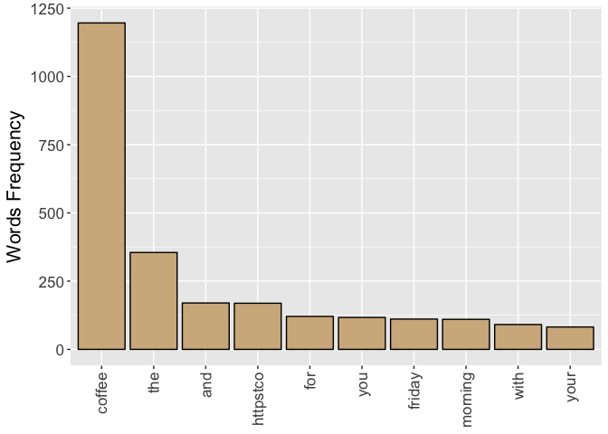
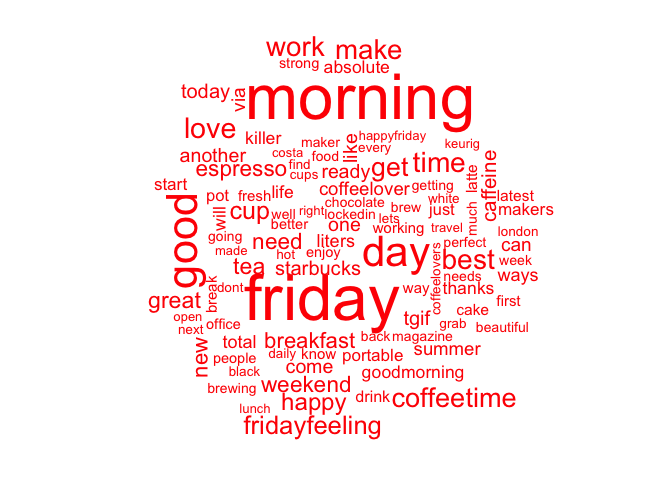

Text Mining Notes
================

Introduction
------------

The notes you are reading now are what I learned from courses, projects and other experts. I tried to give a structured overview of text mining programming in R. My goal is not to give a theoretical overview of text mining but to give practical examples with real code and real data.

As a dataset we will use tweets. I decided I could download some real tweets by myself. This could prove an interesting challenge and could give some interesting insights if we download the right tweets. To do this I followed the instructions on this websites

[Link on twitter download 1](https://www.credera.com/blog/business-intelligence/twitter-analytics-using-r-part-1-extract-tweets/) [Link on twitter download 2](http://thinktostart.com/twitter-authentification-with-r/)

Let's get the tweets
====================

Let's load the necessary libraries

``` r
library("devtools")
library("twitteR")
library("ROAuth")
```

Now to be able to download tweets you need to have a twitter account and authorize it (using special generated keys). To know how follow the instructions you can found on the page linked above. I saved my keys in a file that I access to read it. You don't have to do that, but I wanted to have a working piece of code that I can run and at the same time publish. Again, use google to find out how you can do it differently. You will understand if I don't want to put my keys here ;-)

``` r
secrets <- read.csv("/Users/umberto/Documents/Passwords and Secrets/twitter-keys.csv", stringsAsFactors = FALSE, header = TRUE, sep =",")

api_key <- secrets$api_key
api_secret <- secrets$api_secret
access_token <- secrets$access_token
access_token_secret <- secrets$access_token_secret
 

setup_twitter_oauth(api_key,api_secret)
```

    ## [1] "Using browser based authentication"

Coffee Tweets
-------------

Let's now see what we can find out on Coffee. Let's find tweets that have the hashtag Coffee (`#Coffee`) in them and let's exclude the retweets, since they will falsify our results since they contains almost always the same exact text with RT at the beginning.

``` r
search.string <- "#coffee exclude:retweets"
no.of.tweets <- 1000

c_tweets <- searchTwitter(search.string, n=no.of.tweets, lang="en")
```

Now we need to access the text of the tweets. So we do it in this way (we also need to clean up the tweets from special characters that for now we don't need, like emoticons with the `sapply` function.)

``` r
coffee_tweets = sapply(c_tweets, function(t) t$getText())

coffee_tweets <- sapply(coffee_tweets,function(row) iconv(row, "latin1", "ASCII", sub=""))

head(coffee_tweets)
```

    ##                                                                                                          Which do you prefer? #FathersDay #teavscoffee #tea #coffee https://t.co/uoKJAkWUFY 
    ##                                                                                                        "Which do you prefer? #FathersDay #teavscoffee #tea #coffee https://t.co/uoKJAkWUFY" 
    ## <ed><U+00A0><U+00BD><ed><U+00B8><U+0082><ed><U+00A0><U+00BD><ed><U+00B8><U+0082> I'm so tired man!!! #fridayvibes #Friday #coffee #caffeine #wakemeup #sotired #funny #humour<U+2026> https://t.co/So4TLEvLwx 
    ##                                                                     " I'm so tired man!!! #fridayvibes #Friday #coffee #caffeine #wakemeup #sotired #funny #humour https://t.co/So4TLEvLwx" 
    ##                                                      Looking forward to #cup #fresh #coffee #samples from our #friends in #Uganda. #specialtycoffee #africa<U+2026> https://t.co/bgBzrDW4h8 
    ##                                                            "Looking forward to #cup #fresh #coffee #samples from our #friends in #Uganda. #specialtycoffee #africa https://t.co/bgBzrDW4h8" 
    ##                                                            Anyone else done this? <ed><U+00A0><U+00BD><ed><U+00B8><U+0082> #coffee #ginandtonic #harddayattheoffice https://t.co/0flyIHTzb8 
    ##                                                                                                  "Anyone else done this?  #coffee #ginandtonic #harddayattheoffice https://t.co/0flyIHTzb8" 
    ##                                              "I like cappuccino, actually. But even a bad cup of coffee is better than no coffee at all." #Mornings #Coffee<U+2026> https://t.co/KbI3heMiKT 
    ##                                                  "\"I like cappuccino, actually. But even a bad cup of coffee is better than no coffee at all.\" #Mornings #Coffee https://t.co/KbI3heMiKT" 
    ##                                                           Varieties of #Coffee: What They are and Where They Come From, via @NordicCoffee https://t.co/XqWslMazsT #cafeculture #infographic 
    ##                                                         "Varieties of #Coffee: What They are and Where They Come From, via @NordicCoffee https://t.co/XqWslMazsT #cafeculture #infographic"

It is interested to see how many parameters we get from the search

``` r
str(c_tweets[[1]])
```

    ## Reference class 'status' [package "twitteR"] with 17 fields
    ##  $ text         : chr "Which do you prefer? #FathersDay #teavscoffee #tea #coffee https://t.co/uoKJAkWUFY"
    ##  $ favorited    : logi FALSE
    ##  $ favoriteCount: num 0
    ##  $ replyToSN    : chr(0) 
    ##  $ created      : POSIXct[1:1], format: "2017-06-16 13:55:01"
    ##  $ truncated    : logi FALSE
    ##  $ replyToSID   : chr(0) 
    ##  $ id           : chr "875713324087902212"
    ##  $ replyToUID   : chr(0) 
    ##  $ statusSource : chr "<a href=\"http://www.hootsuite.com\" rel=\"nofollow\">Hootsuite</a>"
    ##  $ screenName   : chr "VektraKettle"
    ##  $ retweetCount : num 0
    ##  $ isRetweet    : logi FALSE
    ##  $ retweeted    : logi FALSE
    ##  $ longitude    : chr(0) 
    ##  $ latitude     : chr(0) 
    ##  $ urls         :'data.frame':   0 obs. of  4 variables:
    ##   ..$ url         : chr(0) 
    ##   ..$ expanded_url: chr(0) 
    ##   ..$ dispaly_url : chr(0) 
    ##   ..$ indices     : num(0) 
    ##  and 53 methods, of which 39 are  possibly relevant:
    ##    getCreated, getFavoriteCount, getFavorited, getId, getIsRetweet,
    ##    getLatitude, getLongitude, getReplyToSID, getReplyToSN, getReplyToUID,
    ##    getRetweetCount, getRetweeted, getRetweeters, getRetweets,
    ##    getScreenName, getStatusSource, getText, getTruncated, getUrls,
    ##    initialize, setCreated, setFavoriteCount, setFavorited, setId,
    ##    setIsRetweet, setLatitude, setLongitude, setReplyToSID, setReplyToSN,
    ##    setReplyToUID, setRetweetCount, setRetweeted, setScreenName,
    ##    setStatusSource, setText, setTruncated, setUrls, toDataFrame,
    ##    toDataFrame#twitterObj

So there is quite some possibilities here. But we are not actually interested in twitters now, but just in the text `tweetsText`. (check for example as reference this [stackoverflow post](http://stackoverflow.com/questions/14549305/searchtwitter-timestamps)).

Tea tweets
----------

Since we are going to compare corpora of text later on, we need a second set of tweets. I decided to download the first 1000 tweets on Tea

Tea Tweets
----------

``` r
search.string <- "#tea exclude:retweets"
no.of.tweets <- 1000

t_tweets <- searchTwitter(search.string, n=no.of.tweets, lang="en")
```

Now we need to access the text of the tweets. So we do it in this way (we also need to clean up the tweets from special characters that for now we don't need, like emoticons with teh `sapply` function.)

``` r
tea_tweets = sapply(t_tweets, function(t) t$getText())

tea_tweets <- sapply(tea_tweets,function(row) iconv(row, "latin1", "ASCII", sub=""))

head(tea_tweets)
```

    ##                                                            Which do you prefer? #FathersDay #teavscoffee #tea #coffee https://t.co/uoKJAkWUFY 
    ##                                                          "Which do you prefer? #FathersDay #teavscoffee #tea #coffee https://t.co/uoKJAkWUFY" 
    ## Our new pyramid #teabag collection is proving very popular. Available in house now &amp; online from 19/6 #tea<U+2026> https://t.co/uXByefJpLo 
    ##      "Our new pyramid #teabag collection is proving very popular. Available in house now &amp; online from 19/6 #tea https://t.co/uXByefJpLo" 
    ##                                    Receiving Lu Shan Yun Wu in China #tea #greentea #teatime #win #90sBabyFollowTrain https://t.co/Ud9QV1cVX2 
    ##                                  "Receiving Lu Shan Yun Wu in China #tea #greentea #teatime #win #90sBabyFollowTrain https://t.co/Ud9QV1cVX2" 
    ##        2 Vintage Royal Chelsea Bone China Tea Cups #Teacups #VintageTeacup #VintageChina #Tea https://t.co/4GbswAb2k8 https://t.co/K2TxA3ljfS 
    ##      "2 Vintage Royal Chelsea Bone China Tea Cups #Teacups #VintageTeacup #VintageChina #Tea https://t.co/4GbswAb2k8 https://t.co/K2TxA3ljfS" 
    ##   Another essential #recipe - #coconut #Oolong #icedtea. Perfect accompaniment to the truly tropical summer sun. #tea https://t.co/zwoBEfjpdL 
    ## "Another essential #recipe - #coconut #Oolong #icedtea. Perfect accompaniment to the truly tropical summer sun. #tea https://t.co/zwoBEfjpdL" 
    ## This aromatic tea will warm your evening up <U+27A1>https://t.co/n3QpoprBDl\n#redmond #kettle #recipe #tea #FridayEve https://t.co/vOWzsaPPJx 
    ##       "This aromatic tea will warm your evening up https://t.co/n3QpoprBDl\n#redmond #kettle #recipe #tea #FridayEve https://t.co/vOWzsaPPJx"

Let's start with text mining
============================

To do text mining one of the most used library (and the one I will use here) is `tm`.

``` r
library("tm")
```

First we need to create a vector of texts

``` r
coffee_source <- VectorSource(coffee_tweets)
tea_source <- VectorSource(tea_tweets)
```

Then we need to make a `VCorpus` of the list of tweets

``` r
coffee_corpus <- VCorpus(coffee_source)
tea_corpus <- VCorpus(tea_source)
coffee_corpus
```

    ## <<VCorpus>>
    ## Metadata:  corpus specific: 0, document level (indexed): 0
    ## Content:  documents: 1000

So if we want to see the text of a tweet in the corpus we can use

``` r
coffee_corpus[[15]][1]
```

    ## $content
    ## [1] "Started Friday praising the Lord at #JosephsCup \nPsalm 100 #guitar #worship\nDiscussed #MARGIN \nMatthew 11:28-30 Psa https://t.co/Lgts1IMViX"

``` r
tea_corpus[[15]][1]
```

    ## $content
    ## [1] "How you too can make a vintage cake stand.\n\nhttps://t.co/HImo4K8pKV\n\n#howto #vintage #cakestand #tea #afternoontea https://t.co/4OvEVk8Pi2"

Cleaning text
-------------

Now that I how to make a corpus, I can focus on cleaning, or preprocessing, the text. In bag of words text mining, cleaning helps aggregate terms. For example, it may make sense that the words "miner", "mining" and "mine" should be considered one term. Specific preprocessing steps will vary based on the project. For example, the words used in tweets are vastly different than those used in legal documents, so the cleaning process can also be quite different. (Text Source: Datacamp)

Common preprocessing functions include:

-   tolower(): Make all characters lowercase
-   removePunctuation(): Remove all punctuation marks
-   removeNumbers(): Remove numbers
-   stripWhitespace(): Remove excess whitespace

Note that tolower() is part of base R, while the other three functions come from the tm package. Going forward, we'll load the tm and qdap for you when they are needed.

The **qdap** package offers other text cleaning functions. Each is useful in its own way and is particularly powerful when combined with the others.

-   bracketX(): Remove all text within brackets (e.g. "It's (so) cool" becomes "It's cool")
-   replace\_number(): Replace numbers with their word equivalents (e.g. "2" becomes "two")
-   replace\_abbreviation(): Replace abbreviations with their full text equivalents (e.g. "Sr" becomes "Senior")
-   replace\_contraction(): Convert contractions back to their base words (e.g. "shouldn't" becomes "should not")
-   replace\_symbol() Replace common symbols with their word equivalents (e.g. "$" becomes "dollar")

Stopwords
---------

Using the c() function allows you to add new words (separated by commas) to the stop words list. For example, the following would add "word1" and "word2" to the default list of English stop words:

    all_stops <- c("word1", "word2", stopwords("en"))

You can use the following command to remove stopwords

    removeWords(text, stopwords("en"))

Stemming
--------

I won't go into stemming here but I tought is worthwile mentioning it. Here is an example of stemming

``` r
stemDocument(c("computational", "computers", "computation"))
```

    ## [1] "comput" "comput" "comput"

Here is an example of using stemming

``` r
# Create complicate
complicate <- c("complicated", "complication", "complicatedly")
# Perform word stemming: stem_doc
stem_doc <- stemDocument(complicate)
# Create the completion dictionary: comp_dict
comp_dict <- "complicate"
# Perform stem completion: complete_text 
complete_text <- stemCompletion(stem_doc, comp_dict)
# Print complete_text
complete_text
```

    ##      complic      complic      complic 
    ## "complicate" "complicate" "complicate"

Clean the Corpus
================

Let's get back to our set of tweets. Let's start cleaning it. To clean the Corpus we can define a function that applies several functions on the corpus

``` r
clean_corpus <- function(corpus){
  corpus <- tm_map(corpus, stripWhitespace)
  corpus <- tm_map(corpus, removePunctuation)
  corpus <- tm_map(corpus, content_transformer(tolower))
  corpus <- tm_map(corpus, removeWords, c(stopwords("en"), "mug", "coffee", "amp","now","cafe"))
  return(corpus)
}
```

Then we can try to apply it on our coffee corpus

``` r
clean_corp <- clean_corpus(coffee_corpus)
```

Then we can pring a cleaned-up tweet

``` r
clean_corp[[227]][1]
```

    ## $content
    ## [1] "thanks       entire journey  bath  morning  caffieneaddict costa"

and the original one

``` r
coffee_corpus[[227]][1]
```

    ## $content
    ## [1] "Thanks for being with me on my entire journey to Bath this morning! \n#coffee #caffieneaddict #costa"

So we have removed special characters, punctuation and so on. Not all the words make much sense really (for example twitter usernames) but it should not be a problem since we don't expect to see them very often in our corpus.

Make a document-term matrix
---------------------------

We can use the following code to make a DTM. Each document is represented as a row and each word as a column.

``` r
coffee_dtm <- DocumentTermMatrix(clean_corp)

# Print out coffee_dtm data
print(coffee_dtm)
```

    ## <<DocumentTermMatrix (documents: 1000, terms: 4589)>>
    ## Non-/sparse entries: 8440/4580560
    ## Sparsity           : 100%
    ## Maximal term length: 29
    ## Weighting          : term frequency (tf)

``` r
# Convert coffee_dtm to a matrix: coffee_m
coffee_m <- as.matrix(coffee_dtm)

# Print the dimensions of coffee_m
dim(coffee_m)
```

    ## [1] 1000 4589

``` r
# Review a portion of the matrix
coffee_m[1:10, 253: 259]
```

    ##     Terms
    ## Docs avoid awaits awaken award away awesome b40
    ##   1      0      0      0     0    0       0   0
    ##   2      0      0      0     0    0       0   0
    ##   3      0      0      0     0    0       0   0
    ##   4      0      0      0     0    0       0   0
    ##   5      0      0      0     0    0       0   0
    ##   6      0      0      0     0    0       0   0
    ##   7      0      0      0     0    0       0   0
    ##   8      0      0      0     0    0       0   0
    ##   9      0      0      0     0    0       0   0
    ##   10     0      0      0     0    0       0   0

Make a document-term matrix (DTM)
---------------------------------

You can also transpose a TDM, to have each word as a row and each column as a document.

``` r
# Create a TDM from clean_corp: coffee_tdm
coffee_tdm <- TermDocumentMatrix(clean_corp)

# Print coffee_tdm data
print(coffee_tdm)
```

    ## <<TermDocumentMatrix (terms: 4589, documents: 1000)>>
    ## Non-/sparse entries: 8440/4580560
    ## Sparsity           : 100%
    ## Maximal term length: 29
    ## Weighting          : term frequency (tf)

``` r
# Convert coffee_tdm to a matrix: coffee_m
coffee_m <- as.matrix(coffee_tdm)

# Print the dimensions of the matrix
dim(coffee_m)
```

    ## [1] 4589 1000

``` r
# Review a portion of the matrix
coffee_m[2587:2590, 148:150]
```

    ##                     Docs
    ## Terms                148 149 150
    ##   httpstcoxnmauar2uk   0   0   0
    ##   httpstcoxops7c5ecn   0   0   0
    ##   httpstcoxpqaybl3qw   0   0   0
    ##   httpstcoxqwslmazst   0   0   0

Frequent terms with tm
----------------------

Now that you know how to make a term-document matrix, as well as its transpose, the document-term matrix, we will use it as the basis for some analysis. In order to analyze it we need to change it to a simple matrix.

Calling `rowSums()` on your newly made matrix aggregates all the terms used in a passage. Once you have the `rowSums()`, you can `sort()` them with `decreasing = TRUE`, so you can focus on the most common terms.

Lastly, you can make a barplot() of the top 5 terms of term\_frequency with the following code (we will make something prettier later on with ggplot2).

    barplot(term_frequency[1:5], col = "#C0DE25")

So let's try with out coffee tweets

``` r
## coffee_tdm is still loaded in your workspace

# Create a matrix: coffee_m
coffee_m <- as.matrix(coffee_tdm)

# Calculate the rowSums: term_frequency
term_frequency <- rowSums(coffee_m)

# Sort term_frequency in descending order
term_frequency <- sort(term_frequency, decreasing = TRUE)

# View the top 10 most common words
term_frequency[1:10]
```

    ##     friday    morning       good        day       love       best 
    ##        111        110         70         68         41         40 
    ##       time       make       work coffeetime 
    ##         40         39         39         38

``` r
# Plot a barchart of the 10 most common words
barplot(term_frequency[1:10], col = "tan", las = 2)
```

 Now let's make it a bit prettier with **ggplot2**...

``` r
library(ggplot2)
```

``` r
library(dplyr)

tf <- as.data.frame(term_frequency)
tf$words <- row.names(tf)
tf10 <- as.data.frame(tf[1:10,])

# We need to make the words factors (ordered) otherwise ggplot2 will order the 
# x axis alphabetically
tf10 <- mutate(tf10, words = factor(words, words))

ggplot(tf10, aes(x = tf10$words , y = tf10$term_frequency   )) + geom_bar(stat = "identity", fill = "tan", col = "black")+ theme_grey()+theme(text = element_text(size=16),  axis.title.x=element_blank(),axis.text.x=element_text(angle=90,hjust=1,vjust=0.5))+ylab("Words Frequency") 
```


Note that the knitr button command don't work from Rstudio if you want to use `knitr`. So the solution is to do it from the console with the following commands

``` r
library(rmarkdown)
render("/Users/umberto/Documents/Education/Data Camp/Text Mining/Text-Mining-Notes/text-mining-notes.Rmd")
```

The command will render an html file in the directory where the `Rmd` file is.

``` r
library(rJava)
library(qdap)
```

Let's build a word frequency plot with `qdap` library (note that we are not working with our cleaned up corpus, and therefore we will see different words).

``` r
frequency <- freq_terms(coffee_tweets, top = 10, at.least = 3, stopwords = "Top200Words")

frequency <- mutate(frequency, WORD = factor(WORD, WORD))

ggplot(frequency, aes(x = frequency$WORD , y = frequency$FREQ   )) + geom_bar(stat = "identity", fill = "tan", col = "black")+ theme_grey()+theme(text = element_text(size=16),  axis.title.x=element_blank(),axis.text.x=element_text(angle=90,hjust=1,vjust=0.5))+ylab("Words Frequency") 
```

 Now let's remove more stopwords (now it looks similar to what we obtained at the beginning)

``` r
frequency2 <- freq_terms(coffee_tweets, top = 10, at.least = 3, stopwords = c(tm::stopwords("english"),"coffee","httpstco","amp","now","cafe"))

frequency2 <- mutate(frequency2, WORD = factor(WORD, WORD))

ggplot(frequency2, aes(x = frequency2$WORD , y = frequency2$FREQ   )) + geom_bar(stat = "identity", fill = "tan", col = "black")+ theme_grey()+theme(text = element_text(size=16),  axis.title.x=element_blank(),axis.text.x=element_text(angle=90,hjust=1,vjust=0.5))+ylab("Words Frequency") 
```


Wordclouds
----------

A very cool way of visualizing frequency of words, are the "wordcloud". You will always get a wow effect when showing it to people. To build beatiful clouds you will need the library `wordcloud`. Here is an example

``` r
library(wordcloud)

term_frequency[1:10]
```

    ##     friday    morning       good        day       love       best 
    ##        111        110         70         68         41         40 
    ##       time       make       work coffeetime 
    ##         40         39         39         38

``` r
word_freqs <- data.frame(term = names(term_frequency), num = term_frequency)
wordcloud(word_freqs$term, word_freqs$num, max.words = 100, colors = "red")
```



Now we need to remove some words that are clear are appearing while talking about coffee

``` r
# Add new stop words to clean_corpus()
clean_corpus <- function(corpus){
  corpus <- tm_map(corpus, removePunctuation)
  corpus <- tm_map(corpus, stripWhitespace)
  corpus <- tm_map(corpus, removeNumbers)
  corpus <- tm_map(corpus, content_transformer(tolower))
  corpus <- tm_map(corpus, removeWords, 
                   c(stopwords("en"), "brew", "cafe", "coffeetime", "cup", "coffee"))
  return(corpus)
}

clean_coffee <- clean_corpus(coffee_corpus)
coffee_tdm <- TermDocumentMatrix(clean_coffee)
coffee_m <- as.matrix(coffee_tdm)
coffee_words <- rowSums(coffee_m)
```

Now we prepare the right order of words for the wordcloud

``` r
coffee_words <- sort(coffee_words, decreasing = TRUE)
coffee_words[1:6]
```

    ##  friday morning    good     day     amp    love 
    ##     111     110      70      68      65      41

``` r
coffee_freqs <- data.frame (term = names(coffee_words), num = coffee_words)

wordcloud(coffee_freqs$term, coffee_freqs$num, max.words = 50, colors = "red")
```


### Improve word colours

``` r
wordcloud(coffee_freqs$term, coffee_freqs$num, max.words = 100, colors = c("grey80", "darkgoldenrod1", "tomato"))
```

    ## Warning in wordcloud(coffee_freqs$term, coffee_freqs$num, max.words =
    ## 100, : friday could not be fit on page. It will not be plotted.


Now let's improve even more on the colors. To do that we will need to use RColorBrewer. RColorBrewer color schemes are organized into three categories:

-   Sequential: Colors ascend from light to dark in sequence
-   Qualitative: Colors are chosen for their pleasing qualities together
-   Diverging: Colors have two distinct color spectra with lighter colors in between

To change the colors parameter of the `wordcloud()` function you can use a select a palette from `RColorBrewer` such as "Greens". The function `display.brewer.all()` will list all predefined color palettes. More information on ColorBrewer (the framework behind RColorBrewer) is available on its [website](http://www.colorbrewer.org/). (Source: datacamp)

The function `brewer.pal()` allows you to select colors from a palette. Specify the number of distinct colors needed (e.g. 8) and the predefined palette to select from (e.g. "Greens"). Often in word clouds, very faint colors are washed out so it may make sense to remove the first couple from a brewer.pal() selection, leaving only the darkest.

Here's an example:

    green_pal <- brewer.pal(8, "Greens")
    green_pal <- green_pal[-(1:2)]

Then just add that object to the wordcloud() function.

    wordcloud(chardonnay_freqs$term, chardonnay_freqs$num, max.words = 100, colors = green_pal)

The command `display.brewer.all()` will display all palettes. Is a very cool command

``` r
display.brewer.all()
```


Let's try to use the `PuOr` palette

``` r
# Create purple_orange
PuOr <- brewer.pal(10, "PuOr")
purple_orange <- PuOr[-(1:2)]
```

And now we can create the wordcloud woith this palette

``` r
wordcloud(coffee_freqs$term, coffee_freqs$num, max.words = 100, colors = purple_orange)
```


Weel it seems that people talking about coffee are talking also about "morning". Make sense. When is Coffee important if not on the morning?

Sometimes not all the words can be plotted. In this case the only solutions are to reduce the number of words or to reduce the scale of the words themselves. For example

``` r
wordcloud(coffee_freqs$term, coffee_freqs$num, max.words = 100, colors = purple_orange, scale = c(2,0.3))
```


Wordclouds with bigrams
-----------------------

Now sometimes single words don't tell the entire story and is interesting to do the same plot with bigrams (words that appear together in the corpus). The tokenizer from `RWeka` is very useful.

``` r
library(RWeka)
```

Then we need to get the couples of words (note that the definition give below will give you **only** bigrams, and not single words anymore).

``` r
BigramTokenizer <- function(x) NGramTokenizer(x, Weka_control(min = 1, max = 2))
tdm.bigram <- TermDocumentMatrix(clean_corp, control = list(tokenize = BigramTokenizer))
```

Then we can get the frequencies of the bigrams

``` r
freq <- sort(rowSums(as.matrix(tdm.bigram)), decreasing = TRUE)
freq.df <- data.frame(word = names(freq), freq= freq)
head(freq.df)
```

    ##            word freq
    ## friday   friday  111
    ## morning morning  110
    ## good       good   70
    ## day         day   68
    ## love       love   41
    ## best       best   40

Now we can plot the wordcloud

``` r
wordcloud(freq.df$word, freq.df$freq, max.words = 50, random.order = F, colors = purple_orange, scale = c(4,0.7))
```


Apparently not many bigrams appear so frequently. The only one is "good morning". It makes again sense...

We need of course first to do a different cleanup of the bigrams list. But that is something that goes beyond the notes I am writing. An important point is that if you remove all stop words like "not" you may loose important informations for bigrams (like negations).

Trigrams
--------

Just as a reference here is the code to do wordclouds with trigrams and bigrams

``` r
TrigramTokenizer <- function(x) NGramTokenizer(x, Weka_control(min = 2, max = 3))
tdm.trigram <- TermDocumentMatrix(clean_corp, control = list(tokenize= TrigramTokenizer))

freq <- sort(rowSums(as.matrix(tdm.trigram)), decreasing = TRUE)
freq.df <- data.frame(word = names(freq), freq= freq)
head(freq.df)
```

    ##                                  word freq
    ## good morning             good morning   33
    ## happy friday             happy friday   20
    ## ready total               ready total   20
    ## ready total liters ready total liters   20
    ## total liters             total liters   20
    ## absolute best           absolute best   18

``` r
wordcloud(freq.df$word, freq.df$freq, max.words = 40, random.order = F, colors = purple_orange, scale = c(3,0.7))
```

    ## Warning in wordcloud(freq.df$word, freq.df$freq, max.words = 40,
    ## random.order = F, : ways make killer could not be fit on page. It will not
    ## be plotted.

    ## Warning in wordcloud(freq.df$word, freq.df$freq, max.words = 40,
    ## random.order = F, : pot ready total could not be fit on page. It will not
    ## be plotted.

    ## Warning in wordcloud(freq.df$word, freq.df$freq, max.words = 40,
    ## random.order = F, : lockedin magazine could not be fit on page. It will not
    ## be plotted.

    ## Warning in wordcloud(freq.df$word, freq.df$freq, max.words = 40,
    ## random.order = F, : espresso maker could not be fit on page. It will not be
    ## plotted.

    ## Warning in wordcloud(freq.df$word, freq.df$freq, max.words = 40,
    ## random.order = F, : day office another could not be fit on page. It will
    ## not be plotted.

    ## Warning in wordcloud(freq.df$word, freq.df$freq, max.words = 40,
    ## random.order = F, : hard working day could not be fit on page. It will not
    ## be plotted.

    ## Warning in wordcloud(freq.df$word, freq.df$freq, max.words = 40,
    ## random.order = F, : office another could not be fit on page. It will not be
    ## plotted.

    ## Warning in wordcloud(freq.df$word, freq.df$freq, max.words = 40,
    ## random.order = F, : office another pot could not be fit on page. It will
    ## not be plotted.

    ## Warning in wordcloud(freq.df$word, freq.df$freq, max.words = 40,
    ## random.order = F, : working day office could not be fit on page. It will
    ## not be plotted.

 Words are long so not all could be written in the plot. You have to choose between something that is not readable and something that has less words...

Common Words between Corpora
============================

To find common words we need to create two "big" documents of tweets. We need to collapse all tweets together separated by a space

``` r
all_coffee <- paste (coffee_tweets, collapse = " ")
all_tea <- paste (tea_tweets,collapse = " ")
all_tweets <- c(all_coffee, all_tea)
```

Now we convert to a Corpus

``` r
# Convert to a vector source
all_tweets <- VectorSource(all_tweets)

# Create all_corpus
all_corpus <- VCorpus(all_tweets)
```

Now that we have a corpus filled with words used in both the tea and coffee tweets files, we can clean the corpus, convert it into a TermDocumentMatrix, and then a matrix to prepare it for a commonality.cloud(). First we need to define a proper cleaning function that contains words like *coffee* and *tea*

``` r
clean_corpus <- function(corpus){
  corpus <- tm_map(corpus, stripWhitespace)
  corpus <- tm_map(corpus, removePunctuation)
  corpus <- tm_map(corpus, content_transformer(tolower))
  corpus <- tm_map(corpus, removeWords, c(stopwords("en"), "mug", "coffee", "tea", "amp", "cup"))
  return(corpus)
}
```

Let's clean the corpus

``` r
# Clean the corpus
all_clean <- clean_corpus (all_corpus)

# Create all_tdm
all_tdm <- TermDocumentMatrix(all_clean) 

# Create all_m
all_m <- as.matrix(all_tdm)
```

Now the communality cloud

``` r
commonality.cloud(all_m, max.words = 100, colors = "steelblue1")
```


Comparison Cloud
----------------

You can plot a comparison cloud in this way

``` r
comparison.cloud(all_m, max.words = 50, colors = c("orange", "blue"), scale = c(3,0.5))
```


(Source Datacamp) A commonality.cloud() may be misleading since words could be represented disproportionately in one corpus or the other, even if they are shared. In the commonality cloud, they would show up without telling you which one of the corpora has more term occurrences.

To solve this problem, we can create a `pyramid.plot()` from the `plotrix` package.

``` r
library(plotrix)
```

``` r
all_tdm_m <- all_m
# Create common_words
common_words <- subset(all_tdm_m, all_tdm_m[, 1] > 0 & all_tdm_m[, 2] > 0)

# Create difference
difference <- abs(common_words[, 1] - common_words[, 2])

# Combine common_words and difference
common_words <- cbind(common_words, difference)

# Order the data frame from most differences to least
common_words <- common_words[order(common_words[, 3], decreasing = TRUE), ]

# Create top25_df
top25_df <- data.frame(x = common_words[1:25, 1], 
                       y = common_words[1:25, 2], 
                       labels = rownames(common_words[1:25, ]))

# Create the pyramid plot
pyramid.plot(top25_df$x, top25_df$y,
             labels = top25_df$labels, gap = 60,
             top.labels = c("Coffee", "Words", "Tea"),
             main = "Words in Common", laxlab = NULL, 
             raxlab = NULL, unit = NULL)
```


    ## [1] 5.1 4.1 4.1 2.1

Word Networks
-------------

In a network graph, the circles are called nodes and represent individual terms, while the lines connecting the circles are called edges and represent the connections between the terms.

For the over-caffeinated text miner, qdap provides a shorcut for making word networks. The word\_network\_plot() and word\_associate() functions both make word networks easy!

``` r
word_associate(coffee_tweets, match.string = c("books"), 
               stopwords = Top200Words, 
               network.plot = TRUE)
```

    ## Warning in text2color(words = V(g)$label, recode.words = target.words,
    ## colors = label.colors): length of colors should be 1 more than length of
    ## recode.words


    ##   row group unit text                                                                                                                                           
    ## 1  58   all   58 Addicted To Books And Coffee! https://t.co/FDYMN7sNIi #Addicted #To #Books #And #Coffee! https://t.co/ovLBl43msJ                               
    ## 2 453   all  453 Grab these two necessities and lock yourself away in your room for some time for yourself! #books #coffee https://t.co/s6BrBb9HPx              
    ## 3 553   all  553 #coffee time (@ Sunshine Books Art and Coffee in Hove) https://t.co/PSfs7VWc1W https://t.co/G8RDDHemUU                                         
    ## 4 703   all  703 For $5 u can read about #fantasy #scifi #fiction #trump worlds over complicated lattes #starbucks #coffee #books https://t.co/cuSHjViOUX       
    ## 5 704   all  704 For $5 u can read about #fantasy #scifi #fiction #trump worlds over complicated lattes #starbucks #coffee #books https://t.co/iw8xfvb4hv       
    ## 6 711   all  711 What was the baristas favorite part about being arrested? The mug shots. Over 30 books on #instafreebie https://t.co/ZGGwJAEdBk                
    ## 7 895   all  895 #coffee time #DubrayBooks Grafton St killing time before #TasteDublin at #IveaghGardens @cinemaster17 see ya soon!! https://t.co/AYqBcct2rz    
    ## 8 972   all  972 Come visit me on #Pinterest! Lots of boards about #Books, #Coffee, #Crochet &amp; #Inspiration! https://t.co/qytQIEOOh7 #Follow #Pinner #Crafty

    ## 
    ## Match Terms
    ## ===========

    ## 
    ## List 1:
    ## books, dubraybooks

    ## 

Distance Matrix and Dendograms
==============================

First let's limit the number of words in your TDM using removeSparseTerms() from tm. Why would you want to adjust the sparsity of the TDM/DTM?

TDMs and DTMs are sparse, meaning they contain mostly zeros. Remember that 1000 tweets can become a TDM with over 3000 terms! You won't be able to easily interpret a dendrogram that is so cluttered, especially if you are working on more text.

A good TDM has between 25 and 70 terms. The lower the sparse value, the more terms are kept. The closer it is to 1, the fewer are kept. This value is a percentage cutoff of zeros for each term in the TDM.

Let's see the dimensions of your coffee tdm

``` r
dim(coffee_tdm)
```

    ## [1] 4494 1000

Let's remove some terms

``` r
coffee_tdm1 <- removeSparseTerms(coffee_tdm, sparse = 0.97)
dim(coffee_tdm1)
```

    ## [1]   13 1000

Let's see a dendrogram now

``` r
coffee_tdm1_m <- as.matrix(coffee_tdm1)
coffee_tdm1_df <- as.data.frame(coffee_tdm1_m)  
coffee_dist <- dist(coffee_tdm1_df)

coffee_hc <- hclust(coffee_dist)
plot(coffee_hc)
```


Now let's make the dendrogram more appealing

``` r
library(dendextend)
```

Now

``` r
hcd <- as.dendrogram(coffee_hc)
labels(hcd)
```

    ##  [1] "friday"        "good"          "morning"       "day"          
    ##  [5] "amp"           "love"          "time"          "now"          
    ##  [9] "work"          "best"          "make"          "fridayfeeling"
    ## [13] "get"

Now let's work on the appearance

``` r
hcd <- branches_attr_by_labels(hcd, c("mondaymorning", "work"), "red")
```

    ## Warning in branches_attr_by_labels(hcd, c("mondaymorning", "work"), "red"): Not all of the labels you provided are included in the dendrogram.
    ## The following labels were omitted:mondaymorning

``` r
plot(hcd, main = "Better Dendrogram")
```

 Now let's add rectangular shapes around the clusters

``` r
# Add cluster rectangles 
plot(hcd, main = "Better Dendrogram")
rect.dendrogram(hcd, k = 2, border = "grey50")
```


Word Associations
=================

Another way to think about word relationships is with the findAssocs() function in the tm package. For any given word, findAssocs() calculates its correlation with every other word in a TDM or DTM. Scores range from 0 to 1. A score of 1 means that two words always appear together, while a score of 0 means that they never appear together.

To use findAssocs() pass in a TDM or DTM, the search term, and a minimum correlation. The function will return a list of all other terms that meet or exceed the minimum threshold.

    findAssocs(tdm, "word", 0.25)

``` r
# Create associations
associations <- findAssocs(coffee_tdm, "starbucks", 0.2)

# View the venti associations
print(associations)
```

    ## $starbucks
    ##            hookup              stat              amer           frappin 
    ##              0.48              0.44              0.43              0.39 
    ## httpstcovlfzoqkmc       philippines              potd          lockedin 
    ##              0.39              0.39              0.39              0.36 
    ##          magazine       lockedinmag             needs            ywhcom 
    ##              0.33              0.30              0.30              0.30 
    ##       complicated           fantasy          followme            frappe 
    ##              0.27              0.27              0.27              0.27 
    ##  httpstcornvntyya            lattes     photooftheday             scifi 
    ##              0.27              0.27              0.27              0.27 
    ##              cozy             chill           fiction 
    ##              0.26              0.22              0.22

As you can see, some more serious cleaning of the text should be done to gain real interesting insights.

``` r
library(ggthemes)

# Create associations_df
associations_df <- list_vect2df(associations)[,2:3]

# Plot the associations_df values (don't change this)
ggplot(associations_df, aes(y = associations_df[, 1])) + 
  geom_point(aes(x = associations_df[, 2]), 
             data = associations_df, size = 3) + 
  theme_gdocs()
```


Similarity matrix
=================

Another very useful thing to calculate is the similarity matrix between tweets. I won't explain here what it is, but show how to calculate it. I will use the cosine distance here (note that the following piece of code may take sometime, since it must calculate one million of values)

``` r
require(proxy)

coffee_tdm_m <- as.matrix(coffee_tdm)

coffee_cosine_dist_mat <- as.matrix(dist(coffee_tdm_m, method = "cosine"))
```

what dimensions we have in this matrix?

``` r
dim(coffee_cosine_dist_mat)
```

    ## [1] 4494 4494

as expected. Let's check some rows

``` r
coffee_cosine_dist_mat[1:5,1:5]
```

    ##           aaall able aboard aboutampi absolute
    ## aaall         0    1      1         1        1
    ## able          1    0      1         1        1
    ## aboard        1    1      0         1        1
    ## aboutampi     1    1      1         0        1
    ## absolute      1    1      1         1        0

We can do the same calculations using the fact we have sparse matrices

``` r
library(slam)
cosine_dist_mat <- crossprod_simple_triplet_matrix(coffee_tdm)/(sqrt(col_sums(coffee_tdm^2) %*% t(col_sums(coffee_tdm^2))))
```

``` r
cosine_dist_mat[1:15,1:15]
```

    ##     Docs
    ## Docs         1         2 3 4     5         6         7     8 9        10
    ##   1  1.0000000 0.0000000 0 0 0.000 0.0000000 0.0000000 0.000 0 0.0000000
    ##   2  0.0000000 1.0000000 0 0 0.000 0.0000000 0.1414214 0.000 0 0.0000000
    ##   3  0.0000000 0.0000000 1 0 0.000 0.0000000 0.0000000 0.000 0 0.0000000
    ##   4  0.0000000 0.0000000 0 1 0.000 0.0000000 0.0000000 0.000 0 0.0000000
    ##   5  0.0000000 0.0000000 0 0 1.000 0.0000000 0.0000000 0.125 0 0.0000000
    ##   6  0.0000000 0.0000000 0 0 0.000 1.0000000 0.0000000 0.000 0 0.0000000
    ##   7  0.0000000 0.1414214 0 0 0.000 0.0000000 1.0000000 0.000 0 0.0000000
    ##   8  0.0000000 0.0000000 0 0 0.125 0.0000000 0.0000000 1.000 0 0.0000000
    ##   9  0.0000000 0.0000000 0 0 0.000 0.0000000 0.0000000 0.000 1 0.0000000
    ##   10 0.0000000 0.0000000 0 0 0.000 0.0000000 0.0000000 0.000 0 1.0000000
    ##   11 0.0000000 0.1054093 0 0 0.000 0.0000000 0.1490712 0.000 0 0.2357023
    ##   12 0.1195229 0.0000000 0 0 0.000 0.1010153 0.0000000 0.000 0 0.0000000
    ##   13 0.0000000 0.0000000 0 0 0.000 0.0000000 0.0000000 0.000 0 0.0000000
    ##   14 0.0000000 0.0000000 0 0 0.000 0.0000000 0.0000000 0.000 0 0.0000000
    ##   15 0.0000000 0.0877058 0 0 0.000 0.0000000 0.1240347 0.000 0 0.0000000
    ##     Docs
    ## Docs         11        12        13 14         15
    ##   1  0.00000000 0.1195229 0.0000000  0 0.00000000
    ##   2  0.10540926 0.0000000 0.0000000  0 0.08770580
    ##   3  0.00000000 0.0000000 0.0000000  0 0.00000000
    ##   4  0.00000000 0.0000000 0.0000000  0 0.00000000
    ##   5  0.00000000 0.0000000 0.0000000  0 0.00000000
    ##   6  0.00000000 0.1010153 0.0000000  0 0.00000000
    ##   7  0.14907120 0.0000000 0.0000000  0 0.12403473
    ##   8  0.00000000 0.0000000 0.0000000  0 0.00000000
    ##   9  0.00000000 0.0000000 0.0000000  0 0.00000000
    ##   10 0.23570226 0.0000000 0.0000000  0 0.00000000
    ##   11 1.00000000 0.0000000 0.0000000  0 0.09245003
    ##   12 0.00000000 1.0000000 0.1091089  0 0.00000000
    ##   13 0.00000000 0.1091089 1.0000000  0 0.00000000
    ##   14 0.00000000 0.0000000 0.0000000  1 0.00000000
    ##   15 0.09245003 0.0000000 0.0000000  0 1.00000000

Tweets 8 and 9 have a similarity score of 0.21. Let's check them

``` r
print(coffee_tweets[[8]])
```

    ## [1] "The perfect cappuccino at cafenoto in #Windsor made with brewtaylormaid #coffee\n#sebastopol https://t.co/29yrFoNPLu"

``` r
print(coffee_tweets[[9]])
```

    ## [1] "I don't see why everyone bashes #socks as a #christmasgift. They can be the best. #coffee https://t.co/QirJyvILC6"

Bag of words
============

``` r
my.tdm <- TermDocumentMatrix(coffee_corpus, control = list(weighting = weightTfIdf))
my.dtm <- DocumentTermMatrix(coffee_corpus, control = list(weighting = weightTfIdf, stopwords = TRUE))
inspect(my.dtm)
```

    ## <<DocumentTermMatrix (documents: 1000, terms: 5424)>>
    ## Non-/sparse entries: 10076/5413924
    ## Sparsity           : 100%
    ## Maximal term length: 40
    ## Weighting          : term frequency - inverse document frequency (normalized) (tf-idf)
    ## Sample             :
    ##      Terms
    ## Docs  #coffee #coffeetime #friday #fridayfeeling    &amp; coffee day good
    ##   15        0           0       0              0 0.000000      0   0    0
    ##   268       0           0       0              0 0.000000      0   0    0
    ##   33        0           0       0              0 0.000000      0   0    0
    ##   431       0           0       0              0 0.000000      0   0    0
    ##   529       0           0       0              0 0.000000      0   0    0
    ##   547       0           0       0              0 0.000000      0   0    0
    ##   588       0           0       0              0 0.000000      0   0    0
    ##   80        0           0       0              0 0.334299      0   0    0
    ##   864       0           0       0              0 0.000000      0   0    0
    ##   903       0           0       0              0 0.000000      0   0    0
    ##      Terms
    ## Docs  morning need
    ##   15        0    0
    ##   268       0    0
    ##   33        0    0
    ##   431       0    0
    ##   529       0    0
    ##   547       0    0
    ##   588       0    0
    ##   80        0    0
    ##   864       0    0
    ##   903       0    0

Let's find (for example) all words that appear twice in any document

``` r
findFreqTerms(my.tdm, 200)
```

    ## character(0)

``` r
cosine_dist_mat <- crossprod_simple_triplet_matrix(my.tdm)/(sqrt(col_sums(my.tdm^2) %*% t(col_sums(my.tdm^2))))
cosine_dist_mat[1:5,1:5]
```

    ##     Docs
    ## Docs            1            2            3            4            5
    ##    1 1.000000e+00 5.186829e-05 5.168881e-05 6.210422e-05 5.463124e-05
    ##    2 5.186829e-05 1.000000e+00 3.717341e-05 4.466394e-05 3.928954e-05
    ##    3 5.168881e-05 3.717341e-05 1.000000e+00 4.450939e-05 3.915359e-05
    ##    4 6.210422e-05 4.466394e-05 4.450939e-05 1.000000e+00 4.704312e-05
    ##    5 5.463124e-05 3.928954e-05 3.915359e-05 4.704312e-05 1.000000e+00

``` r
y <- which(cosine_dist_mat>0.5, arr.in = TRUE)
str(y)
```

    ##  int [1:1764, 1:2] 1 2 3 4 5 6 7 8 9 10 ...
    ##  - attr(*, "dimnames")=List of 2
    ##   ..$ : chr [1:1764] "1" "2" "3" "4" ...
    ##   ..$ : chr [1:2] "Docs" "Docs"

``` r
y
```

    ##      Docs Docs
    ## 1       1    1
    ## 2       2    2
    ## 3       3    3
    ## 4       4    4
    ## 5       5    5
    ## 6       6    6
    ## 7       7    7
    ## 8       8    8
    ## 9       9    9
    ## 10     10   10
    ## 11     11   11
    ## 12     12   12
    ## 13     13   13
    ## 14     14   14
    ## 15     15   15
    ## 16     16   16
    ## 17     17   17
    ## 18     18   18
    ## 19     19   19
    ## 20     20   20
    ## 21     21   21
    ## 22     22   22
    ## 23     23   23
    ## 24     24   24
    ## 25     25   25
    ## 26     26   26
    ## 27     27   27
    ## 28     28   28
    ## 29     29   29
    ## 30     30   30
    ## 31     31   31
    ## 32     32   32
    ## 33     33   33
    ## 34     34   34
    ## 35     35   35
    ## 36     36   36
    ## 37     37   37
    ## 38     38   38
    ## 39     39   39
    ## 40     40   40
    ## 41     41   41
    ## 42     42   42
    ## 43     43   43
    ## 44     44   44
    ## 45     45   45
    ## 46     46   46
    ## 47     47   47
    ## 48     48   48
    ## 49     49   49
    ## 53     53   49
    ## 96     96   49
    ## 192   192   49
    ## 207   207   49
    ## 217   217   49
    ## 221   221   49
    ## 267   267   49
    ## 318   318   49
    ## 458   458   49
    ## 463   463   49
    ## 469   469   49
    ## 492   492   49
    ## 565   565   49
    ## 572   572   49
    ## 622   622   49
    ## 666   666   49
    ## 763   763   49
    ## 50     50   50
    ## 51     51   51
    ## 52     52   52
    ## 49     49   53
    ## 53     53   53
    ## 96     96   53
    ## 192   192   53
    ## 207   207   53
    ## 217   217   53
    ## 221   221   53
    ## 267   267   53
    ## 318   318   53
    ## 458   458   53
    ## 463   463   53
    ## 469   469   53
    ## 492   492   53
    ## 565   565   53
    ## 572   572   53
    ## 622   622   53
    ## 666   666   53
    ## 763   763   53
    ## 54     54   54
    ## 55     55   55
    ## 56     56   56
    ## 57     57   57
    ## 58     58   58
    ## 59     59   59
    ## 60     60   60
    ## 61     61   61
    ## 62     62   62
    ## 63     63   63
    ## 64     64   64
    ## 65     65   65
    ## 275   275   65
    ## 349   349   65
    ## 448   448   65
    ## 528   528   65
    ## 592   592   65
    ## 716   716   65
    ## 729   729   65
    ## 748   748   65
    ## 764   764   65
    ## 814   814   65
    ## 833   833   65
    ## 963   963   65
    ## 984   984   65
    ## 66     66   66
    ## 67     67   67
    ## 68     68   68
    ## 69     69   69
    ## 70     70   70
    ## 71     71   71
    ## 72     72   72
    ## 73     73   73
    ## 74     74   74
    ## 75     75   75
    ## 76     76   76
    ## 77     77   77
    ## 78     78   78
    ## 79     79   79
    ## 80     80   80
    ## 81     81   81
    ## 82     82   82
    ## 83     83   83
    ## 84     84   84
    ## 85     85   85
    ## 86     86   86
    ## 87     87   87
    ## 88     88   88
    ## 89     89   89
    ## 90     90   90
    ## 91     91   91
    ## 92     92   92
    ## 93     93   93
    ## 94     94   94
    ## 95     95   95
    ## 49     49   96
    ## 53     53   96
    ## 96     96   96
    ## 192   192   96
    ## 207   207   96
    ## 217   217   96
    ## 221   221   96
    ## 267   267   96
    ## 318   318   96
    ## 458   458   96
    ## 463   463   96
    ## 469   469   96
    ## 492   492   96
    ## 565   565   96
    ## 572   572   96
    ## 622   622   96
    ## 666   666   96
    ## 763   763   96
    ## 97     97   97
    ## 98     98   98
    ## 99     99   99
    ## 100   100  100
    ## 101   101  101
    ## 102   102  102
    ## 103   103  103
    ## 104   104  103
    ## 103   103  104
    ## 104   104  104
    ## 105   105  105
    ## 106   106  106
    ## 107   107  107
    ## 108   108  108
    ## 109   109  109
    ## 110   110  109
    ## 109   109  110
    ## 110   110  110
    ## 111   111  111
    ## 112   112  112
    ## 113   113  113
    ## 114   114  114
    ## 115   115  115
    ## 116   116  116
    ## 117   117  117
    ## 118   118  118
    ## 119   119  119
    ## 120   120  120
    ## 773   773  120
    ## 121   121  121
    ## 122   122  122
    ## 123   123  123
    ## 124   124  123
    ## 123   123  124
    ## 124   124  124
    ## 125   125  125
    ## 126   126  126
    ## 127   127  127
    ## 128   128  128
    ## 129   129  129
    ## 130   130  130
    ## 131   131  131
    ## 132   132  132
    ## 133   133  133
    ## 134   134  134
    ## 135   135  135
    ## 136   136  136
    ## 137   137  137
    ## 138   138  138
    ## 139   139  139
    ## 140   140  140
    ## 141   141  141
    ## 142   142  142
    ## 143   143  143
    ## 144   144  144
    ## 145   145  145
    ## 146   146  146
    ## 147   147  147
    ## 148   148  148
    ## 149   149  149
    ## 150   150  150
    ## 151   151  151
    ## 152   152  152
    ## 153   153  153
    ## 154   154  154
    ## 155   155  155
    ## 156   156  156
    ## 157   157  157
    ## 158   158  158
    ## 459   459  158
    ## 159   159  159
    ## 160   160  160
    ## 161   161  161
    ## 162   162  162
    ## 163   163  163
    ## 164   164  164
    ## 165   165  165
    ## 166   166  166
    ## 167   167  167
    ## 168   168  168
    ## 169   169  169
    ## 170   170  170
    ## 171   171  171
    ## 172   172  172
    ## 810   810  172
    ## 173   173  173
    ## 174   174  174
    ## 175   175  175
    ## 176   176  175
    ## 175   175  176
    ## 176   176  176
    ## 177   177  177
    ## 178   178  178
    ## 179   179  179
    ## 322   322  179
    ## 180   180  180
    ## 181   181  181
    ## 182   182  182
    ## 183   183  183
    ## 184   184  184
    ## 185   185  185
    ## 186   186  186
    ## 187   187  187
    ## 188   188  188
    ## 189   189  189
    ## 190   190  189
    ## 191   191  189
    ## 189   189  190
    ## 190   190  190
    ## 191   191  190
    ## 189   189  191
    ## 190   190  191
    ## 191   191  191
    ## 49     49  192
    ## 53     53  192
    ## 96     96  192
    ## 192   192  192
    ## 207   207  192
    ## 217   217  192
    ## 221   221  192
    ## 267   267  192
    ## 318   318  192
    ## 458   458  192
    ## 463   463  192
    ## 469   469  192
    ## 492   492  192
    ## 565   565  192
    ## 572   572  192
    ## 622   622  192
    ## 666   666  192
    ## 763   763  192
    ## 193   193  193
    ## 194   194  194
    ## 195   195  195
    ## 196   196  196
    ## 197   197  197
    ## 198   198  198
    ## 199   199  199
    ## 200   200  200
    ## 201   201  201
    ## 202   202  202
    ## 203   203  203
    ## 204   204  204
    ## 205   205  205
    ## 206   206  206
    ## 49     49  207
    ## 53     53  207
    ## 96     96  207
    ## 192   192  207
    ## 207   207  207
    ## 217   217  207
    ## 221   221  207
    ## 267   267  207
    ## 318   318  207
    ## 458   458  207
    ## 463   463  207
    ## 469   469  207
    ## 492   492  207
    ## 565   565  207
    ## 572   572  207
    ## 622   622  207
    ## 666   666  207
    ## 763   763  207
    ## 208   208  208
    ## 209   209  209
    ## 210   210  210
    ## 211   211  211
    ## 246   246  211
    ## 212   212  212
    ## 213   213  213
    ## 214   214  214
    ## 215   215  215
    ## 216   216  216
    ## 49     49  217
    ## 53     53  217
    ## 96     96  217
    ## 192   192  217
    ## 207   207  217
    ## 217   217  217
    ## 221   221  217
    ## 267   267  217
    ## 318   318  217
    ## 458   458  217
    ## 463   463  217
    ## 469   469  217
    ## 492   492  217
    ## 565   565  217
    ## 572   572  217
    ## 622   622  217
    ## 666   666  217
    ## 763   763  217
    ## 218   218  218
    ## 219   219  219
    ## 220   220  220
    ## 49     49  221
    ## 53     53  221
    ## 96     96  221
    ## 192   192  221
    ## 207   207  221
    ## 217   217  221
    ## 221   221  221
    ## 267   267  221
    ## 318   318  221
    ## 458   458  221
    ## 463   463  221
    ## 469   469  221
    ## 492   492  221
    ## 565   565  221
    ## 572   572  221
    ## 622   622  221
    ## 666   666  221
    ## 763   763  221
    ## 222   222  222
    ## 223   223  223
    ## 224   224  224
    ## 225   225  225
    ## 226   226  226
    ## 227   227  227
    ## 228   228  228
    ## 229   229  229
    ## 230   230  230
    ## 231   231  231
    ## 232   232  232
    ## 233   233  233
    ## 234   234  234
    ## 235   235  235
    ## 236   236  236
    ## 237   237  237
    ## 238   238  238
    ## 239   239  239
    ## 240   240  240
    ## 241   241  241
    ## 242   242  242
    ## 243   243  243
    ## 244   244  244
    ## 245   245  245
    ## 211   211  246
    ## 246   246  246
    ## 247   247  247
    ## 248   248  248
    ## 249   249  249
    ## 250   250  250
    ## 251   251  251
    ## 252   252  252
    ## 253   253  253
    ## 254   254  254
    ## 255   255  255
    ## 256   256  256
    ## 257   257  257
    ## 258   258  258
    ## 259   259  259
    ## 260   260  260
    ## 261   261  261
    ## 262   262  262
    ## 263   263  263
    ## 264   264  264
    ## 265   265  265
    ## 266   266  266
    ## 49     49  267
    ## 53     53  267
    ## 96     96  267
    ## 192   192  267
    ## 207   207  267
    ## 217   217  267
    ## 221   221  267
    ## 267   267  267
    ## 318   318  267
    ## 458   458  267
    ## 463   463  267
    ## 469   469  267
    ## 492   492  267
    ## 565   565  267
    ## 572   572  267
    ## 622   622  267
    ## 666   666  267
    ## 763   763  267
    ## 268   268  268
    ## 269   269  269
    ## 270   270  270
    ## 271   271  271
    ## 272   272  272
    ## 273   273  273
    ## 274   274  274
    ## 65     65  275
    ## 275   275  275
    ## 321   321  275
    ## 349   349  275
    ## 448   448  275
    ## 499   499  275
    ## 528   528  275
    ## 592   592  275
    ## 689   689  275
    ## 716   716  275
    ## 729   729  275
    ## 736   736  275
    ## 748   748  275
    ## 764   764  275
    ## 778   778  275
    ## 814   814  275
    ## 833   833  275
    ## 901   901  275
    ## 963   963  275
    ## 984   984  275
    ## 276   276  276
    ## 277   277  277
    ## 278   278  278
    ## 279   279  279
    ## 280   280  280
    ## 281   281  281
    ## 282   282  282
    ## 283   283  283
    ## 287   287  283
    ## 284   284  284
    ## 285   285  284
    ## 286   286  284
    ## 287   287  284
    ## 288   288  284
    ## 284   284  285
    ## 285   285  285
    ## 286   286  285
    ## 287   287  285
    ## 288   288  285
    ## 284   284  286
    ## 285   285  286
    ## 286   286  286
    ## 287   287  286
    ## 288   288  286
    ## 283   283  287
    ## 284   284  287
    ## 285   285  287
    ## 286   286  287
    ## 287   287  287
    ## 288   288  287
    ## 284   284  288
    ## 285   285  288
    ## 286   286  288
    ## 287   287  288
    ## 288   288  288
    ## 289   289  289
    ## 290   290  290
    ##  [ reached getOption("max.print") -- omitted 1264 rows ]

``` r
print(coffee_tweets[[659]])
```

    ## [1] "Is your town the place to go for good #coffee? https://t.co/pPukd0mw7s"

``` r
print(coffee_tweets[[292]])
```

    ## [1] "Bamboo cutting board still-life. #jkrcopyright2017 #jamesradke #editorial #missouri #coffee https://t.co/w6CXxksPak"

So really very similar...

and we can extract the values of the matrix with

``` r
cosine_dist_mat[y]
```

    ##    [1] 1.0000000 1.0000000 1.0000000 1.0000000 1.0000000 1.0000000
    ##    [7] 1.0000000 1.0000000 1.0000000 1.0000000 1.0000000 1.0000000
    ##   [13] 1.0000000 1.0000000 1.0000000 1.0000000 1.0000000 1.0000000
    ##   [19] 1.0000000 1.0000000 1.0000000 1.0000000 1.0000000 1.0000000
    ##   [25] 1.0000000 1.0000000 1.0000000 1.0000000 1.0000000 1.0000000
    ##   [31] 1.0000000 1.0000000 1.0000000 1.0000000 1.0000000 1.0000000
    ##   [37] 1.0000000 1.0000000 1.0000000 1.0000000 1.0000000 1.0000000
    ##   [43] 1.0000000 1.0000000 1.0000000 1.0000000 1.0000000 1.0000000
    ##   [49] 1.0000000 0.5682944 0.5682944 0.5682944 0.5682944 0.5682944
    ##   [55] 0.5682944 0.5682944 0.5682944 0.5682944 0.5682944 0.5682944
    ##   [61] 0.5682944 0.5682944 0.5682944 0.5682944 0.5682944 0.5682944
    ##   [67] 1.0000000 1.0000000 1.0000000 0.5682944 1.0000000 0.5682944
    ##   [73] 0.5682944 0.5682944 0.5682944 0.5682944 0.5682944 0.5682944
    ##   [79] 0.5682944 0.5682944 0.5682944 0.5682944 0.5682944 0.5682944
    ##   [85] 0.5682944 0.5682944 0.5682944 1.0000000 1.0000000 1.0000000
    ##   [91] 1.0000000 1.0000000 1.0000000 1.0000000 1.0000000 1.0000000
    ##   [97] 1.0000000 1.0000000 1.0000000 0.5626069 0.7986652 0.5626069
    ##  [103] 0.7986652 0.5626069 0.7986652 0.5626069 0.7986652 0.5626069
    ##  [109] 0.7986652 0.5626069 0.7986652 0.5626069 1.0000000 1.0000000
    ##  [115] 1.0000000 1.0000000 1.0000000 1.0000000 1.0000000 1.0000000
    ##  [121] 1.0000000 1.0000000 1.0000000 1.0000000 1.0000000 1.0000000
    ##  [127] 1.0000000 1.0000000 1.0000000 1.0000000 1.0000000 1.0000000
    ##  [133] 1.0000000 1.0000000 1.0000000 1.0000000 1.0000000 1.0000000
    ##  [139] 1.0000000 1.0000000 1.0000000 1.0000000 0.5682944 0.5682944
    ##  [145] 1.0000000 0.5682944 0.5682944 0.5682944 0.5682944 0.5682944
    ##  [151] 0.5682944 0.5682944 0.5682944 0.5682944 0.5682944 0.5682944
    ##  [157] 0.5682944 0.5682944 0.5682944 0.5682944 1.0000000 1.0000000
    ##  [163] 1.0000000 1.0000000 1.0000000 1.0000000 1.0000000 0.8259299
    ##  [169] 0.8259299 1.0000000 1.0000000 1.0000000 1.0000000 1.0000000
    ##  [175] 1.0000000 0.7622718 0.7622718 1.0000000 1.0000000 1.0000000
    ##  [181] 1.0000000 1.0000000 1.0000000 1.0000000 1.0000000 1.0000000
    ##  [187] 1.0000000 1.0000000 0.6046691 1.0000000 1.0000000 1.0000000
    ##  [193] 0.7360379 0.7360379 1.0000000 1.0000000 1.0000000 1.0000000
    ##  [199] 1.0000000 1.0000000 1.0000000 1.0000000 1.0000000 1.0000000
    ##  [205] 1.0000000 1.0000000 1.0000000 1.0000000 1.0000000 1.0000000
    ##  [211] 1.0000000 1.0000000 1.0000000 1.0000000 1.0000000 1.0000000
    ##  [217] 1.0000000 1.0000000 1.0000000 1.0000000 1.0000000 1.0000000
    ##  [223] 1.0000000 1.0000000 1.0000000 1.0000000 1.0000000 1.0000000
    ##  [229] 1.0000000 0.7238511 1.0000000 1.0000000 1.0000000 1.0000000
    ##  [235] 1.0000000 1.0000000 1.0000000 1.0000000 1.0000000 1.0000000
    ##  [241] 1.0000000 1.0000000 1.0000000 1.0000000 0.7712495 1.0000000
    ##  [247] 1.0000000 1.0000000 0.6517010 0.6517010 1.0000000 1.0000000
    ##  [253] 1.0000000 1.0000000 0.5006256 1.0000000 1.0000000 1.0000000
    ##  [259] 1.0000000 1.0000000 1.0000000 1.0000000 1.0000000 1.0000000
    ##  [265] 1.0000000 0.6896245 0.6896245 0.6896245 1.0000000 0.6896245
    ##  [271] 0.6896245 0.6896245 1.0000000 0.5682944 0.5682944 0.5682944
    ##  [277] 1.0000000 0.5682944 0.5682944 0.5682944 0.5682944 0.5682944
    ##  [283] 0.5682944 0.5682944 0.5682944 0.5682944 0.5682944 0.5682944
    ##  [289] 0.5682944 0.5682944 0.5682944 1.0000000 1.0000000 1.0000000
    ##  [295] 1.0000000 1.0000000 1.0000000 1.0000000 1.0000000 1.0000000
    ##  [301] 1.0000000 1.0000000 1.0000000 1.0000000 1.0000000 0.5682944
    ##  [307] 0.5682944 0.5682944 0.5682944 1.0000000 0.5682944 0.5682944
    ##  [313] 0.5682944 0.5682944 0.5682944 0.5682944 0.5682944 0.5682944
    ##  [319] 0.5682944 0.5682944 0.5682944 0.5682944 0.5682944 1.0000000
    ##  [325] 1.0000000 1.0000000 1.0000000 0.8723011 1.0000000 1.0000000
    ##  [331] 1.0000000 1.0000000 1.0000000 0.5682944 0.5682944 0.5682944
    ##  [337] 0.5682944 0.5682944 1.0000000 0.5682944 0.5682944 0.5682944
    ##  [343] 0.5682944 0.5682944 0.5682944 0.5682944 0.5682944 0.5682944
    ##  [349] 0.5682944 0.5682944 0.5682944 1.0000000 1.0000000 1.0000000
    ##  [355] 0.5682944 0.5682944 0.5682944 0.5682944 0.5682944 0.5682944
    ##  [361] 1.0000000 0.5682944 0.5682944 0.5682944 0.5682944 0.5682944
    ##  [367] 0.5682944 0.5682944 0.5682944 0.5682944 0.5682944 0.5682944
    ##  [373] 1.0000000 1.0000000 1.0000000 1.0000000 1.0000000 1.0000000
    ##  [379] 1.0000000 1.0000000 1.0000000 1.0000000 1.0000000 1.0000000
    ##  [385] 1.0000000 1.0000000 1.0000000 1.0000000 1.0000000 1.0000000
    ##  [391] 1.0000000 1.0000000 1.0000000 1.0000000 1.0000000 1.0000000
    ##  [397] 0.8723011 1.0000000 1.0000000 1.0000000 1.0000000 1.0000000
    ##  [403] 1.0000000 1.0000000 1.0000000 1.0000000 1.0000000 1.0000000
    ##  [409] 1.0000000 1.0000000 1.0000000 1.0000000 1.0000000 1.0000000
    ##  [415] 1.0000000 1.0000000 1.0000000 1.0000000 0.5682944 0.5682944
    ##  [421] 0.5682944 0.5682944 0.5682944 0.5682944 0.5682944 1.0000000
    ##  [427] 0.5682944 0.5682944 0.5682944 0.5682944 0.5682944 0.5682944
    ##  [433] 0.5682944 0.5682944 0.5682944 0.5682944 1.0000000 1.0000000
    ##  [439] 1.0000000 1.0000000 1.0000000 1.0000000 1.0000000 0.5626069
    ##  [445] 1.0000000 0.5537641 0.5626069 0.6938104 0.5537641 0.5626069
    ##  [451] 0.6938104 0.5537641 0.5626069 0.6938104 0.5537641 0.5626069
    ##  [457] 0.6938104 0.5537641 0.5626069 0.6938104 0.5537641 0.5626069
    ##  [463] 0.6938104 1.0000000 1.0000000 1.0000000 1.0000000 1.0000000
    ##  [469] 1.0000000 1.0000000 1.0000000 0.5709452 1.0000000 0.7112264
    ##  [475] 0.7112264 0.7212206 0.7112264 0.7112264 1.0000000 0.7112264
    ##  [481] 0.7212206 0.7112264 0.7112264 0.7112264 1.0000000 0.7212206
    ##  [487] 0.7112264 0.5709452 0.7212206 0.7212206 0.7212206 1.0000000
    ##  [493] 0.7212206 0.7112264 0.7112264 0.7112264 0.7212206 1.0000000
    ##  [499] 1.0000000 1.0000000 1.0000000 1.0000000 1.0000000 1.0000000
    ##  [505] 1.0000000 1.0000000 1.0000000 1.0000000 1.0000000 1.0000000
    ##  [511] 1.0000000 1.0000000 1.0000000 1.0000000 1.0000000 1.0000000
    ##  [517] 1.0000000 1.0000000 1.0000000 1.0000000 1.0000000 1.0000000
    ##  [523] 1.0000000 1.0000000 1.0000000 1.0000000 1.0000000 0.5682944
    ##  [529] 0.5682944 0.5682944 0.5682944 0.5682944 0.5682944 0.5682944
    ##  [535] 0.5682944 1.0000000 0.5682944 0.5682944 0.5682944 0.5682944
    ##  [541] 0.5682944 0.5682944 0.5682944 0.5682944 0.5682944 1.0000000
    ##  [547] 1.0000000 0.5537641 1.0000000 0.5537641 0.6182932 0.5537641
    ##  [553] 0.6182932 0.5537641 0.6182932 0.5537641 0.6182932 0.5537641
    ##  [559] 0.6182932 0.5537641 0.5006256 1.0000000 1.0000000 1.0000000
    ##  [565] 1.0000000 1.0000000 0.8805091 0.8805091 1.0000000 1.0000000
    ##  [571] 1.0000000 1.0000000 1.0000000 1.0000000 1.0000000 1.0000000
    ##  [577] 1.0000000 1.0000000 1.0000000 1.0000000 1.0000000 1.0000000
    ##  [583] 1.0000000 0.8262905 1.0000000 1.0000000 1.0000000 1.0000000
    ##  [589] 1.0000000 1.0000000 1.0000000 0.7986652 0.5626069 1.0000000
    ##  [595] 0.5626069 0.7986652 0.5626069 0.7986652 0.5626069 0.7986652
    ##  [601] 0.5626069 0.7986652 0.5626069 0.7986652 0.5626069 1.0000000
    ##  [607] 1.0000000 1.0000000 1.0000000 1.0000000 0.8009634 0.8009634
    ##  [613] 1.0000000 1.0000000 1.0000000 1.0000000 1.0000000 1.0000000
    ##  [619] 1.0000000 1.0000000 1.0000000 1.0000000 1.0000000 1.0000000
    ##  [625] 1.0000000 1.0000000 1.0000000 1.0000000 1.0000000 1.0000000
    ##  [631] 1.0000000 1.0000000 1.0000000 1.0000000 1.0000000 0.6587245
    ##  [637] 1.0000000 1.0000000 0.8544935 1.0000000 1.0000000 1.0000000
    ##  [643] 0.6587245 1.0000000 1.0000000 0.8544935 1.0000000 1.0000000
    ##  [649] 1.0000000 1.0000000 1.0000000 1.0000000 1.0000000 1.0000000
    ##  [655] 1.0000000 1.0000000 1.0000000 1.0000000 1.0000000 1.0000000
    ##  [661] 1.0000000 1.0000000 1.0000000 1.0000000 1.0000000 1.0000000
    ##  [667] 1.0000000 1.0000000 1.0000000 1.0000000 1.0000000 1.0000000
    ##  [673] 1.0000000 1.0000000 1.0000000 1.0000000 1.0000000 1.0000000
    ##  [679] 1.0000000 0.8761435 1.0000000 1.0000000 1.0000000 1.0000000
    ##  [685] 0.8761435 1.0000000 1.0000000 1.0000000 1.0000000 1.0000000
    ##  [691] 1.0000000 1.0000000 1.0000000 1.0000000 1.0000000 1.0000000
    ##  [697] 1.0000000 1.0000000 1.0000000 1.0000000 1.0000000 1.0000000
    ##  [703] 1.0000000 1.0000000 1.0000000 1.0000000 1.0000000 1.0000000
    ##  [709] 1.0000000 1.0000000 1.0000000 0.5626069 0.6938104 0.5537641
    ##  [715] 0.5626069 1.0000000 0.5537641 0.5626069 0.6938104 0.5537641
    ##  [721] 0.5626069 0.6938104 0.5537641 0.5626069 0.6938104 0.5537641
    ##  [727] 0.5626069 0.6938104 0.5537641 0.5626069 0.6938104 1.0000000
    ##  [733] 1.0000000 1.0000000 1.0000000 1.0000000 1.0000000 1.0000000
    ##  [739] 1.0000000 1.0000000 0.5682944 0.5682944 0.5682944 0.5682944
    ##  [745] 0.5682944 0.5682944 0.5682944 0.5682944 0.5682944 1.0000000
    ##  [751] 0.5682944 0.5682944 0.5682944 0.5682944 0.5682944 0.5682944
    ##  [757] 0.5682944 0.5682944 0.7238511 1.0000000 1.0000000 1.0000000
    ##  [763] 1.0000000 0.5682944 0.5682944 0.5682944 0.5682944 0.5682944
    ##  [769] 0.5682944 0.5682944 0.5682944 0.5682944 0.5682944 1.0000000
    ##  [775] 0.5682944 0.5682944 0.5682944 0.5682944 0.5682944 0.5682944
    ##  [781] 0.5682944 1.0000000 1.0000000 1.0000000 1.0000000 1.0000000
    ##  [787] 0.5682944 0.5682944 0.5682944 0.5682944 0.5682944 0.5682944
    ##  [793] 0.5682944 0.5682944 0.5682944 0.5682944 0.5682944 1.0000000
    ##  [799] 0.5682944 0.5682944 0.5682944 0.5682944 0.5682944 0.5682944
    ##  [805] 1.0000000 1.0000000 1.0000000 1.0000000 1.0000000 1.0000000
    ##  [811] 1.0000000 1.0000000 1.0000000 1.0000000 1.0000000 1.0000000
    ##  [817] 1.0000000 1.0000000 1.0000000 1.0000000 1.0000000 0.7325119
    ##  [823] 1.0000000 1.0000000 1.0000000 1.0000000 1.0000000 0.5682944
    ##  [829] 0.5682944 0.5682944 0.5682944 0.5682944 0.5682944 0.5682944
    ##  [835] 0.5682944 0.5682944 0.5682944 0.5682944 0.5682944 1.0000000
    ##  [841] 0.5682944 0.5682944 0.5682944 0.5682944 0.5682944 1.0000000
    ##  [847] 0.7325119 1.0000000 1.0000000 1.0000000 1.0000000 1.0000000
    ##  [853] 0.5537641 0.6182932 0.5537641 1.0000000 0.5537641 0.6182932
    ##  [859] 0.5537641 0.6182932 0.5537641 0.6182932 0.5537641 0.6182932
    ##  [865] 0.5537641 1.0000000 1.0000000 1.0000000 1.0000000 1.0000000
    ##  [871] 1.0000000 1.0000000 1.0000000 0.5559292 1.0000000 1.0000000
    ##  [877] 1.0000000 1.0000000 1.0000000 1.0000000 1.0000000 0.7710043
    ##  [883] 0.7710043 1.0000000 1.0000000 1.0000000 1.0000000 0.6416545
    ##  [889] 1.0000000 1.0000000 1.0000000 1.0000000 1.0000000 1.0000000
    ##  [895] 1.0000000 1.0000000 1.0000000 0.7986652 0.5626069 0.7986652
    ##  [901] 0.5626069 1.0000000 0.5626069 0.7986652 0.5626069 0.7986652
    ##  [907] 0.5626069 0.7986652 0.5626069 0.7986652 0.5626069 1.0000000
    ##  [913] 1.0000000 1.0000000 1.0000000 1.0000000 1.0000000 1.0000000
    ##  [919] 1.0000000 1.0000000 1.0000000 1.0000000 1.0000000 1.0000000
    ##  [925] 1.0000000 1.0000000 1.0000000 1.0000000 1.0000000 1.0000000
    ##  [931] 1.0000000 1.0000000 1.0000000 1.0000000 1.0000000 1.0000000
    ##  [937] 1.0000000 1.0000000 1.0000000 1.0000000 1.0000000 1.0000000
    ##  [943] 1.0000000 1.0000000 1.0000000 1.0000000 1.0000000 0.5682944
    ##  [949] 0.5682944 0.5682944 0.5682944 0.5682944 0.5682944 0.5682944
    ##  [955] 0.5682944 0.5682944 0.5682944 0.5682944 0.5682944 0.5682944
    ##  [961] 1.0000000 0.5682944 0.5682944 0.5682944 0.5682944 1.0000000
    ##  [967] 1.0000000 1.0000000 1.0000000 1.0000000 1.0000000 0.5682944
    ##  [973] 0.5682944 0.5682944 0.5682944 0.5682944 0.5682944 0.5682944
    ##  [979] 0.5682944 0.5682944 0.5682944 0.5682944 0.5682944 0.5682944
    ##  [985] 0.5682944 1.0000000 0.5682944 0.5682944 0.5682944 0.6416545
    ##  [991] 1.0000000 1.0000000 1.0000000 1.0000000 1.0000000 1.0000000
    ##  [997] 1.0000000 1.0000000 1.0000000 1.0000000
    ##  [ reached getOption("max.print") -- omitted 764 entries ]

Another way of doing TF-IDF
===========================

Another way of doing TF-IDF is the following

``` r
dtm <- DocumentTermMatrix(coffee_corpus)
dtm_tfxidf <- weightTfIdf(dtm)
inspect(dtm_tfxidf[1:10, 1001:1010])
```

    ## <<DocumentTermMatrix (documents: 10, terms: 10)>>
    ## Non-/sparse entries: 0/100
    ## Sparsity           : 100%
    ## Maximal term length: 21
    ## Weighting          : term frequency - inverse document frequency (normalized) (tf-idf)
    ## Sample             :
    ##     Terms
    ## Docs #nyceats #nycfoodie #nycrealtor #ocean #oceanvillage #office #officec
    ##   1         0          0           0      0             0       0        0
    ##   10        0          0           0      0             0       0        0
    ##   2         0          0           0      0             0       0        0
    ##   3         0          0           0      0             0       0        0
    ##   4         0          0           0      0             0       0        0
    ##   5         0          0           0      0             0       0        0
    ##   6         0          0           0      0             0       0        0
    ##   7         0          0           0      0             0       0        0
    ##   8         0          0           0      0             0       0        0
    ##   9         0          0           0      0             0       0        0
    ##     Terms
    ## Docs #officialfordproducts #oneofthosedays #oneserambicafe
    ##   1                      0               0               0
    ##   10                     0               0               0
    ##   2                      0               0               0
    ##   3                      0               0               0
    ##   4                      0               0               0
    ##   5                      0               0               0
    ##   6                      0               0               0
    ##   7                      0               0               0
    ##   8                      0               0               0
    ##   9                      0               0               0

Keep Tweets Metadata
--------------------

Depending on what you are trying to accomplish, you may want to keep metadata about the document when you create a TDM or DTM. This metadata can be incorporated into the corpus fairly easily by creating a readerControl list and applying it to a DataframeSource when calling `VCorpus()`.

You will need to know the column names of the data frame containing the metadata to be captured. The `names()` function is helpful for this.

To capture the text column of the coffee tweets text along with a metadata column of unique numbers called num you would use the code below.

    custom_reader <- readTabular(
      mapping = list(content = "text", id = "num")
    )
    text_corpus <- VCorpus(
      DataframeSource(tweets), 
      readerControl = list(reader = custom_reader)
    )

An example is

``` r
df <- do.call("rbind", lapply(c_tweets, as.data.frame))

df$text <- sapply(df$text,function(row) iconv(row, "latin1", "ASCII", sub=""))


# Add author to custom reading list
custom_reader <- readTabular(mapping = list(content = "text", 
                                            id = "id",
                                            author = "screenName",
                                            date = "created"
                                            ))

# Make corpus with custom reading
text_corpus <- VCorpus(DataframeSource(df), readerControl = list(reader = custom_reader))

# Clean corpus
text_corpus <- clean_corpus(text_corpus)

# Print data
text_corpus[[1]][1]
```

    ## $content
    ## [1] "   prefer fathersday teavscoffee   httpstcouokjakwufy"

``` r
# Print metadata
text_corpus[[1]][2]
```

    ## $meta
    ##   id      : 875713324087902212
    ##   author  : VektraKettle
    ##   date    : 2017-06-16 13:55:01
    ##   language: en

Clustering
----------

The unsupervised clustering is still a work in progress. Will be updated soon.

``` r
m <- as.matrix(dtm_tfxidf)
rownames(m) <- 1:nrow(m)

### don't forget to normalize the vectors so Euclidean makes sense
norm_eucl <- function(m) m/apply(m, MARGIN=1, FUN=function(x) sum(x^2)^.5)
m_norm <- norm_eucl(m)


### cluster into 10 clusters
cl <- kmeans(m_norm, 10)
table(cl$cluster)
```

    ## 
    ##   1   2   3   4   5   6   7   8   9  10 
    ##  29  55  28  53  83  52  20  15 647  18

``` r
dtm[cl$cluster == 1,]
```

    ## <<DocumentTermMatrix (documents: 29, terms: 5529)>>
    ## Non-/sparse entries: 301/160040
    ## Sparsity           : 100%
    ## Maximal term length: 40
    ## Weighting          : term frequency (tf)

``` r
findFreqTerms(dtm[cl$cluster==7,], 1)
```

    ##  [1] "#coffee" "#work"   "17450"   "17451"   "17452"   "17453"   "17454"  
    ##  [8] "17455"   "17456"   "17457"   "17458"   "17459"   "17460"   "17461"  
    ## [15] "17462"   "17463"   "17464"   "17465"   "17466"   "17468"   "17469"  
    ## [22] "17470"   "another" "coffee"  "day"     "hard"    "liters"  "now:"   
    ## [29] "office!" "pot"     "ready!"  "the"     "total"   "working"

``` r
inspect(coffee_corpus[which(cl$cluster==7)])
```

    ## <<VCorpus>>
    ## Metadata:  corpus specific: 0, document level (indexed): 0
    ## Content:  documents: 20
    ## 
    ## $`Hard working day at the office! Another coffee pot ready! Total liters is now: 17470 #coffee #work`
    ## <<PlainTextDocument>>
    ## Metadata:  7
    ## Content:  chars: 98
    ## 
    ## $`Another coffee pot ready! Total liters is now: 17469 #coffee #work`
    ## <<PlainTextDocument>>
    ## Metadata:  7
    ## Content:  chars: 66
    ## 
    ## $`Coffee is ready! Total liters is now: 17468 #coffee #work`
    ## <<PlainTextDocument>>
    ## Metadata:  7
    ## Content:  chars: 57
    ## 
    ## $`Hard working day at the office! Another coffee pot ready! Total liters is now: 17466 #coffee #work`
    ## <<PlainTextDocument>>
    ## Metadata:  7
    ## Content:  chars: 98
    ## 
    ## $`Another coffee pot ready! Total liters is now: 17465 #coffee #work`
    ## <<PlainTextDocument>>
    ## Metadata:  7
    ## Content:  chars: 66
    ## 
    ## $`Coffee is ready! Total liters is now: 17464 #coffee #work`
    ## <<PlainTextDocument>>
    ## Metadata:  7
    ## Content:  chars: 57
    ## 
    ## $`Hard working day at the office! Another coffee pot ready! Total liters is now: 17463 #coffee #work`
    ## <<PlainTextDocument>>
    ## Metadata:  7
    ## Content:  chars: 98
    ## 
    ## $`Another coffee pot ready! Total liters is now: 17462 #coffee #work`
    ## <<PlainTextDocument>>
    ## Metadata:  7
    ## Content:  chars: 66
    ## 
    ## $`Coffee is ready! Total liters is now: 17461 #coffee #work`
    ## <<PlainTextDocument>>
    ## Metadata:  7
    ## Content:  chars: 57
    ## 
    ## $`Hard working day at the office! Another coffee pot ready! Total liters is now: 17460 #coffee #work`
    ## <<PlainTextDocument>>
    ## Metadata:  7
    ## Content:  chars: 98
    ## 
    ## $`Another coffee pot ready! Total liters is now: 17459 #coffee #work`
    ## <<PlainTextDocument>>
    ## Metadata:  7
    ## Content:  chars: 66
    ## 
    ## $`Coffee is ready! Total liters is now: 17458 #coffee #work`
    ## <<PlainTextDocument>>
    ## Metadata:  7
    ## Content:  chars: 57
    ## 
    ## $`Hard working day at the office! Another coffee pot ready! Total liters is now: 17457 #coffee #work`
    ## <<PlainTextDocument>>
    ## Metadata:  7
    ## Content:  chars: 98
    ## 
    ## $`Another coffee pot ready! Total liters is now: 17456 #coffee #work`
    ## <<PlainTextDocument>>
    ## Metadata:  7
    ## Content:  chars: 66
    ## 
    ## $`Coffee is ready! Total liters is now: 17455 #coffee #work`
    ## <<PlainTextDocument>>
    ## Metadata:  7
    ## Content:  chars: 57
    ## 
    ## $`Hard working day at the office! Another coffee pot ready! Total liters is now: 17454 #coffee #work`
    ## <<PlainTextDocument>>
    ## Metadata:  7
    ## Content:  chars: 98
    ## 
    ## $`Another coffee pot ready! Total liters is now: 17453 #coffee #work`
    ## <<PlainTextDocument>>
    ## Metadata:  7
    ## Content:  chars: 66
    ## 
    ## $`Coffee is ready! Total liters is now: 17452 #coffee #work`
    ## <<PlainTextDocument>>
    ## Metadata:  7
    ## Content:  chars: 57
    ## 
    ## $`Hard working day at the office! Another coffee pot ready! Total liters is now: 17451 #coffee #work`
    ## <<PlainTextDocument>>
    ## Metadata:  7
    ## Content:  chars: 98
    ## 
    ## $`Another coffee pot ready! Total liters is now: 17450 #coffee #work`
    ## <<PlainTextDocument>>
    ## Metadata:  7
    ## Content:  chars: 66
