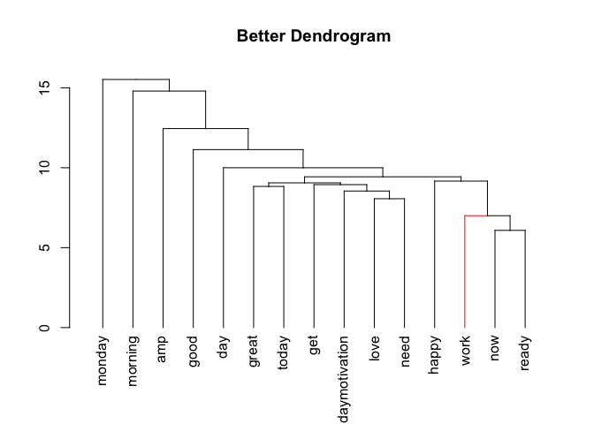

Text Mining Notes
================

Introduction
------------

The notes you are reading now, are the notes I took during the course I took on Datacamp on text mining.

[Link on Datacamp](https://www.datacamp.com/courses/intro-to-text-mining-bag-of-words)

The course is quite nice and well structured, and has a lot of practical examples. But it goes quite fast, so I tend to forget the right syntax, or the right function name that has been used in the examples. So I tought to put them together in a series of examples that one can read, try and use as a reference.

As a dataset we will use tweets. Since I have not found the original csv files from the course, I decided I could download some real tweets by myself. This could prove an interesting project and could give some interesting insights if we download the right tweets. To do this I followed the instructions on this websites

[Link on twitter download 1](https://www.credera.com/blog/business-intelligence/twitter-analytics-using-r-part-1-extract-tweets/) [Link on twitter download 2](http://thinktostart.com/twitter-authentification-with-r/)

Let's get the tweets
====================

Let's load the necessary libraries

``` r
library("devtools")
library("twitteR")
library("ROAuth")
```

Now we need to save our keys

``` r
secrets <- read.csv("/Users/umberto/Documents/Passwords and Secrets/twitter-keys.csv", stringsAsFactors = FALSE, header = TRUE, sep =",")

api_key <- secrets$api_key
api_secret <- secrets$api_secret
access_token <- secrets$access_token
access_token_secret <- secrets$access_token_secret
 

setup_twitter_oauth(api_key,api_secret)
```

    ## [1] "Using browser based authentication"

Coffee Tweets
-------------

``` r
search.string <- "#coffee"
no.of.tweets <- 1000

c_tweets <- searchTwitter(search.string, n=no.of.tweets, lang="en")
```

Now we need to access the text of the tweets. So we do it in this way (we also need to clean up the tweets from special characters that for now we don't need, like emoticons with teh `sapply` function.)

``` r
coffee_tweets = sapply(c_tweets, function(t) t$getText())

coffee_tweets <- sapply(coffee_tweets,function(row) iconv(row, "latin1", "ASCII", sub=""))

head(coffee_tweets)
```

    ##          RT @KauaiVacRentals: Aloha and happy Monday!\nCome stay with us.\n#Kauai #VacationRentals #Coffee #MondayMorning https://t.co/fvJul9UGO7 
    ##        "RT @KauaiVacRentals: Aloha and happy Monday!\nCome stay with us.\n#Kauai #VacationRentals #Coffee #MondayMorning https://t.co/fvJul9UGO7" 
    ##                                                                            Coffee isn't a must . . . https://t.co/7OlrV8gGaa\n\n#coffee #mornings 
    ##                                                                          "Coffee isn't a must . . . https://t.co/7OlrV8gGaa\n\n#coffee #mornings" 
    ## RT @AGStockport: 2 slots left for our fitting event which is free. Call in and have a #coffee and chat with us. #stockport #RT #wednesdaywi<U+2026> 
    ##     "RT @AGStockport: 2 slots left for our fitting event which is free. Call in and have a #coffee and chat with us. #stockport #RT #wednesdaywi" 
    ##              RT @Mt_Atkinson: Ask if anyone wants a coffee they said...\n#coffee #mtatkinson #westtillirest @thetannerynz https://t.co/Xc6Fves66b 
    ##            "RT @Mt_Atkinson: Ask if anyone wants a coffee they said...\n#coffee #mtatkinson #westtillirest @thetannerynz https://t.co/Xc6Fves66b" 
    ##                                                   #nottingham #coffee #career get in touch to #applynow #jobs #lovecoffee https://t.co/zsn3zh0eue 
    ##                                                 "#nottingham #coffee #career get in touch to #applynow #jobs #lovecoffee https://t.co/zsn3zh0eue" 
    ##                     Can't come to work today. I'm sick. \n*\n*\n*\n#Starbucks #coffee #darkroast #hermit #spinner<U+2026> https://t.co/q6LplBVjad 
    ##                           "Can't come to work today. I'm sick. \n*\n*\n*\n#Starbucks #coffee #darkroast #hermit #spinner https://t.co/q6LplBVjad"

It is interested to see how many parameters we get from the search

``` r
str(c_tweets[[1]])
```

    ## Reference class 'status' [package "twitteR"] with 17 fields
    ##  $ text         : chr "RT @KauaiVacRentals: Aloha and happy Monday!\nCome stay with us.\n#Kauai #VacationRentals #Coffee #MondayMornin"| __truncated__
    ##  $ favorited    : logi FALSE
    ##  $ favoriteCount: num 0
    ##  $ replyToSN    : chr(0) 
    ##  $ created      : POSIXct[1:1], format: "2017-05-23 20:55:31"
    ##  $ truncated    : logi FALSE
    ##  $ replyToSID   : chr(0) 
    ##  $ id           : chr "867121837930672128"
    ##  $ replyToUID   : chr(0) 
    ##  $ statusSource : chr "<a href=\"http://twitter.com\" rel=\"nofollow\">Twitter Web Client</a>"
    ##  $ screenName   : chr "CabinetDepotFL"
    ##  $ retweetCount : num 8
    ##  $ isRetweet    : logi TRUE
    ##  $ retweeted    : logi FALSE
    ##  $ longitude    : chr(0) 
    ##  $ latitude     : chr(0) 
    ##  $ urls         :'data.frame':   0 obs. of  4 variables:
    ##   ..$ url         : chr(0) 
    ##   ..$ expanded_url: chr(0) 
    ##   ..$ dispaly_url : chr(0) 
    ##   ..$ indices     : num(0) 
    ##  and 53 methods, of which 39 are  possibly relevant:
    ##    getCreated, getFavoriteCount, getFavorited, getId, getIsRetweet,
    ##    getLatitude, getLongitude, getReplyToSID, getReplyToSN, getReplyToUID,
    ##    getRetweetCount, getRetweeted, getRetweeters, getRetweets,
    ##    getScreenName, getStatusSource, getText, getTruncated, getUrls,
    ##    initialize, setCreated, setFavoriteCount, setFavorited, setId,
    ##    setIsRetweet, setLatitude, setLongitude, setReplyToSID, setReplyToSN,
    ##    setReplyToUID, setRetweetCount, setRetweeted, setScreenName,
    ##    setStatusSource, setText, setTruncated, setUrls, toDataFrame,
    ##    toDataFrame#twitterObj

So there is quite some possibilities here. But we are not actually interested in twitters now, but just in the text `tweetsText`. (check for example as reference this [stackoverflow post](http://stackoverflow.com/questions/14549305/searchtwitter-timestamps)).

Tea tweets
----------

Since we are going to compare corpora of text, we need a second set of tweets, and, following the example of the course, I decided to download the first 1000 tweets on Tea

Tea Tweets
----------

``` r
search.string <- "#tea"
no.of.tweets <- 1000

t_tweets <- searchTwitter(search.string, n=no.of.tweets, lang="en")
```

Now we need to access the text of the tweets. So we do it in this way (we also need to clean up the tweets from special characters that for now we don't need, like emoticons with teh `sapply` function.)

``` r
tea_tweets = sapply(t_tweets, function(t) t$getText())

tea_tweets <- sapply(tea_tweets,function(row) iconv(row, "latin1", "ASCII", sub=""))

head(tea_tweets)
```

    ##      Australian Crunch Bars (Gluten Free Version) #britishfood #teatime #tea #afternoontea #omgb - Christina's Cucina<U+2026> https://t.co/pP20UAcqZw 
    ##            "Australian Crunch Bars (Gluten Free Version) #britishfood #teatime #tea #afternoontea #omgb - Christina's Cucina https://t.co/pP20UAcqZw" 
    ##        Discover the perfect cup of tea with @BrevilleCanada &amp; enter to win their #TeaMaker via @MamaAshEMB #giveaway #tea https://t.co/PZdTHwgSan 
    ##      "Discover the perfect cup of tea with @BrevilleCanada &amp; enter to win their #TeaMaker via @MamaAshEMB #giveaway #tea https://t.co/PZdTHwgSan" 
    ## RT @GSMLondon: In 1921, #tea blender J. Lyons &amp; Co. extended production to #Greenford by the Grand Union Canal.  Happy Local Community and<U+2026> 
    ##      "RT @GSMLondon: In 1921, #tea blender J. Lyons &amp; Co. extended production to #Greenford by the Grand Union Canal.  Happy Local Community and" 
    ##                                                                                      @SchadenJake Hi - What was your first experience with #tea like? 
    ##                                                                                    "@SchadenJake Hi - What was your first experience with #tea like?" 
    ##                                             RT @batznatz: I want to be this tea set. #Tea set # porcelain !!!<U+2728><U+2601> https://t.co/wT8COhY21W 
    ##                                                           "RT @batznatz: I want to be this tea set. #Tea set # porcelain !!! https://t.co/wT8COhY21W" 
    ## RT @DanaHamm: I start my day w @flattummytea b/c I can see &amp; feel the difference Who doesn't want a flat sexy tummy everyday! #tea #abs #fi<U+2026> 
    ##     "RT @DanaHamm: I start my day w @flattummytea b/c I can see &amp; feel the difference Who doesn't want a flat sexy tummy everyday! #tea #abs #fi"

Let's start with text mining
============================

To do text mining one of the most used library (and the one I will use here) is `tm`.

``` r
library("tm")
```

First we need to create a vector of texts

``` r
coffee_source <- VectorSource(coffee_tweets)
tea_source <- VectorSource(tea_tweets)
```

Then we need to make a `VCorpus` of the list of tweets

``` r
coffee_corpus <- VCorpus(coffee_source)
tea_corpus <- VCorpus(tea_source)
coffee_corpus
```

    ## <<VCorpus>>
    ## Metadata:  corpus specific: 0, document level (indexed): 0
    ## Content:  documents: 1000

So if we want to see the text of a tweet in the corpus we can use

``` r
coffee_corpus[[15]][1]
```

    ## $content
    ## [1] "Morning Coffee - view from our tent - Badlands National Park\n#Badlands #camping #tentcamping #coffee https://t.co/DmXtfbV5e9"

``` r
tea_corpus[[15]][1]
```

    ## $content
    ## [1] "RT @agreenang: Fun and unique #giftidea for a #tea #drinker! by agreenangel  https://t.co/RdZLAXZKOl #epiconetsy #sale #womeninbiz"

Cleaning text
-------------

Now that I how to make a corpus, I can focus on cleaning, or preprocessing, the text. In bag of words text mining, cleaning helps aggregate terms. For example, it may make sense that the words "miner", "mining" and "mine" should be considered one term. Specific preprocessing steps will vary based on the project. For example, the words used in tweets are vastly different than those used in legal documents, so the cleaning process can also be quite different. (Text Source: Datacamp)

From Data Source

Common preprocessing functions include:

-   tolower(): Make all characters lowercase
-   removePunctuation(): Remove all punctuation marks
-   removeNumbers(): Remove numbers
-   stripWhitespace(): Remove excess whitespace

Note that tolower() is part of base R, while the other three functions come from the tm package. Going forward, we'll load the tm and qdap for you when they are needed. Every time we introduce a new package, we'll have you load it the first time.

The **qdap** package offers other text cleaning functions. Each is useful in its own way and is particularly powerful when combined with the others.

-   bracketX(): Remove all text within brackets (e.g. "It's (so) cool" becomes "It's cool")
-   replace\_number(): Replace numbers with their word equivalents (e.g. "2" becomes "two")
-   replace\_abbreviation(): Replace abbreviations with their full text equivalents (e.g. "Sr" becomes "Senior")
-   replace\_contraction(): Convert contractions back to their base words (e.g. "shouldn't" becomes "should not")
-   replace\_symbol() Replace common symbols with their word equivalents (e.g. "$" becomes "dollar")

Stopwords
---------

Using the c() function allows you to add new words (separated by commas) to the stop words list. For example, the following would add "word1" and "word2" to the default list of English stop words:

    all_stops <- c("word1", "word2", stopwords("en"))

You can use the following command to remove stopwords

    removeWords(text, stopwords("en"))

Stemming
--------

Here is an example of stemming

``` r
stemDocument(c("computational", "computers", "computation"))
```

    ## [1] "comput" "comput" "comput"

Here is an example of using stemming

``` r
# Create complicate
complicate <- c("complicated", "complication", "complicatedly")
# Perform word stemming: stem_doc
stem_doc <- stemDocument(complicate)
# Create the completion dictionary: comp_dict
comp_dict <- "complicate"
# Perform stem completion: complete_text 
complete_text <- stemCompletion(stem_doc, comp_dict)
# Print complete_text
complete_text
```

    ##      complic      complic      complic 
    ## "complicate" "complicate" "complicate"

Clean the Corpus
================

To clean the Corpus we can define a function that applies several functions on the corpus

``` r
clean_corpus <- function(corpus){
  corpus <- tm_map(corpus, stripWhitespace)
  corpus <- tm_map(corpus, removePunctuation)
  corpus <- tm_map(corpus, content_transformer(tolower))
  corpus <- tm_map(corpus, removeWords, c(stopwords("en"), "mug", "coffee"))
  return(corpus)
}
```

Then we can try to apply it on our corpus

``` r
clean_corp <- clean_corpus(coffee_corpus)
```

Then we can pring a cleaned-up tweet

``` r
clean_corp[[227]][1]
```

    ## $content
    ## [1] "rt suziday123 gigirules7 monday  morning letsdothis mondaymotivaton caramiasg magnumexotics coffeeandbean httpst"

and the original one

``` r
coffee_corpus[[227]][1]
```

    ## $content
    ## [1] "RT @suziday123: @gigirules7 Monday #coffee  Morning #letsdothis #MondayMotivaton @CaraMiaSG @MagnumExotics @Coffee_and_Bean https://t"

So we have removed special characters, punctuation and so on. Not all the words make much sense really (for example twitter usernames) but it should not be a problem since we don't expect to see them very often in our corpus.

Make a document-term matrix
---------------------------

We can use the following code to make a DTM. Each document is represented as a row and each word as a column.

``` r
coffee_dtm <- DocumentTermMatrix(clean_corp)

# Print out coffee_dtm data
print(coffee_dtm)
```

    ## <<DocumentTermMatrix (documents: 1000, terms: 3960)>>
    ## Non-/sparse entries: 9223/3950777
    ## Sparsity           : 100%
    ## Maximal term length: 63
    ## Weighting          : term frequency (tf)

``` r
# Convert coffee_dtm to a matrix: coffee_m
coffee_m <- as.matrix(coffee_dtm)

# Print the dimensions of coffee_m
dim(coffee_m)
```

    ## [1] 1000 3960

``` r
# Review a portion of the matrix
coffee_m[148:150, 2587: 2590]
```

    ##      Terms
    ## Docs  meeting meetings meetup melbourne
    ##   148       0        0      0         0
    ##   149       0        0      0         0
    ##   150       0        0      0         0

Make a document-term matrix (DTM)
---------------------------------

You can also transpose a TDM, to have each word as a row and each column as a document.

``` r
# Create a TDM from clean_corp: coffee_tdm
coffee_tdm <- TermDocumentMatrix(clean_corp)

# Print coffee_tdm data
print(coffee_tdm)
```

    ## <<TermDocumentMatrix (terms: 3960, documents: 1000)>>
    ## Non-/sparse entries: 9223/3950777
    ## Sparsity           : 100%
    ## Maximal term length: 63
    ## Weighting          : term frequency (tf)

``` r
# Convert coffee_tdm to a matrix: coffee_m
coffee_m <- as.matrix(coffee_tdm)

# Print the dimensions of the matrix
dim(coffee_m)
```

    ## [1] 3960 1000

``` r
# Review a portion of the matrix
coffee_m[2587:2590, 148:150]
```

    ##            Docs
    ## Terms       148 149 150
    ##   meeting     0   0   0
    ##   meetings    0   0   0
    ##   meetup      0   0   0
    ##   melbourne   0   0   0

Frequent terms with tm
----------------------

(source Datacamp) Now that you know how to make a term-document matrix, as well as its transpose, the document-term matrix, we will use it as the basis for some analysis. In order to analyze it we need to change it to a simple matrix like we did in chapter 1 using as.matrix.

Calling `rowSums()` on your newly made matrix aggregates all the terms used in a passage. Once you have the `rowSums()`, you can `sort()` them with `decreasing = TRUE`, so you can focus on the most common terms.

Lastly, you can make a barplot() of the top 5 terms of term\_frequency with the following code.

    barplot(term_frequency[1:5], col = "#C0DE25")

Of course, you could take our ggplot2 course to learn how to customize the plot even more... :)

So let's try with out coffee tweets

``` r
## coffee_tdm is still loaded in your workspace

# Create a matrix: coffee_m
coffee_m <- as.matrix(coffee_tdm)

# Calculate the rowSums: term_frequency
term_frequency <- rowSums(coffee_m)

# Sort term_frequency in descending order
term_frequency <- sort(term_frequency, decreasing = TRUE)

# View the top 10 most common words
term_frequency[1:10]
```

    ##   cup cakes welsh   amp  free   day  love   buy   one   add 
    ##    93    81    80    55    54    49    49    47    46    45

``` r
# Plot a barchart of the 10 most common words
barplot(term_frequency[1:10], col = "tan", las = 2)
```

 Now let's make it a bit prettier with **ggplot2**...

``` r
library(ggplot2)
```

``` r
library(dplyr)

tf <- as.data.frame(term_frequency)
tf$words <- row.names(tf)
tf10 <- as.data.frame(tf[1:10,])

# We need to make the words factors (ordered) otherwise ggplot2 will order the 
# x axis alphabetically
tf10 <- mutate(tf10, words = factor(words, words))

ggplot(tf10, aes(x = tf10$words , y = tf10$term_frequency   )) + geom_bar(stat = "identity", fill = "tan", col = "black")+ theme_grey()+theme(text = element_text(size=16),  axis.title.x=element_blank(),axis.text.x=element_text(angle=90,hjust=1,vjust=0.5))+ylab("Words Frequency") 
```


Note that the following command don't work from Rstudio if you want to use `knitr`. So the solution is to do it from the console with the following commands

``` r
library(rmarkdown)
render("/Users/umberto/Documents/Education/Data Camp/Text Mining/Text-Mining-Notes/text-mining-notes.Rmd")
```

The command will render an html file in the directory where the `Rmd` file is.

``` r
library(rJava)
library(qdap)
```

Let's build a word frequency plot with `qdap` library

``` r
frequency <- freq_terms(coffee_tweets, top = 10, at.least = 3, stopwords = "Top200Words")

frequency <- mutate(frequency, WORD = factor(WORD, WORD))

ggplot(frequency, aes(x = frequency$WORD , y = frequency$FREQ   )) + geom_bar(stat = "identity", fill = "tan", col = "black")+ theme_grey()+theme(text = element_text(size=16),  axis.title.x=element_blank(),axis.text.x=element_text(angle=90,hjust=1,vjust=0.5))+ylab("Words Frequency") 
```

 Now let's remove more stopwords

``` r
frequency2 <- freq_terms(coffee_tweets, top = 10, at.least = 3, stopwords = tm::stopwords("english"))

frequency2 <- mutate(frequency2, WORD = factor(WORD, WORD))

ggplot(frequency2, aes(x = frequency2$WORD , y = frequency2$FREQ   )) + geom_bar(stat = "identity", fill = "tan", col = "black")+ theme_grey()+theme(text = element_text(size=16),  axis.title.x=element_blank(),axis.text.x=element_text(angle=90,hjust=1,vjust=0.5))+ylab("Words Frequency") 
```


Wordclouds
----------

``` r
library(wordcloud)
```

``` r
term_frequency[1:10]
```

    ##   cup cakes welsh   amp  free   day  love   buy   one   add 
    ##    93    81    80    55    54    49    49    47    46    45

``` r
word_freqs <- data.frame(term = names(term_frequency), num = term_frequency)
wordcloud(word_freqs$term, word_freqs$num, max.words = 100, colors = "red")
```

    ## Warning in wordcloud(word_freqs$term, word_freqs$num, max.words = 100,
    ## colors = "red"): welsh could not be fit on page. It will not be plotted.

    ## Warning in wordcloud(word_freqs$term, word_freqs$num, max.words = 100,
    ## colors = "red"): morning could not be fit on page. It will not be plotted.



Now we need to remove some words that are clear are appearing while talking about coffee

``` r
# Add new stop words to clean_corpus()
clean_corpus <- function(corpus){
  corpus <- tm_map(corpus, removePunctuation)
  corpus <- tm_map(corpus, stripWhitespace)
  corpus <- tm_map(corpus, removeNumbers)
  corpus <- tm_map(corpus, content_transformer(tolower))
  corpus <- tm_map(corpus, removeWords, 
                   c(stopwords("en"), "brew", "cafe", "coffeetime", "cup", "coffee"))
  return(corpus)
}

clean_coffee <- clean_corpus(coffee_corpus)
coffee_tdm <- TermDocumentMatrix(clean_coffee)
coffee_m <- as.matrix(coffee_tdm)
coffee_words <- rowSums(coffee_m)
```

Now we prepare the right order of words for the wordcloud

``` r
coffee_words <- sort(coffee_words, decreasing = TRUE)
coffee_words[1:6]
```

    ## cakes welsh   amp  free   day  love 
    ##    81    80    55    54    49    49

``` r
coffee_freqs <- data.frame (term = names(coffee_words), num = coffee_words)

wordcloud(coffee_freqs$term, coffee_freqs$num, max.words = 50, colors = "red")
```


### Improve word colours

``` r
wordcloud(coffee_freqs$term, coffee_freqs$num, max.words = 100, colors = c("grey80", "darkgoldenrod1", "tomato"))
```

    ## Warning in wordcloud(coffee_freqs$term, coffee_freqs$num, max.words =
    ## 100, : espresso could not be fit on page. It will not be plotted.

    ## Warning in wordcloud(coffee_freqs$term, coffee_freqs$num, max.words =
    ## 100, : amp could not be fit on page. It will not be plotted.

    ## Warning in wordcloud(coffee_freqs$term, coffee_freqs$num, max.words =
    ## 100, : packs could not be fit on page. It will not be plotted.

    ## Warning in wordcloud(coffee_freqs$term, coffee_freqs$num, max.words =
    ## 100, : love could not be fit on page. It will not be plotted.

    ## Warning in wordcloud(coffee_freqs$term, coffee_freqs$num, max.words =
    ## 100, : httpstcopqxaevqg could not be fit on page. It will not be plotted.

    ## Warning in wordcloud(coffee_freqs$term, coffee_freqs$num, max.words =
    ## 100, : problem could not be fit on page. It will not be plotted.

    ## Warning in wordcloud(coffee_freqs$term, coffee_freqs$num, max.words =
    ## 100, : solution could not be fit on page. It will not be plotted.

    ## Warning in wordcloud(coffee_freqs$term, coffee_freqs$num, max.words =
    ## 100, : one could not be fit on page. It will not be plotted.

    ## Warning in wordcloud(coffee_freqs$term, coffee_freqs$num, max.words =
    ## 100, : coffeelovers could not be fit on page. It will not be plotted.


RColorBrewer color schemes are organized into three categories:

-   Sequential: Colors ascend from light to dark in sequence
-   Qualitative: Colors are chosen for their pleasing qualities together
-   Diverging: Colors have two distinct color spectra with lighter colors in between

To change the colors parameter of the `wordcloud()` function you can use a select a palette from `RColorBrewer` such as "Greens". The function `display.brewer.all()` will list all predefined color palettes. More information on ColorBrewer (the framework behind RColorBrewer) is available on its [website](http://www.colorbrewer.org/).

(Source: datacamp)

The function `brewer.pal()` allows you to select colors from a palette. Specify the number of distinct colors needed (e.g. 8) and the predefined palette to select from (e.g. "Greens"). Often in word clouds, very faint colors are washed out so it may make sense to remove the first couple from a brewer.pal() selection, leaving only the darkest.

Here's an example:

    green_pal <- brewer.pal(8, "Greens")
    green_pal <- green_pal[-(1:2)]

Then just add that object to the wordcloud() function.

    wordcloud(chardonnay_freqs$term, chardonnay_freqs$num, max.words = 100, colors = green_pal)

(Source: datacamp)

The command `display.brewer.all()` will display all palettes. Is a very cool command

``` r
display.brewer.all()
```


Let's try to use the `PuOr` palette

``` r
# Create purple_orange
PuOr <- brewer.pal(10, "PuOr")
purple_orange <- PuOr[-(1:2)]
```

And now we can create the wordcloud woith this palette

``` r
wordcloud(coffee_freqs$term, coffee_freqs$num, max.words = 100, colors = purple_orange)
```

    ## Warning in wordcloud(coffee_freqs$term, coffee_freqs$num, max.words =
    ## 100, : coffeelover could not be fit on page. It will not be plotted.

    ## Warning in wordcloud(coffee_freqs$term, coffee_freqs$num, max.words =
    ## 100, : drink could not be fit on page. It will not be plotted.

    ## Warning in wordcloud(coffee_freqs$term, coffee_freqs$num, max.words =
    ## 100, : httpstcopqxaevqg could not be fit on page. It will not be plotted.

    ## Warning in wordcloud(coffee_freqs$term, coffee_freqs$num, max.words =
    ## 100, : queenbeancoffee could not be fit on page. It will not be plotted.

    ## Warning in wordcloud(coffee_freqs$term, coffee_freqs$num, max.words =
    ## 100, : selection could not be fit on page. It will not be plotted.

    ## Warning in wordcloud(coffee_freqs$term, coffee_freqs$num, max.words =
    ## 100, : elfortney could not be fit on page. It will not be plotted.

    ## Warning in wordcloud(coffee_freqs$term, coffee_freqs$num, max.words =
    ## 100, : caffeine could not be fit on page. It will not be plotted.

    ## Warning in wordcloud(coffee_freqs$term, coffee_freqs$num, max.words =
    ## 100, : even could not be fit on page. It will not be plotted.

    ## Warning in wordcloud(coffee_freqs$term, coffee_freqs$num, max.words =
    ## 100, : simple could not be fit on page. It will not be plotted.

    ## Warning in wordcloud(coffee_freqs$term, coffee_freqs$num, max.words =
    ## 100, : starbucks could not be fit on page. It will not be plotted.

    ## Warning in wordcloud(coffee_freqs$term, coffee_freqs$num, max.words =
    ## 100, : shop could not be fit on page. It will not be plotted.

    ## Warning in wordcloud(coffee_freqs$term, coffee_freqs$num, max.words =
    ## 100, : mystery could not be fit on page. It will not be plotted.


Sometimes not all the words can be plotted. In this case the only solutions are to reduce the number of words or to reduce the scale of the words themselves. For example

``` r
wordcloud(coffee_freqs$term, coffee_freqs$num, max.words = 100, colors = purple_orange, scale = c(2,0.3))
```


Now all the words are in the plots.

Wordclouds with bigrams
-----------------------

Now sometimes single words don't tell the entire story and is interesting to do the same plot with bigrams (words that appear together in the corpus). The tokenizer from `RWeka` is very useful.

``` r
library(RWeka)
```

Then we need to get the couples of words (note that the definition give below will give you **only** bigrams, and not single words anymore).

``` r
BigramTokenizer <- function(x) NGramTokenizer(x, Weka_control(min = 2, max = 2))
tdm.bigram <- TermDocumentMatrix(coffee_corpus, control = list(tokenize = BigramTokenizer))
```

Then we can get the frequencies of the bigrams

``` r
freq <- sort(rowSums(as.matrix(tdm.bigram)), decreasing = TRUE)
freq.df <- data.frame(word = names(freq), freq= freq)
head(freq.df)
```

    ##                        word freq
    ## https //t         https //t 1000
    ## #coffee https #coffee https  167
    ## coffee we         coffee we   41
    ## #free til         #free til   40
    ## / mix                 / mix   40
    ## 2 6                     2 6   40

Now we can plot the wordcloud

``` r
wordcloud(freq.df$word, freq.df$freq, max.words = 50, random.order = F, colors = purple_orange, scale = c(4,0.7))
```


We need of course first to do a cleanup of the bigrams list. But that is something that goes beyond the notes I am writing. An important point is that if you remove all stop words like "not" you may loose important informations for bigrams (like negations).

Trigrams
--------

Just as a reference here is the code to do wordclouds with trigrams

``` r
TrigramTokenizer <- function(x) NGramTokenizer(x, Weka_control(min = 3, max = 3))
tdm.trigram <- TermDocumentMatrix(coffee_corpus, control = list(tokenize= TrigramTokenizer))

freq <- sort(rowSums(as.matrix(tdm.trigram)), decreasing = TRUE)
freq.df <- data.frame(word = names(freq), freq= freq)
head(freq.df)
```

    ##                                word freq
    ## #coffee https //t #coffee https //t  163
    ## #free til 5/10       #free til 5/10   40
    ## / mix or                   / mix or   40
    ## 2 6 packs                 2 6 packs   40
    ## 2 choc dipt             2 choc dipt   40
    ## 5/10 buy 2               5/10 buy 2   40

Common Words between Corpora
============================

To find common words we need to create two "big" documents of tweets. We need to collapse all tweets together separated by a space

``` r
all_coffee <- paste (coffee_tweets, collapse = " ")
all_tea <- paste (tea_tweets,collapse = " ")
all_tweets <- c(all_coffee, all_tea)
```

Now we convert to a Corpus

``` r
# Convert to a vector source
all_tweets <- VectorSource(all_tweets)

# Create all_corpus
all_corpus <- VCorpus(all_tweets)
```

Now that we have a corpus filled with words used in both the tea and coffee tweets files, we can clean the corpus, convert it into a TermDocumentMatrix, and then a matrix to prepare it for a commonality.cloud(). First we need to define a proper cleaning function that contains words like *coffee* and *tea*

``` r
clean_corpus <- function(corpus){
  corpus <- tm_map(corpus, stripWhitespace)
  corpus <- tm_map(corpus, removePunctuation)
  corpus <- tm_map(corpus, content_transformer(tolower))
  corpus <- tm_map(corpus, removeWords, c(stopwords("en"), "mug", "coffee", "tea"))
  return(corpus)
}
```

Let's clean the corpus

``` r
# Clean the corpus
all_clean <- clean_corpus (all_corpus)

# Create all_tdm
all_tdm <- TermDocumentMatrix(all_clean) 

# Create all_m
all_m <- as.matrix(all_tdm)
```

Now the communality cloud

``` r
commonality.cloud(all_m, max.words = 100, colors = "steelblue1")
```


Comparison Cloud
----------------

You can plot a comparison cloud in this way

``` r
comparison.cloud(all_m, max.words = 50, colors = c("orange", "blue"), scale = c(3,0.5))
```


(Source Datacamp) A commonality.cloud() may be misleading since words could be represented disproportionately in one corpus or the other, even if they are shared. In the commonality cloud, they would show up without telling you which one of the corpora has more term occurrences.

To solve this problem, we can create a `pyramid.plot()` from the `plotrix` package.

``` r
library(plotrix)
```

``` r
all_tdm_m <- all_m
# Create common_words
common_words <- subset(all_tdm_m, all_tdm_m[, 1] > 0 & all_tdm_m[, 2] > 0)

# Create difference
difference <- abs(common_words[, 1] - common_words[, 2])

# Combine common_words and difference
common_words <- cbind(common_words, difference)

# Order the data frame from most differences to least
common_words <- common_words[order(common_words[, 3], decreasing = TRUE), ]

# Create top25_df
top25_df <- data.frame(x = common_words[1:25, 1], 
                       y = common_words[1:25, 2], 
                       labels = rownames(common_words[1:25, ]))

# Create the pyramid plot
pyramid.plot(top25_df$x, top25_df$y,
             labels = top25_df$labels, gap = 60,
             top.labels = c("Coffee", "Words", "Tea"),
             main = "Words in Common", laxlab = NULL, 
             raxlab = NULL, unit = NULL)
```


    ## [1] 5.1 4.1 4.1 2.1

Word Networks
-------------

In a network graph, the circles are called nodes and represent individual terms, while the lines connecting the circles are called edges and represent the connections between the terms.

For the over-caffeinated text miner, qdap provides a shorcut for making word networks. The word\_network\_plot() and word\_associate() functions both make word networks easy!

``` r
word_associate(coffee_tweets, match.string = c("monday"), 
               stopwords = c(Top200Words, "coffee", "mug"), 
               network.plot = TRUE)
```

    ## Warning in text2color(words = V(g)$label, recode.words = target.words,
    ## colors = label.colors): length of colors should be 1 more than length of
    ## recode.words


    ##   row group unit text                                                                                                                                       
    ## 1   1   all    1 RT @KauaiVacRentals: Aloha and happy Monday! Come stay with us. #Kauai #VacationRentals #Coffee #MondayMorning https://t.co/fvJul9UGO7     
    ## 2 227   all  227 RT @suziday123: @gigirules7 Monday #coffee Morning #letsdothis #MondayMotivaton @CaraMiaSG @MagnumExotics @Coffee_and_Bean https://t       
    ## 3 238   all  238 Alto Astral #bemorehuman #monday #saturday #goodmorning #overheadsquat #snatch #coffee https://t.co/gUp677aGDp                             
    ## 4 653   all  653 RT @badolinaLDN: Monday morning... Our #coffee is so strong it wakes up the neighbours! (sorry neighbours....) https://t.co/GjgqbKMqmD     
    ## 5 925   all  925 When Tuesday after a long weekend still feels like Monday #parenting #coffee #CoffeeAddict #preschooler #coffeetime https://t.co/od8zLwjjdb

    ## 
    ## Match Terms
    ## ===========

    ## 
    ## List 1:
    ## monday, mondaymorning, mondaymotivaton

    ## 

Distance Matrix and Dendograms
==============================

Now that you understand the steps in making a dendrogram, you can apply them to text. But first, you have to limit the number of words in your TDM using removeSparseTerms() from tm. Why would you want to adjust the sparsity of the TDM/DTM?

TDMs and DTMs are sparse, meaning they contain mostly zeros. Remember that 1000 tweets can become a TDM with over 3000 terms! You won't be able to easily interpret a dendrogram that is so cluttered, especially if you are working on more text.

A good TDM has between 25 and 70 terms. The lower the sparse value, the more terms are kept. The closer it is to 1, the fewer are kept. This value is a percentage cutoff of zeros for each term in the TDM.

Let's see the dimensions of your coffee tdm

``` r
dim(coffee_tdm)
```

    ## [1] 3887 1000

Let's remove some terms

``` r
coffee_tdm1 <- removeSparseTerms(coffee_tdm, sparse = 0.97)
dim(coffee_tdm1)
```

    ## [1]   23 1000

Let's see a dendrogram now

``` r
coffee_tdm1_m <- as.matrix(coffee_tdm1)
coffee_tdm1_df <- as.data.frame(coffee_tdm1_m)  
coffee_dist <- dist(coffee_tdm1_df)

coffee_hc <- hclust(coffee_dist)
plot(coffee_hc)
```


Now let's make the dendrogram more appealing

``` r
library(dendextend)
```

Now

``` r
hcd <- as.dendrogram(coffee_hc)
labels(hcd)
```

    ##  [1] "cakes"     "welsh"     "free"      "buy"       "add"      
    ##  [6] "packs"     "mix"       "til"       "choc"      "dipt"     
    ## [11] "amp"       "love"      "day"       "can"       "one"      
    ## [16] "morning"   "like"      "via"       "starbucks" "drink"    
    ## [21] "need"      "great"     "new"

Now let's work on the appearance

``` r
hcd <- branches_attr_by_labels(hcd, c("mondaymorning", "work"), "red")
```

    ## Warning in branches_attr_by_labels(hcd, c("mondaymorning", "work"), "red"): Not all of the labels you provided are included in the dendrogram.
    ## The following labels were omitted:mondaymorningwork

``` r
plot(hcd, main = "Better Dendrogram")
```

 Now let's add rectangular shapes around the clusters

``` r
# Add cluster rectangles 
plot(hcd, main = "Better Dendrogram")
rect.dendrogram(hcd, k = 2, border = "grey50")
```


Word Associations
=================

Another way to think about word relationships is with the findAssocs() function in the tm package. For any given word, findAssocs() calculates its correlation with every other word in a TDM or DTM. Scores range from 0 to 1. A score of 1 means that two words always appear together, while a score of 0 means that they never appear together.

To use findAssocs() pass in a TDM or DTM, the search term, and a minimum correlation. The function will return a list of all other terms that meet or exceed the minimum threshold.

    findAssocs(tdm, "word", 0.25)

``` r
# Create associations
associations <- findAssocs(coffee_tdm, "mug", 0.2)

# View the venti associations
print(associations)
```

    ## $mug
    ##       disappearing   httpstcohcqgsyyv       morningkraze 
    ##               0.42               0.42               0.42 
    ##           morphing             batman            ceramic 
    ##               0.42               0.39               0.39 
    ##            fathers           deserves         epiconetsy 
    ##               0.34               0.31               0.31 
    ##       etsychaching httpstcoiwovyllqjz               away 
    ##               0.31               0.31               0.30 
    ##           birthday        daydrinking             hockey 
    ##               0.30               0.30               0.30 
    ##  httpstcocgzitfizv httpstcoqzukkwrhnp           silicone 
    ##               0.30               0.30               0.30 
    ##  whiskeyandwhineco               june       coffeelovers 
    ##               0.30               0.25               0.21 
    ##              color             travel              funny 
    ##               0.21               0.21               0.20 
    ##              retro 
    ##               0.20

``` r
library(ggthemes)

# Create associations_df
associations_df <- list_vect2df(associations)[,2:3]

# Plot the associations_df values (don't change this)
ggplot(associations_df, aes(y = associations_df[, 1])) + 
  geom_point(aes(x = associations_df[, 2]), 
             data = associations_df, size = 3) + 
  theme_gdocs()
```


Similarity matrix
=================

``` r
require(proxy)
```

    ## Loading required package: proxy

    ## 
    ## Attaching package: 'proxy'

    ## The following objects are masked from 'package:stats':
    ## 
    ##     as.dist, dist

    ## The following object is masked from 'package:base':
    ## 
    ##     as.matrix

``` r
coffee_tdm_m <- as.matrix(coffee_tdm)

coffee_cosine_dist_mat <- as.matrix(dist(coffee_tdm_m, method = "cosine"))
```

what dimensions we have in this matrix?

``` r
dim(coffee_cosine_dist_mat)
```

    ## [1] 3887 3887

as expected. Let's check some rows

``` r
coffee_cosine_dist_mat[1:5,1:5]
```

    ##            aammton abroad abwbhlucas accept accessory
    ## aammton          0      1          1      1         1
    ## abroad           1      0          1      1         1
    ## abwbhlucas       1      1          0      1         1
    ## accept           1      1          1      0         1
    ## accessory        1      1          1      1         0

We can do the same calculations using the fact we have sparse matrices

``` r
library(slam)
cosine_dist_mat <- crossprod_simple_triplet_matrix(coffee_tdm)/(sqrt(col_sums(coffee_tdm^2) %*% t(col_sums(coffee_tdm^2))))
```

``` r
cosine_dist_mat[1:5,1:5]
```

    ##     Docs
    ## Docs 1 2 3 4 5
    ##    1 1 0 0 0 0
    ##    2 0 1 0 0 0
    ##    3 0 0 1 0 0
    ##    4 0 0 0 1 0
    ##    5 0 0 0 0 1

Tweets 2 and 3 have a similarity score of 0.92, so a very high one. Let's check them

``` r
print(coffee_tweets[[2]])
```

    ## [1] "Coffee isn't a must . . . https://t.co/7OlrV8gGaa\n\n#coffee #mornings"

``` r
print(coffee_tweets[[3]])
```

    ## [1] "RT @AGStockport: 2 slots left for our fitting event which is free. Call in and have a #coffee and chat with us. #stockport #RT #wednesdaywi"

They are indeed very similar being one a retweet of the other.

Bag of words
============

``` r
my.tdm <- TermDocumentMatrix(coffee_corpus, control = list(weighting = weightTfIdf))
my.dtm <- DocumentTermMatrix(coffee_corpus, control = list(weighting = weightTfIdf, stopwords = TRUE))
inspect(my.dtm)
```

    ## <<DocumentTermMatrix (documents: 1000, terms: 4591)>>
    ## Non-/sparse entries: 10817/4580183
    ## Sparsity           : 100%
    ## Maximal term length: 73
    ## Weighting          : term frequency - inverse document frequency (normalized) (tf-idf)
    ## Sample             :
    ##      Terms
    ## Docs  #coffee #coffeelover &amp; coffee cup drink like need via welsh
    ##   186       0            0     0      0   0     0    0    0   0     0
    ##   254       0            0     0      0   0     0    0    0   0     0
    ##   258       0            0     0      0   0     0    0    0   0     0
    ##   413       0            0     0      0   0     0    0    0   0     0
    ##   491       0            0     0      0   0     0    0    0   0     0
    ##   50        0            0     0      0   0     0    0    0   0     0
    ##   685       0            0     0      0   0     0    0    0   0     0
    ##   736       0            0     0      0   0     0    0    0   0     0
    ##   898       0            0     0      0   0     0    0    0   0     0
    ##   984       0            0     0      0   0     0    0    0   0     0

Let's find (for example) all words that appear twice in any document

``` r
findFreqTerms(my.tdm, 200)
```

    ## character(0)

``` r
cosine_dist_mat <- crossprod_simple_triplet_matrix(my.tdm)/(sqrt(col_sums(my.tdm^2) %*% t(col_sums(my.tdm^2))))
cosine_dist_mat[1:5,1:5]
```

    ##     Docs
    ## Docs            1            2            3            4            5
    ##    1 1.000000e+00 6.053233e-05 9.759121e-02 3.455744e-05 4.363423e-05
    ##    2 6.053233e-05 1.000000e+00 5.676083e-05 9.809743e-03 7.675880e-05
    ##    3 9.759121e-02 5.676083e-05 1.000000e+00 3.240432e-05 4.091558e-05
    ##    4 3.455744e-05 9.809743e-03 3.240432e-05 1.000000e+00 4.382101e-05
    ##    5 4.363423e-05 7.675880e-05 4.091558e-05 4.382101e-05 1.000000e+00

``` r
y <- which(cosine_dist_mat>0.5, arr.in = TRUE)
str(y)
```

    ##  int [1:4402, 1:2] 1 2 3 620 4 5 6 7 609 8 ...
    ##  - attr(*, "dimnames")=List of 2
    ##   ..$ : chr [1:4402] "1" "2" "3" "620" ...
    ##   ..$ : chr [1:2] "Docs" "Docs"

``` r
y
```

    ##      Docs Docs
    ## 1       1    1
    ## 2       2    2
    ## 3       3    3
    ## 620   620    3
    ## 4       4    4
    ## 5       5    5
    ## 6       6    6
    ## 7       7    7
    ## 609   609    7
    ## 8       8    8
    ## 10     10    8
    ## 9       9    9
    ## 8       8   10
    ## 10     10   10
    ## 11     11   11
    ## 12     12   12
    ## 13     13   13
    ## 14     14   14
    ## 15     15   15
    ## 16     16   16
    ## 21     21   16
    ## 17     17   17
    ## 445   445   17
    ## 974   974   17
    ## 18     18   18
    ## 25     25   18
    ## 63     63   18
    ## 108   108   18
    ## 240   240   18
    ## 247   247   18
    ## 249   249   18
    ## 252   252   18
    ## 509   509   18
    ## 534   534   18
    ## 687   687   18
    ## 996   996   18
    ## 19     19   19
    ## 46     46   19
    ## 47     47   19
    ## 48     48   19
    ## 79     79   19
    ## 119   119   19
    ## 192   192   19
    ## 213   213   19
    ## 544   544   19
    ## 865   865   19
    ## 20     20   20
    ## 16     16   21
    ## 21     21   21
    ## 22     22   22
    ## 23     23   23
    ## 293   293   23
    ## 790   790   23
    ## 840   840   23
    ## 24     24   24
    ## 18     18   25
    ## 25     25   25
    ## 63     63   25
    ## 108   108   25
    ## 240   240   25
    ## 247   247   25
    ## 249   249   25
    ## 252   252   25
    ## 509   509   25
    ## 534   534   25
    ## 687   687   25
    ## 996   996   25
    ## 26     26   26
    ## 27     27   27
    ## 104   104   27
    ## 28     28   28
    ## 29     29   29
    ## 30     30   30
    ## 69     69   30
    ## 246   246   30
    ## 750   750   30
    ## 967   967   30
    ## 986   986   30
    ## 31     31   31
    ## 35     35   31
    ## 49     49   31
    ## 62     62   31
    ## 75     75   31
    ## 101   101   31
    ## 116   116   31
    ## 172   172   31
    ## 188   188   31
    ## 203   203   31
    ## 226   226   31
    ## 273   273   31
    ## 278   278   31
    ## 289   289   31
    ## 291   291   31
    ## 308   308   31
    ## 393   393   31
    ## 511   511   31
    ## 820   820   31
    ## 893   893   31
    ## 992   992   31
    ## 32     32   32
    ## 33     33   33
    ## 34     34   34
    ## 31     31   35
    ## 35     35   35
    ## 49     49   35
    ## 62     62   35
    ## 75     75   35
    ## 101   101   35
    ## 116   116   35
    ## 172   172   35
    ## 188   188   35
    ## 203   203   35
    ## 226   226   35
    ## 273   273   35
    ## 278   278   35
    ## 289   289   35
    ## 291   291   35
    ## 308   308   35
    ## 393   393   35
    ## 511   511   35
    ## 820   820   35
    ## 893   893   35
    ## 992   992   35
    ## 36     36   36
    ## 325   325   36
    ## 37     37   37
    ## 38     38   38
    ## 39     39   39
    ## 40     40   40
    ## 60     60   40
    ## 41     41   41
    ## 42     42   42
    ## 43     43   43
    ## 44     44   44
    ## 45     45   45
    ## 19     19   46
    ## 46     46   46
    ## 47     47   46
    ## 48     48   46
    ## 79     79   46
    ## 119   119   46
    ## 192   192   46
    ## 213   213   46
    ## 544   544   46
    ## 865   865   46
    ## 19     19   47
    ## 46     46   47
    ## 47     47   47
    ## 48     48   47
    ## 79     79   47
    ## 119   119   47
    ## 192   192   47
    ## 213   213   47
    ## 544   544   47
    ## 865   865   47
    ## 19     19   48
    ## 46     46   48
    ## 47     47   48
    ## 48     48   48
    ## 79     79   48
    ## 119   119   48
    ## 192   192   48
    ## 213   213   48
    ## 544   544   48
    ## 865   865   48
    ## 31     31   49
    ## 35     35   49
    ## 49     49   49
    ## 62     62   49
    ## 75     75   49
    ## 101   101   49
    ## 116   116   49
    ## 172   172   49
    ## 188   188   49
    ## 203   203   49
    ## 226   226   49
    ## 273   273   49
    ## 278   278   49
    ## 289   289   49
    ## 291   291   49
    ## 308   308   49
    ## 393   393   49
    ## 511   511   49
    ## 820   820   49
    ## 893   893   49
    ## 992   992   49
    ## 50     50   50
    ## 51     51   51
    ## 52     52   52
    ## 53     53   53
    ## 54     54   54
    ## 55     55   55
    ## 56     56   56
    ## 83     83   56
    ## 57     57   57
    ## 58     58   58
    ## 59     59   59
    ## 304   304   59
    ## 415   415   59
    ## 450   450   59
    ## 40     40   60
    ## 60     60   60
    ## 61     61   61
    ## 31     31   62
    ## 35     35   62
    ## 49     49   62
    ## 62     62   62
    ## 75     75   62
    ## 101   101   62
    ## 116   116   62
    ## 172   172   62
    ## 188   188   62
    ## 203   203   62
    ## 226   226   62
    ## 273   273   62
    ## 278   278   62
    ## 289   289   62
    ## 291   291   62
    ## 308   308   62
    ## 393   393   62
    ## 511   511   62
    ## 820   820   62
    ## 893   893   62
    ## 992   992   62
    ## 18     18   63
    ## 25     25   63
    ## 63     63   63
    ## 108   108   63
    ## 240   240   63
    ## 247   247   63
    ## 249   249   63
    ## 252   252   63
    ## 509   509   63
    ## 534   534   63
    ## 687   687   63
    ## 996   996   63
    ## 64     64   64
    ## 524   524   64
    ## 65     65   65
    ## 66     66   66
    ## 67     67   67
    ## 180   180   67
    ## 181   181   67
    ## 182   182   67
    ## 68     68   68
    ## 30     30   69
    ## 69     69   69
    ## 246   246   69
    ## 750   750   69
    ## 967   967   69
    ## 986   986   69
    ## 70     70   70
    ## 231   231   70
    ## 773   773   70
    ## 71     71   71
    ## 239   239   71
    ## 72     72   72
    ## 73     73   73
    ## 74     74   74
    ## 31     31   75
    ## 35     35   75
    ## 49     49   75
    ## 62     62   75
    ## 75     75   75
    ## 101   101   75
    ## 116   116   75
    ## 172   172   75
    ## 188   188   75
    ## 203   203   75
    ## 226   226   75
    ## 273   273   75
    ## 278   278   75
    ## 289   289   75
    ## 291   291   75
    ## 308   308   75
    ## 393   393   75
    ## 511   511   75
    ## 820   820   75
    ## 893   893   75
    ## 992   992   75
    ## 76     76   76
    ## 77     77   77
    ## 78     78   78
    ## 19     19   79
    ## 46     46   79
    ## 47     47   79
    ## 48     48   79
    ## 79     79   79
    ## 119   119   79
    ## 192   192   79
    ## 213   213   79
    ## 544   544   79
    ## 865   865   79
    ## 80     80   80
    ## 81     81   81
    ## 82     82   82
    ## 88     88   82
    ## 56     56   83
    ## 83     83   83
    ## 84     84   84
    ## 85     85   85
    ## 126   126   85
    ## 128   128   85
    ## 129   129   85
    ## 131   131   85
    ## 132   132   85
    ## 133   133   85
    ## 134   134   85
    ## 135   135   85
    ## 136   136   85
    ## 137   137   85
    ## 138   138   85
    ## 139   139   85
    ## 140   140   85
    ## 141   141   85
    ## 142   142   85
    ## 143   143   85
    ## 145   145   85
    ## 146   146   85
    ## 147   147   85
    ## 148   148   85
    ## 149   149   85
    ## 150   150   85
    ## 151   151   85
    ## 152   152   85
    ## 153   153   85
    ## 154   154   85
    ## 155   155   85
    ## 156   156   85
    ## 157   157   85
    ## 159   159   85
    ## 160   160   85
    ## 161   161   85
    ## 162   162   85
    ## 164   164   85
    ## 165   165   85
    ## 166   166   85
    ## 167   167   85
    ## 168   168   85
    ## 169   169   85
    ## 86     86   86
    ## 87     87   87
    ## 82     82   88
    ## 88     88   88
    ## 89     89   89
    ## 90     90   90
    ## 91     91   91
    ## 92     92   92
    ## 93     93   93
    ## 94     94   94
    ## 95     95   95
    ## 112   112   95
    ## 96     96   96
    ## 97     97   97
    ## 281   281   97
    ## 98     98   98
    ## 99     99   99
    ## 100   100   99
    ## 99     99  100
    ## 100   100  100
    ## 31     31  101
    ## 35     35  101
    ## 49     49  101
    ## 62     62  101
    ## 75     75  101
    ## 101   101  101
    ## 116   116  101
    ## 172   172  101
    ## 188   188  101
    ## 203   203  101
    ## 226   226  101
    ## 273   273  101
    ## 278   278  101
    ## 289   289  101
    ## 291   291  101
    ## 308   308  101
    ## 393   393  101
    ## 511   511  101
    ## 820   820  101
    ## 893   893  101
    ## 992   992  101
    ## 102   102  102
    ## 268   268  102
    ## 634   634  102
    ## 892   892  102
    ## 103   103  103
    ## 198   198  103
    ## 382   382  103
    ## 637   637  103
    ## 726   726  103
    ## 953   953  103
    ## 980   980  103
    ## 27     27  104
    ## 104   104  104
    ## 105   105  105
    ## 106   106  106
    ## 107   107  107
    ## 18     18  108
    ## 25     25  108
    ## 63     63  108
    ## 108   108  108
    ## 240   240  108
    ## 247   247  108
    ## 249   249  108
    ## 252   252  108
    ## 509   509  108
    ## 534   534  108
    ## 687   687  108
    ## 996   996  108
    ## 109   109  109
    ## 110   110  110
    ## 111   111  111
    ## 95     95  112
    ## 112   112  112
    ## 113   113  113
    ## 991   991  113
    ## 114   114  114
    ## 115   115  115
    ## 31     31  116
    ## 35     35  116
    ## 49     49  116
    ## 62     62  116
    ## 75     75  116
    ## 101   101  116
    ## 116   116  116
    ## 172   172  116
    ## 188   188  116
    ## 203   203  116
    ## 226   226  116
    ## 273   273  116
    ## 278   278  116
    ## 289   289  116
    ## 291   291  116
    ## 308   308  116
    ## 393   393  116
    ## 511   511  116
    ## 820   820  116
    ## 893   893  116
    ## 992   992  116
    ## 117   117  117
    ## 302   302  117
    ## 752   752  117
    ## 973   973  117
    ## 118   118  118
    ## 344   344  118
    ## 391   391  118
    ## 828   828  118
    ## 937   937  118
    ## 19     19  119
    ## 46     46  119
    ## 47     47  119
    ## 48     48  119
    ## 79     79  119
    ## 119   119  119
    ## 192   192  119
    ## 213   213  119
    ## 544   544  119
    ## 865   865  119
    ## 120   120  120
    ## 122   122  120
    ## 179   179  120
    ## 121   121  121
    ## 272   272  121
    ## 120   120  122
    ## 122   122  122
    ## 179   179  122
    ## 123   123  123
    ## 124   124  124
    ## 125   125  125
    ## 85     85  126
    ## 126   126  126
    ## 128   128  126
    ## 129   129  126
    ## 131   131  126
    ## 132   132  126
    ## 133   133  126
    ## 134   134  126
    ## 135   135  126
    ## 136   136  126
    ## 137   137  126
    ## 138   138  126
    ## 139   139  126
    ## 140   140  126
    ## 141   141  126
    ## 142   142  126
    ## 143   143  126
    ## 145   145  126
    ## 146   146  126
    ## 147   147  126
    ## 148   148  126
    ## 149   149  126
    ## 150   150  126
    ## 151   151  126
    ## 152   152  126
    ## 153   153  126
    ## 154   154  126
    ## 155   155  126
    ## 156   156  126
    ## 157   157  126
    ## 159   159  126
    ##  [ reached getOption("max.print") -- omitted 3902 rows ]

``` r
print(coffee_tweets[[209]])
```

    ## [1] "We love the #Oregon vibes of @SistersCoffee's newly renovated flagship cafe &amp; roastery! Great #coffee, great team. https://t.co/V8EK6KjGBL"

``` r
print(coffee_tweets[[202]])
```

    ## [1] "RT @CoffeeNCarsClub: Coffee comforts #Coffee #Cafe #CoffeeShop #Design #Decor #InteriorDesign #Business #Events #Network #Tech #Creative #D"

and we can extract the values of the matrix with

``` r
cosine_dist_mat[y]
```

    ##    [1] 1.0000000 1.0000000 1.0000000 0.8596933 1.0000000 1.0000000
    ##    [7] 1.0000000 1.0000000 1.0000000 1.0000000 0.9351037 1.0000000
    ##   [13] 0.9351037 1.0000000 1.0000000 1.0000000 1.0000000 1.0000000
    ##   [19] 1.0000000 1.0000000 0.8945663 1.0000000 1.0000000 1.0000000
    ##   [25] 1.0000000 1.0000000 1.0000000 1.0000000 1.0000000 1.0000000
    ##   [31] 1.0000000 1.0000000 1.0000000 1.0000000 1.0000000 1.0000000
    ##   [37] 1.0000000 1.0000000 1.0000000 1.0000000 1.0000000 1.0000000
    ##   [43] 1.0000000 1.0000000 1.0000000 1.0000000 1.0000000 0.8945663
    ##   [49] 1.0000000 1.0000000 1.0000000 1.0000000 1.0000000 1.0000000
    ##   [55] 1.0000000 1.0000000 1.0000000 1.0000000 1.0000000 1.0000000
    ##   [61] 1.0000000 1.0000000 1.0000000 1.0000000 1.0000000 1.0000000
    ##   [67] 1.0000000 1.0000000 1.0000000 0.8435051 1.0000000 1.0000000
    ##   [73] 1.0000000 1.0000000 1.0000000 1.0000000 1.0000000 1.0000000
    ##   [79] 1.0000000 1.0000000 1.0000000 1.0000000 1.0000000 1.0000000
    ##   [85] 1.0000000 1.0000000 1.0000000 1.0000000 1.0000000 1.0000000
    ##   [91] 1.0000000 1.0000000 1.0000000 1.0000000 1.0000000 1.0000000
    ##   [97] 1.0000000 1.0000000 1.0000000 1.0000000 1.0000000 1.0000000
    ##  [103] 1.0000000 1.0000000 1.0000000 1.0000000 1.0000000 1.0000000
    ##  [109] 1.0000000 1.0000000 1.0000000 1.0000000 1.0000000 1.0000000
    ##  [115] 1.0000000 1.0000000 1.0000000 1.0000000 1.0000000 1.0000000
    ##  [121] 1.0000000 1.0000000 1.0000000 1.0000000 0.9038114 1.0000000
    ##  [127] 1.0000000 1.0000000 1.0000000 0.8603841 1.0000000 1.0000000
    ##  [133] 1.0000000 1.0000000 1.0000000 1.0000000 1.0000000 1.0000000
    ##  [139] 1.0000000 1.0000000 1.0000000 1.0000000 1.0000000 1.0000000
    ##  [145] 1.0000000 1.0000000 1.0000000 1.0000000 1.0000000 1.0000000
    ##  [151] 1.0000000 1.0000000 1.0000000 1.0000000 1.0000000 1.0000000
    ##  [157] 1.0000000 1.0000000 1.0000000 1.0000000 1.0000000 1.0000000
    ##  [163] 1.0000000 1.0000000 1.0000000 1.0000000 1.0000000 1.0000000
    ##  [169] 1.0000000 1.0000000 1.0000000 1.0000000 1.0000000 1.0000000
    ##  [175] 1.0000000 1.0000000 1.0000000 1.0000000 1.0000000 1.0000000
    ##  [181] 1.0000000 1.0000000 1.0000000 1.0000000 1.0000000 1.0000000
    ##  [187] 1.0000000 1.0000000 1.0000000 1.0000000 1.0000000 1.0000000
    ##  [193] 1.0000000 0.8360147 1.0000000 1.0000000 1.0000000 1.0000000
    ##  [199] 1.0000000 1.0000000 0.8603841 1.0000000 1.0000000 1.0000000
    ##  [205] 1.0000000 1.0000000 1.0000000 1.0000000 1.0000000 1.0000000
    ##  [211] 1.0000000 1.0000000 1.0000000 1.0000000 1.0000000 1.0000000
    ##  [217] 1.0000000 1.0000000 1.0000000 1.0000000 1.0000000 1.0000000
    ##  [223] 1.0000000 1.0000000 1.0000000 1.0000000 1.0000000 1.0000000
    ##  [229] 1.0000000 1.0000000 1.0000000 1.0000000 1.0000000 1.0000000
    ##  [235] 1.0000000 1.0000000 1.0000000 0.8195973 1.0000000 1.0000000
    ##  [241] 1.0000000 0.8701654 0.8701654 0.8701654 1.0000000 1.0000000
    ##  [247] 1.0000000 1.0000000 1.0000000 1.0000000 1.0000000 1.0000000
    ##  [253] 0.7233798 0.7233798 1.0000000 1.0000000 1.0000000 1.0000000
    ##  [259] 1.0000000 1.0000000 1.0000000 1.0000000 1.0000000 1.0000000
    ##  [265] 1.0000000 1.0000000 1.0000000 1.0000000 1.0000000 1.0000000
    ##  [271] 1.0000000 1.0000000 1.0000000 1.0000000 1.0000000 1.0000000
    ##  [277] 1.0000000 1.0000000 1.0000000 1.0000000 1.0000000 1.0000000
    ##  [283] 1.0000000 1.0000000 1.0000000 1.0000000 1.0000000 1.0000000
    ##  [289] 1.0000000 1.0000000 1.0000000 1.0000000 1.0000000 1.0000000
    ##  [295] 1.0000000 1.0000000 0.9106335 0.8360147 1.0000000 1.0000000
    ##  [301] 1.0000000 0.6200701 0.6889519 0.6889519 0.6889519 0.6889519
    ##  [307] 0.6889519 0.6889519 0.6889519 0.6889519 0.6889519 0.6889519
    ##  [313] 0.6889519 0.6889519 0.6889519 0.6889519 0.6889519 0.6889519
    ##  [319] 0.6889519 0.6889519 0.6889519 0.6889519 0.6889519 0.6889519
    ##  [325] 0.6889519 0.6889519 0.6889519 0.6889519 0.6889519 0.6889519
    ##  [331] 0.6889519 0.6889519 0.6889519 0.6889519 0.6889519 0.6889519
    ##  [337] 0.6889519 0.6889519 0.6889519 0.6889519 1.0000000 1.0000000
    ##  [343] 0.9106335 1.0000000 1.0000000 1.0000000 1.0000000 1.0000000
    ##  [349] 1.0000000 1.0000000 1.0000000 0.9149096 1.0000000 1.0000000
    ##  [355] 1.0000000 1.0000000 1.0000000 1.0000000 1.0000000 1.0000000
    ##  [361] 1.0000000 1.0000000 1.0000000 1.0000000 1.0000000 1.0000000
    ##  [367] 1.0000000 1.0000000 1.0000000 1.0000000 1.0000000 1.0000000
    ##  [373] 1.0000000 1.0000000 1.0000000 1.0000000 1.0000000 1.0000000
    ##  [379] 1.0000000 1.0000000 1.0000000 1.0000000 0.8644004 0.8644004
    ##  [385] 0.8644004 1.0000000 1.0000000 1.0000000 1.0000000 1.0000000
    ##  [391] 1.0000000 1.0000000 0.8435051 1.0000000 1.0000000 1.0000000
    ##  [397] 1.0000000 1.0000000 1.0000000 1.0000000 1.0000000 1.0000000
    ##  [403] 1.0000000 1.0000000 1.0000000 1.0000000 1.0000000 1.0000000
    ##  [409] 1.0000000 1.0000000 1.0000000 1.0000000 0.9149096 1.0000000
    ##  [415] 1.0000000 1.0000000 1.0000000 1.0000000 1.0000000 1.0000000
    ##  [421] 1.0000000 1.0000000 1.0000000 1.0000000 1.0000000 1.0000000
    ##  [427] 1.0000000 1.0000000 1.0000000 1.0000000 1.0000000 1.0000000
    ##  [433] 1.0000000 1.0000000 1.0000000 1.0000000 1.0000000 1.0000000
    ##  [439] 1.0000000 1.0000000 1.0000000 1.0000000 1.0000000 1.0000000
    ##  [445] 1.0000000 1.0000000 1.0000000 0.8546421 1.0000000 1.0000000
    ##  [451] 1.0000000 1.0000000 1.0000000 1.0000000 1.0000000 1.0000000
    ##  [457] 1.0000000 1.0000000 1.0000000 0.8220561 0.7524288 1.0000000
    ##  [463] 0.7884564 0.8220561 1.0000000 0.7524288 1.0000000 1.0000000
    ##  [469] 1.0000000 0.6200701 1.0000000 0.6889519 0.6889519 0.6889519
    ##  [475] 0.6889519 0.6889519 0.6889519 0.6889519 0.6889519 0.6889519
    ##  [481] 0.6889519 0.6889519 0.6889519 0.6889519 0.6889519 0.6889519
    ##  [487] 0.6889519 0.6889519 0.6889519 0.6889519 0.6889519 0.6889519
    ##  [493] 0.6889519 0.6889519 0.6889519 0.6889519 0.6889519 0.6889519
    ##  [499] 0.6889519 0.6889519 0.6889519 0.6889519 0.6889519 0.6889519
    ##  [505] 0.6889519 0.6889519 0.6889519 0.6889519 0.6889519 1.0000000
    ##  [511] 0.6889519 0.6889519 1.0000000 0.7654855 0.7654855 0.7654855
    ##  [517] 0.7654855 0.7654855 0.7654855 0.7654855 0.7654855 0.7654855
    ##  [523] 0.7654855 0.7654855 0.7654855 0.7654855 0.7654855 0.7654855
    ##  [529] 0.7654855 0.7654855 0.7654855 0.7654855 0.7654855 0.7654855
    ##  [535] 0.7654855 0.7654855 0.7654855 0.7654855 0.7654855 0.7654855
    ##  [541] 0.7654855 0.7654855 0.7654855 0.7654855 0.7654855 0.7654855
    ##  [547] 0.7654855 0.7654855 0.7654855 0.7654855 0.6889519 0.6889519
    ##  [553] 0.7654855 1.0000000 0.7654855 0.7654855 0.7654855 0.7654855
    ##  [559] 0.7654855 0.7654855 0.7654855 0.7654855 0.7654855 0.7654855
    ##  [565] 0.7654855 0.7654855 0.7654855 0.7654855 0.7654855 0.7654855
    ##  [571] 0.7654855 0.7654855 0.7654855 0.7654855 0.7654855 0.7654855
    ##  [577] 0.7654855 0.7654855 0.7654855 0.7654855 0.7654855 0.7654855
    ##  [583] 0.7654855 0.7654855 0.7654855 0.7654855 0.7654855 0.7654855
    ##  [589] 0.7654855 0.7654855 1.0000000 0.6889519 0.6889519 0.7654855
    ##  [595] 0.7654855 1.0000000 0.7654855 0.7654855 0.7654855 0.7654855
    ##  [601] 0.7654855 0.7654855 0.7654855 0.7654855 0.7654855 0.7654855
    ##  [607] 0.7654855 0.7654855 0.7654855 0.7654855 0.7654855 0.7654855
    ##  [613] 0.7654855 0.7654855 0.7654855 0.7654855 0.7654855 0.7654855
    ##  [619] 0.7654855 0.7654855 0.7654855 0.7654855 0.7654855 0.7654855
    ##  [625] 0.7654855 0.7654855 0.7654855 0.7654855 0.7654855 0.7654855
    ##  [631] 0.7654855 0.6889519 0.6889519 0.7654855 0.7654855 0.7654855
    ##  [637] 1.0000000 0.7654855 0.7654855 0.7654855 0.7654855 0.7654855
    ##  [643] 0.7654855 0.7654855 0.7654855 0.7654855 0.7654855 0.7654855
    ##  [649] 0.7654855 0.7654855 0.7654855 0.7654855 0.7654855 0.7654855
    ##  [655] 0.7654855 0.7654855 0.7654855 0.7654855 0.7654855 0.7654855
    ##  [661] 0.7654855 0.7654855 0.7654855 0.7654855 0.7654855 0.7654855
    ##  [667] 0.7654855 0.7654855 0.7654855 0.7654855 0.7654855 0.6889519
    ##  [673] 0.6889519 0.7654855 0.7654855 0.7654855 0.7654855 1.0000000
    ##  [679] 0.7654855 0.7654855 0.7654855 0.7654855 0.7654855 0.7654855
    ##  [685] 0.7654855 0.7654855 0.7654855 0.7654855 0.7654855 0.7654855
    ##  [691] 0.7654855 0.7654855 0.7654855 0.7654855 0.7654855 0.7654855
    ##  [697] 0.7654855 0.7654855 0.7654855 0.7654855 0.7654855 0.7654855
    ##  [703] 0.7654855 0.7654855 0.7654855 0.7654855 0.7654855 0.7654855
    ##  [709] 0.7654855 0.7654855 0.7654855 0.6889519 0.6889519 0.7654855
    ##  [715] 0.7654855 0.7654855 0.7654855 0.7654855 1.0000000 0.7654855
    ##  [721] 0.7654855 0.7654855 0.7654855 0.7654855 0.7654855 0.7654855
    ##  [727] 0.7654855 0.7654855 0.7654855 0.7654855 0.7654855 0.7654855
    ##  [733] 0.7654855 0.7654855 0.7654855 0.7654855 0.7654855 0.7654855
    ##  [739] 0.7654855 0.7654855 0.7654855 0.7654855 0.7654855 0.7654855
    ##  [745] 0.7654855 0.7654855 0.7654855 0.7654855 0.7654855 0.7654855
    ##  [751] 0.7654855 0.6889519 0.6889519 0.7654855 0.7654855 0.7654855
    ##  [757] 0.7654855 0.7654855 0.7654855 1.0000000 0.7654855 0.7654855
    ##  [763] 0.7654855 0.7654855 0.7654855 0.7654855 0.7654855 0.7654855
    ##  [769] 0.7654855 0.7654855 0.7654855 0.7654855 0.7654855 0.7654855
    ##  [775] 0.7654855 0.7654855 0.7654855 0.7654855 0.7654855 0.7654855
    ##  [781] 0.7654855 0.7654855 0.7654855 0.7654855 0.7654855 0.7654855
    ##  [787] 0.7654855 0.7654855 0.7654855 0.7654855 0.7654855 0.6889519
    ##  [793] 0.6889519 0.7654855 0.7654855 0.7654855 0.7654855 0.7654855
    ##  [799] 0.7654855 0.7654855 1.0000000 0.7654855 0.7654855 0.7654855
    ##  [805] 0.7654855 0.7654855 0.7654855 0.7654855 0.7654855 0.7654855
    ##  [811] 0.7654855 0.7654855 0.7654855 0.7654855 0.7654855 0.7654855
    ##  [817] 0.7654855 0.7654855 0.7654855 0.7654855 0.7654855 0.7654855
    ##  [823] 0.7654855 0.7654855 0.7654855 0.7654855 0.7654855 0.7654855
    ##  [829] 0.7654855 0.7654855 0.7654855 0.6889519 0.6889519 0.7654855
    ##  [835] 0.7654855 0.7654855 0.7654855 0.7654855 0.7654855 0.7654855
    ##  [841] 0.7654855 1.0000000 0.7654855 0.7654855 0.7654855 0.7654855
    ##  [847] 0.7654855 0.7654855 0.7654855 0.7654855 0.7654855 0.7654855
    ##  [853] 0.7654855 0.7654855 0.7654855 0.7654855 0.7654855 0.7654855
    ##  [859] 0.7654855 0.7654855 0.7654855 0.7654855 0.7654855 0.7654855
    ##  [865] 0.7654855 0.7654855 0.7654855 0.7654855 0.7654855 0.7654855
    ##  [871] 0.7654855 0.6889519 0.6889519 0.7654855 0.7654855 0.7654855
    ##  [877] 0.7654855 0.7654855 0.7654855 0.7654855 0.7654855 0.7654855
    ##  [883] 1.0000000 0.7654855 0.7654855 0.7654855 0.7654855 0.7654855
    ##  [889] 0.7654855 0.7654855 0.7654855 0.7654855 0.7654855 0.7654855
    ##  [895] 0.7654855 0.7654855 0.7654855 0.7654855 0.7654855 0.7654855
    ##  [901] 0.7654855 0.7654855 0.7654855 0.7654855 0.7654855 0.7654855
    ##  [907] 0.7654855 0.7654855 0.7654855 0.7654855 0.7654855 0.6889519
    ##  [913] 0.6889519 0.7654855 0.7654855 0.7654855 0.7654855 0.7654855
    ##  [919] 0.7654855 0.7654855 0.7654855 0.7654855 0.7654855 1.0000000
    ##  [925] 0.7654855 0.7654855 0.7654855 0.7654855 0.7654855 0.7654855
    ##  [931] 0.7654855 0.7654855 0.7654855 0.7654855 0.7654855 0.7654855
    ##  [937] 0.7654855 0.7654855 0.7654855 0.7654855 0.7654855 0.7654855
    ##  [943] 0.7654855 0.7654855 0.7654855 0.7654855 0.7654855 0.7654855
    ##  [949] 0.7654855 0.7654855 0.7654855 0.6889519 0.6889519 0.7654855
    ##  [955] 0.7654855 0.7654855 0.7654855 0.7654855 0.7654855 0.7654855
    ##  [961] 0.7654855 0.7654855 0.7654855 0.7654855 1.0000000 0.7654855
    ##  [967] 0.7654855 0.7654855 0.7654855 0.7654855 0.7654855 0.7654855
    ##  [973] 0.7654855 0.7654855 0.7654855 0.7654855 0.7654855 0.7654855
    ##  [979] 0.7654855 0.7654855 0.7654855 0.7654855 0.7654855 0.7654855
    ##  [985] 0.7654855 0.7654855 0.7654855 0.7654855 0.7654855 0.7654855
    ##  [991] 0.7654855 0.6889519 0.6889519 0.7654855 0.7654855 0.7654855
    ##  [997] 0.7654855 0.7654855 0.7654855 0.7654855
    ##  [ reached getOption("max.print") -- omitted 3402 entries ]

Another way of doing TD-IDF
===========================

``` r
dtm <- DocumentTermMatrix(coffee_corpus)
dtm_tfxidf <- weightTfIdf(dtm)
inspect(dtm_tfxidf[1:10, 1001:1010])
```

    ## <<DocumentTermMatrix (documents: 10, terms: 10)>>
    ## Non-/sparse entries: 1/99
    ## Sparsity           : 99%
    ## Maximal term length: 18
    ## Weighting          : term frequency - inverse document frequency (normalized) (tf-idf)
    ## Sample             :
    ##     Terms
    ## Docs #statonisland #stockholm #stockport #story #strawberry #street
    ##   1              0          0  0.0000000      0           0       0
    ##   10             0          0  0.0000000      0           0       0
    ##   2              0          0  0.0000000      0           0       0
    ##   3              0          0  0.4482892      0           0       0
    ##   4              0          0  0.0000000      0           0       0
    ##   5              0          0  0.0000000      0           0       0
    ##   6              0          0  0.0000000      0           0       0
    ##   7              0          0  0.0000000      0           0       0
    ##   8              0          0  0.0000000      0           0       0
    ##   9              0          0  0.0000000      0           0       0
    ##     Terms
    ## Docs #streetphotography #stroopwafels! #studiocity #studiolife
    ##   1                   0              0           0           0
    ##   10                  0              0           0           0
    ##   2                   0              0           0           0
    ##   3                   0              0           0           0
    ##   4                   0              0           0           0
    ##   5                   0              0           0           0
    ##   6                   0              0           0           0
    ##   7                   0              0           0           0
    ##   8                   0              0           0           0
    ##   9                   0              0           0           0

Clustering
----------

``` r
m <- as.matrix(dtm_tfxidf)
rownames(m) <- 1:nrow(m)

### don't forget to normalize the vectors so Euclidean makes sense
norm_eucl <- function(m) m/apply(m, MARGIN=1, FUN=function(x) sum(x^2)^.5)
m_norm <- norm_eucl(m)


### cluster into 10 clusters
cl <- kmeans(m_norm, 10)
table(cl$cluster)
```

    ## 
    ##   1   2   3   4   5   6   7   8   9  10 
    ##  40   6   8  23  19  21  10  77 777  19

``` r
dtm[cl$cluster == 1,]
```

    ## <<DocumentTermMatrix (documents: 40, terms: 4697)>>
    ## Non-/sparse entries: 602/187278
    ## Sparsity           : 100%
    ## Maximal term length: 73
    ## Weighting          : term frequency (tf)

``` r
findFreqTerms(dtm[cl$cluster==7,], 1)
```

    ##  [1] "#coffee,"                "#dogs,"                 
    ##  [3] "#mystery?"               "@tonyakappes11:"        
    ##  [5] "and"                     "coffee"                 
    ##  [7] "grind"                   "https://t.co/bxg3ownawm"
    ##  [9] "killer"                  "like"                   
    ## [11] "mystery"                 "recipes,"               
    ## [13] "scene"                   "the"                    
    ## [15] "you"

``` r
inspect(coffee_corpus[which(cl$cluster==7)])
```

    ## <<VCorpus>>
    ## Metadata:  corpus specific: 0, document level (indexed): 0
    ## Content:  documents: 10
    ## 
    ## $`RT @tonyakappes11: Do you like #coffee, #dogs, recipes, and #mystery? https://t.co/BxG3OWNAWM SCENE OF THE GRIND A Killer Coffee Mystery Bo<U+2026>`
    ## <<PlainTextDocument>>
    ## Metadata:  7
    ## Content:  chars: 139
    ## 
    ## $`RT @tonyakappes11: Do you like #coffee, #dogs, recipes, and #mystery? https://t.co/BxG3OWNAWM SCENE OF THE GRIND A Killer Coffee Mystery Bo<U+2026>`
    ## <<PlainTextDocument>>
    ## Metadata:  7
    ## Content:  chars: 139
    ## 
    ## $`RT @tonyakappes11: Do you like #coffee, #dogs, recipes, and #mystery? https://t.co/BxG3OWNAWM SCENE OF THE GRIND A Killer Coffee Mystery Bo<U+2026>`
    ## <<PlainTextDocument>>
    ## Metadata:  7
    ## Content:  chars: 139
    ## 
    ## $`RT @tonyakappes11: Do you like #coffee, #dogs, recipes, and #mystery? https://t.co/BxG3OWNAWM SCENE OF THE GRIND A Killer Coffee Mystery Bo<U+2026>`
    ## <<PlainTextDocument>>
    ## Metadata:  7
    ## Content:  chars: 139
    ## 
    ## $`RT @tonyakappes11: Do you like #coffee, #dogs, recipes, and #mystery? https://t.co/BxG3OWNAWM SCENE OF THE GRIND A Killer Coffee Mystery Bo<U+2026>`
    ## <<PlainTextDocument>>
    ## Metadata:  7
    ## Content:  chars: 139
    ## 
    ## $`RT @tonyakappes11: Do you like #coffee, #dogs, recipes, and #mystery? https://t.co/BxG3OWNAWM SCENE OF THE GRIND A Killer Coffee Mystery Bo<U+2026>`
    ## <<PlainTextDocument>>
    ## Metadata:  7
    ## Content:  chars: 139
    ## 
    ## $`RT @tonyakappes11: Do you like #coffee, #dogs, recipes, and #mystery? https://t.co/BxG3OWNAWM SCENE OF THE GRIND A Killer Coffee Mystery Bo<U+2026>`
    ## <<PlainTextDocument>>
    ## Metadata:  7
    ## Content:  chars: 139
    ## 
    ## $`RT @tonyakappes11: Do you like #coffee, #dogs, recipes, and #mystery? https://t.co/BxG3OWNAWM SCENE OF THE GRIND A Killer Coffee Mystery Bo<U+2026>`
    ## <<PlainTextDocument>>
    ## Metadata:  7
    ## Content:  chars: 139
    ## 
    ## $`RT @tonyakappes11: Do you like #coffee, #dogs, recipes, and #mystery? https://t.co/BxG3OWNAWM SCENE OF THE GRIND A Killer Coffee Mystery Bo<U+2026>`
    ## <<PlainTextDocument>>
    ## Metadata:  7
    ## Content:  chars: 139
    ## 
    ## $`RT @tonyakappes11: Do you like #coffee, #dogs, recipes, and #mystery? https://t.co/BxG3OWNAWM SCENE OF THE GRIND A Killer Coffee Mystery Bo<U+2026>`
    ## <<PlainTextDocument>>
    ## Metadata:  7
    ## Content:  chars: 139
